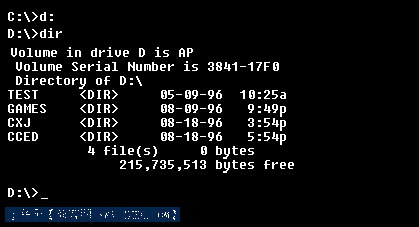
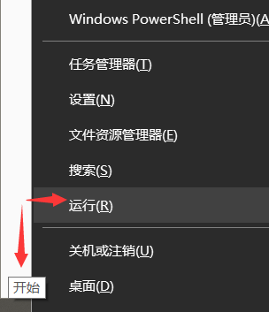
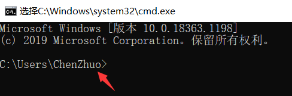
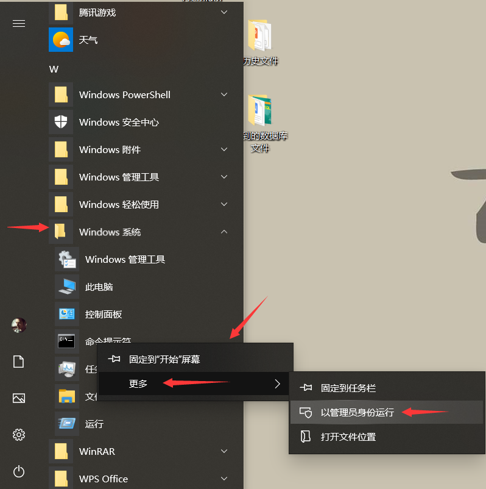
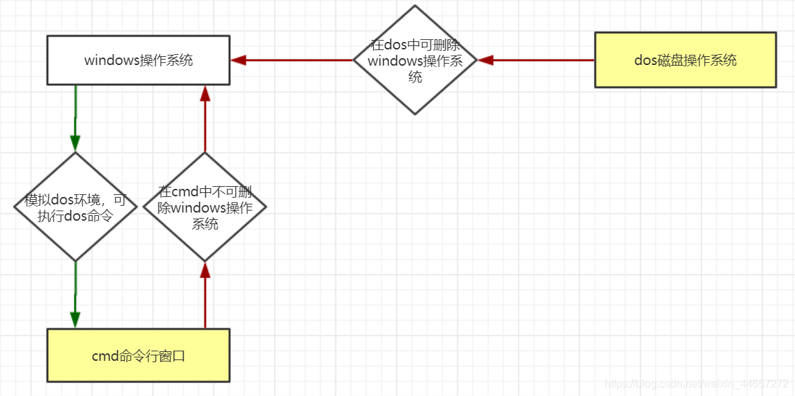

# DOS系统

##### 简介

**DOS系统，即磁盘操作系统（Disk Operating System），是早期个人计算机上的一个单用户单任务操作系统。**

DOS家族包括MS-DOS、PC-DOS、DR-DOS、FreeDOS、NovellDOS、PTS-DOS、ROM-DOS、JM-OS等，其中以MS-DOS最为著名，最自由开放的则是Free-DOS。虽然这些系统常被简称为"DOS"，但没有任何一个系统单纯以"DOS"命名（只有一个毫无关连的1960年代IBM大型主机操作系统以此命名）。

##### 发展历程

**早期的DOS系统是由微软（Microsoft）公司为IBM的个人计算机开发的，称为MS-DOS。它直接操纵管理硬盘的文件，一般都是黑底白色文字的界面。**

DOS是个非常实用的操作系统，因此受到国内外人们的普遍喜爱，拥有数以亿计的用户。但自从1995年以来，微软(Microsoft)公司出于商业利益等方面的原因，决定抛弃手中文字界面的MS-DOS操作系统，而转以开发图形界面Windows操作系统。**因为，DOS对操作人员的要求是比较高的，操作者需要记住很多的命令，并利用命令编写大量的命令行，来完成一些工作，操作相对比较复杂。而图形界面的Windows更直观，操作更方便，所以被大多数人所接受。**

##### 模拟DOS

**现在的Windows系统中已经没有了DOS系统，但Windows仍然为其保留了模拟的DOS环境用于执行DOS命令来间接调用DOS程序。**

**命令行窗口（Command）就是在windows下模拟DOS环境的一个程序，可以执行很多DOS命令，但不能直接运行DOS程序。**

**用户命令行：即进入命令行后操作者的身份是用户，初始路径为C盘下的用户目录，拥有一般权限。**

方式一：在Windows中鼠标右键点击 `开始`，左键点击 `运行` ，输入 `cmd`，点击确定即可进入用户命令行窗口。

方式二：在电脑键盘上点击按中 `win+R`，在运行框中输入 `cmd`，回车即可进入用户命令行窗口。

**管理员命令行：即进入命令行后操作者的身份是管理员，初始路径为C盘下的系统目录，拥有最高权限。**

方式：在Windows中鼠标左键点击 `开始`，左键点击 `Windows系统`，右键点击 `命令行提示符`，选择 `更多`，左键点击 `以管理员身份运行`，即可进入管理员命令行。

##### CMD区别

正如上面所描述的，其实我们在Windows操作系统中通过命令提示符cmd进入的DOS并不是纯的DOS，只是为方便某些需求而建立的，而纯DOS本身就是一种操作系统。两者的区别在于，比如我们可以在纯DOS中删除Windows操作系统，但是在命令提示符中却不能删除Windows系统，因为你总不能“在房子里面拆房子”吧！

