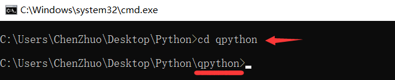
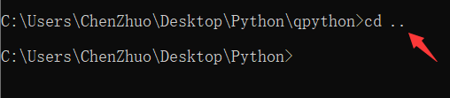

# DOS基础命令

随着Windows操作系统的风行，DOS系统已逐渐成为一种历史，失去了往日那样的熠熠生辉。但是别看Windows风光无限，但是还是有很多的很难解决或者无法解决的的问题，而这个时候我们的DOS系统就可以大显身手了，用DOS命令来解决一些问题，往往会收到事半功倍的效果，而且还有大量的微机的运行仍在使用DOS操作系统，因此掌握DOS的基本命令是必要的。

**DOS命令，是指DOS操作系统的命令，是一种面向磁盘的操作命令，主要包括目录操作类命令、磁盘操作类命令、文件操作类命令和其它命令。**

### 路径

##### 初始路径

前面提过，不同身份进入命令行，其初始路径是不一样的。

用户命令进入的初始路径：C盘的Users目录下面的当前用户名目录里面。


管理员命令进入的初始路径：C盘的Windws目录下面的System32系统目录里面。


##### 查看目录

查看当前目录下的所有文件和文件夹信息。

```
dir
```


##### 进入下层

```
cd 下层文件夹名称
```

?> 提示：可以使用Tab键来选择或者补全下层文件夹名称。



##### 返回上层

```
cd ..
```



##### 切换盘符

所切换的盘符必须是其他存在的盘符，不能是当前盘符。

```
其他盘符:
```


##### 切换路径

所切换的路径必须在当前盘符内，否则就需要先切换盘符。

```
cd 当前盘符:\路径\路径
```


##### 快捷键

tab键可以补全文件夹名和文件名。

##### 清屏

```
//记成 苍老师 就记住了
cls
```

##### 退出

```
exit
```

##### 查看目录

```
dir
```

##### 切换盘符


```
盘符:
```

##### 切换目录

```
//当前位置的下的文件夹
cd 文件夹名

//绝对路径下的文件夹
cd 盘符:文件夹
//如果是其他盘下的路径还需要再切换一次到该盘
盘符:

//切换到当前目录的上一级
cd ..
```

##### 新建目录

```
//在当前位置创建新的目录
md 目录名称

//创建多个目录
md 目录名称1 目录名称2 ...
```

##### 删除目录

```
//带询问删除当前位置下的目录
rd /s 目录名称

//不询问删除当前位置下的目录
rd /q/s 目录名称
```

##### 新建文件

```
//通过添加内容到新文件中来创建文件
//创建新文件test.txt，并将hello写入该文件中
echo hello >盘符:\路径\test.txt
```

##### 复制文件

```
//复制当前路径下的文件到其他路径下
copy 文件名 盘符:\路径

//复制当前路径下的文件到其他路径下，并重新命名
copy 文件名 盘符:\路径\新文件名 
```

##### 移动文件

```
//移动当前路径的文件到其他路径下去
move 文件 盘符:\路径
```

##### 删除文件

```
//删除当前路径的文件
del 文件名

//删除所有文件，不包括文件夹
del *.*
```

批量结束相同服务的命令

```
taskkill /F /im chromedriver.exe
```

