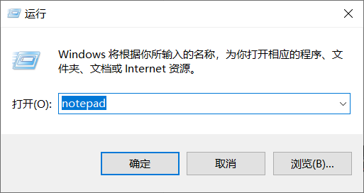
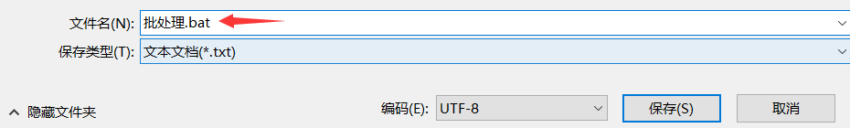
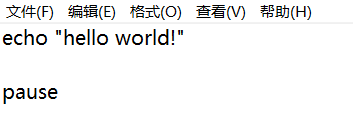
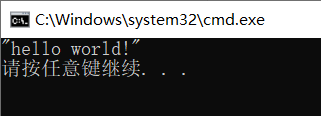

# 批处理

### 认识批处理

##### 批处理简介

**批处理(Batch)，也称为批处理脚本，批处理就是对某对象进行批量的处理，通常被认为是一种简化的脚本语言，它应用于DOS和Windows系统中。**

目前比较常见的批处理包含两类：**PS批处理和DOS批处理。**PS批处理是基于微软强大的PowerShell的，用来批量处理一些任务的脚本；而DOS批处理则是基于DOS命令的，用来自动地批量地执行DOS命令以实现特定操作的脚本。

##### 批处理程序

**批处理使用的是Windows操作系统自带的原生Batch file programming脚本开发语言，由于在系统中已经集成了开发和执行环境，因此可以直接在系统中开发和执行批处理脚本。**

批处理程序由DOS或者Windows系统内嵌的命令解释器（通常是COMMAND. COM或者CMD.EXE）解释运行。一般情况下，每条命令占据一行；当然也可以将多条命令用特定符号（如：&；、&&；、|、||等）分隔后写入同一行中；还有的情况就是像if、for等较高级的命令则要占据几行、几十甚至几百行的空间。系统在解释运行批处理程序时，首先扫描整个批处理程序，然后从第一行代码开始向下逐句执行所有的命令，直至程序结尾或遇见exit命令或出错意外退出。

##### 批处理文件

**批处理文件具有.bat或者.cmd的扩展名，是由一条条的DOS命令组成的普通文本文件，可以用记事本直接编辑或用DOS命令创建，也可以用DOS下的文本编辑器Edit.exe来编辑。**

编写好的批处理文件，在“命令提示”下键入批该处理文件的名称，或者双击该批处理文件，系统就会调用Cmd.exe运行该批处理文件。

##### 批处理作用

批处理使用一系列内置命令和外置命令进行自动化操作，例如：匹配规则删除文件、新建日志、批量创建计算机病毒。

批处理不仅仅能使用命令行软件，而且任何当前系统下可运行的程序都可以放在批处理文件中运行。

### 编写批处理

##### 使用记事本

使用记事本也是可以编写批处理脚本程序的。

右键点击“开始”选择“运行”或者按键“WIN+R”输入 `notepad` 即可打开新的空白记事本。



编写好批处理程序以后，选择好路径直接另存为bat文件即可。



##### 简单批处理

`echo`：输出后面的字符串。

`pause`：暂停（防止程序结束关闭）。

```
echo "hello world!"

pause
```




##### 省略盘符

上面的输出程序中，依然显示了没有必要出现的盘符和路径，可以关闭它的显示。

`@echo off`：关闭显示盘符和路径。

```
@echo off

echo "hello world!"

pause
```




### 命令分类

##### 内部命令

内部命令包含前面提及的基础DOS命令还有一些其他命令。

Windows 系统常用小工具：

| **工具名称**      | **cmd 命令** | **含义**           |
| ----------------- | ------------ | ------------------ |
| 计算器            | calc         | 与 "工具名称" 相同 |
| 记事本            | notepad      | 与 "工具名称" 相同 |
| 写字板            | write        | 与 "工具名称" 相同 |
| 画图              | mspaint      | 与 "工具名称" 相同 |
| 放大镜            | magnify      | 与 "工具名称" 相同 |
| 屏幕键盘          | osk          | 与 "工具名称" 相同 |
| 字符映射表        | charmap      | 与 "工具名称" 相同 |
| 专用字符编辑程序  | eudcedit     | 造字程序           |
| 远程桌面连接      | mstsc        | 与 "工具名称" 相同 |
| 音量合成器-扬声器 | sndvol       | 调节音量           |

 Windows 系统常用管理工具：

| **工具名称**            | **cmd 命令** | **含义**                                                    |
| ----------------------- | ------------ | ----------------------------------------------------------- |
| 任务管理器              | taskmgr      | 与 "工具名称" 相同                                          |
| 资源监视器              | perfmon.msc  | 对计算机资源（CPU、内存、硬盘、网络）的占用情况进行详细管理 |
| 关于“Windows”           | winver       | 查看Windows版本                                             |
| 资源管理器              | explorer     | 与 "工具名称" 相同                                          |
| 计算机管理              | compmgmt.msc | 与 "工具名称" 相同                                          |
| 设备管理器              | devmgmt.msc  | 与 "工具名称" 相同                                          |
| 事件查看器              | eventvwr.msc | 与 "工具名称" 相同                                          |
| 磁盘管理                | diskmgmt.msc | 与 "工具名称" 相同                                          |
| 组件管理                | dcomcnfg     | 与 "工具名称" 相同                                          |
| 本地安全策略            | secpol.msc   | 与 "工具名称" 相同                                          |
| 本地组策略管理器        | gpedit.msc   | 与 "工具名称" 相同                                          |
| 组策略结果集            | rsop.msc     | 与 "工具名称" 相同                                          |
| 本地用户和组            | lusrmgr.msc  | 与 "工具名称" 相同                                          |
| 服务                    | services.msc | 本地服务设置                                                |
| 注册表编辑器            | regedit      | 与 "工具名称" 相同                                          |
| Registry Editor Utility | regedt32     | 打开注册表编辑器                                            |
| 系统配置实用工具        | msconfig     | 与 "工具名称" 相同                                          |
| DirectX 诊断工具        | dxdiag       | 与 "工具名称" 相同                                          |
| 控制台                  | mmc          | 与 "工具名称" 相同                                          |
| WMI控件                 | wmimgmt.msc  | 配置和控制Windows Management Instrument （WMI）服务         |

##### 外部命令

在Windows系统当中安装了对应的软件后就可以使用相对应的外部命令。

本机装了Python环境就可以直接运行Python命令。

