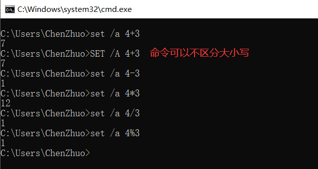

# 批处理

### 认识批处理

##### 批处理简介

**批处理(Batch)，也称为批处理脚本，批处理就是对某对象进行批量的处理，通常被认为是一种简化的脚本语言，它应用于DOS和Windows系统中。**

目前比较常见的批处理包含两类：**PS批处理和DOS批处理。**PS批处理是基于微软强大的PowerShell的，用来批量处理一些任务的脚本；而DOS批处理则是基于DOS命令的，用来自动地批量地执行DOS命令以实现特定操作的脚本。

##### 批处理程序

**批处理使用的是Windows操作系统自带的原生Batch file programming脚本开发语言，由于在系统中已经集成了开发和执行环境，因此可以直接在系统中开发和执行批处理脚本。另外，命令行中是不区分大小写的。**

批处理程序由DOS或者Windows系统内嵌的命令解释器（通常是COMMAND. COM或者CMD.EXE）解释运行。一般情况下，每条命令占据一行；当然也可以将多条命令用特定符号（如：&；、&&；、|、||等）分隔后写入同一行中；还有的情况就是像if、for等较高级的命令则要占据几行、几十甚至几百行的空间。系统在解释运行批处理程序时，首先扫描整个批处理程序，然后从第一行代码开始向下逐句执行所有的命令，直至程序结尾或遇见exit命令或出错意外退出。

##### 批处理文件

**批处理文件具有.bat或者.cmd的扩展名，是由一条条的DOS命令组成的普通文本文件，可以用记事本直接编辑或用DOS命令创建，也可以用DOS下的文本编辑器Edit.exe来编辑。**

编写好的批处理文件，在“命令提示”下键入批该处理文件的名称，或者双击该批处理文件，系统就会调用Cmd.exe运行该批处理文件。

##### 批处理作用

批处理使用一系列内置命令和外置命令进行自动化操作，例如：匹配规则删除文件、新建日志、批量创建计算机病毒。

批处理不仅仅能使用命令行软件，而且任何当前系统下可运行的程序都可以放在批处理文件中运行。

### 编写批处理

##### 使用记事本

使用记事本也是可以编写批处理脚本程序的。

右键点击“开始”选择“运行”或者按键“WIN+R”输入 `notepad` 即可打开新的空白记事本。


编写好批处理程序以后，选择好路径直接另存为bat文件即可。


##### 简单批处理

`echo`：输出后面的字符串。

`pause`：暂停（防止程序结束关闭）。

```
echo "hello world!"

pause
```


##### 省略盘符

上面的输出程序中，依然显示了没有必要出现的盘符和路径，可以关闭它的显示。

`@echo off`：关闭显示盘符和路径。

```
@echo off

echo "hello world!"

pause
```


##### 运算符

比较运算符：`>、=、<`，分别对应：`大于、等于、小于`。

算术运算符：`+、-、*、/、%`，分别对应：`加、减、乘、除、余`。

括号：`()`，可以改变优先级，且优先级最高。

算术优先级：`()` > `*、/、%` > `+、-`

**命令模式**：通过命令直接在命令行中执行算术运算得出结果。

```
set /a 算术运算
```



**文本模式**：通过批处理文件执行算术运算。

```
@echo off

set /a 变量名 = 算术运算
echo %变量名%

pause
```


