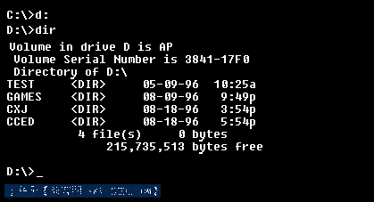
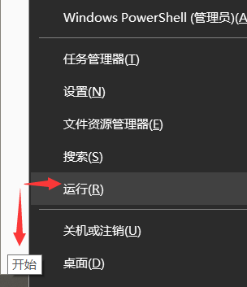
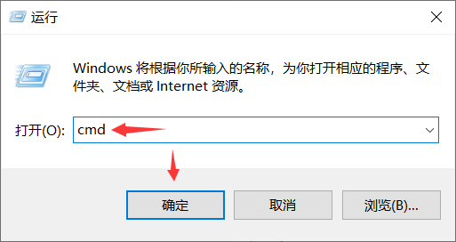
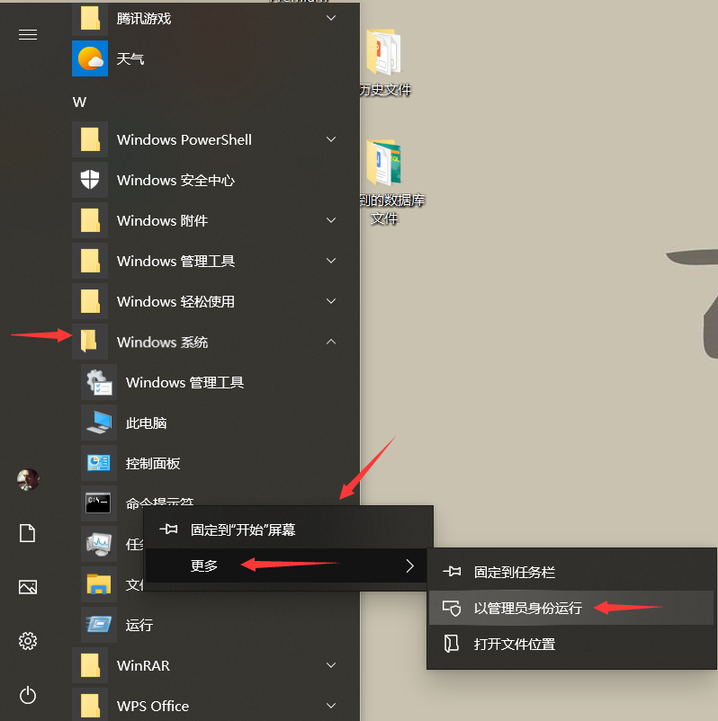
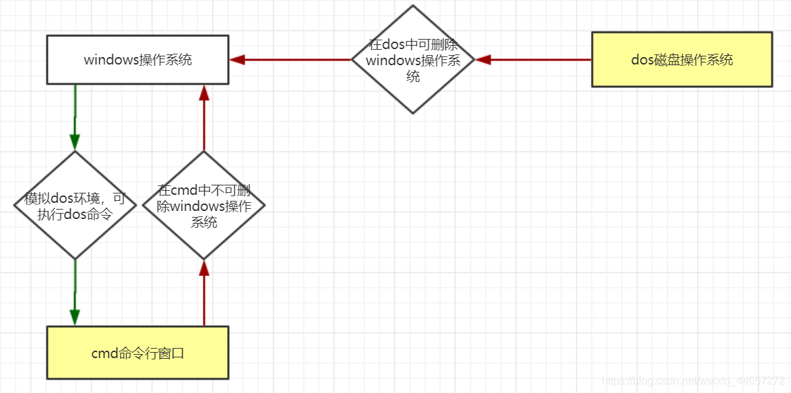
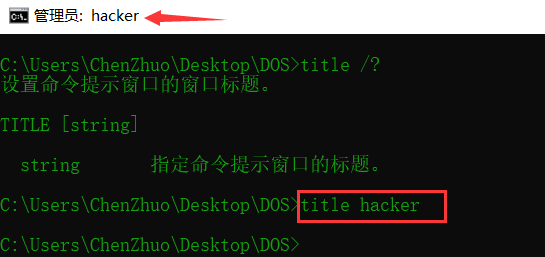
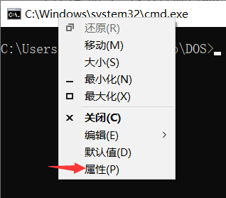
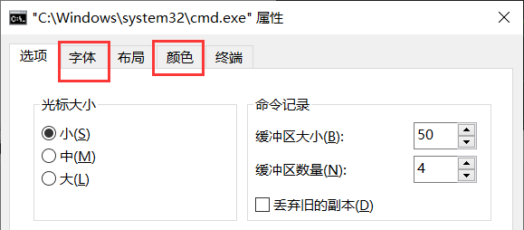

# DOS系统

## 简介

**DOS系统，即磁盘操作系统（Disk Operating System），是早期个人计算机上的一个单用户单任务操作系统。**

DOS家族包括MS-DOS、PC-DOS、DR-DOS、FreeDOS、NovellDOS、PTS-DOS、ROM-DOS、JM-OS等，其中以MS-DOS最为著名，最自由开放的则是Free-DOS。虽然这些系统常被简称为"DOS"，但没有任何一个系统单纯以"DOS"命名（只有一个毫无关连的1960年代IBM大型主机操作系统以此命名）。


### 发展历程

**早期的DOS系统是由微软（Microsoft）公司为IBM的个人计算机开发的，称为MS-DOS。它直接操纵管理硬盘的文件，一般都是黑底白色文字的界面。**



DOS是个非常实用的操作系统，因此受到国内外人们的普遍喜爱，拥有数以亿计的用户。但自从1995年以来，微软(Microsoft)公司出于商业利益等方面的原因，决定抛弃手中文字界面的MS-DOS操作系统，而转以开发图形界面Windows操作系统。**因为，DOS对操作人员的要求是比较高的，操作者需要记住很多的命令，并利用命令编写大量的命令行，来完成一些工作，操作相对比较复杂。而图形界面的Windows更直观，操作更方便，所以被大多数人所接受。**

## 模拟DOS

**现在的Windows系统中已经没有了DOS系统，但Windows仍然为其保留了模拟的DOS环境用于执行DOS命令来间接调用DOS程序。**

**命令行窗口（Command）就是在windows下模拟DOS环境的一个程序，可以执行很多DOS命令，但不能直接运行DOS程序。**

**用户命令行：即进入命令行后操作者的身份是用户，初始路径为C盘下的用户目录，拥有一般权限。**

方式一：在Windows中鼠标右键点击 `开始`，左键点击 `运行` ，输入 `cmd`，点击确定即可进入用户命令行窗口。

方式二：在电脑键盘上点击按中 `win+R`，在运行框中输入 `cmd`，回车即可进入用户命令行窗口。






**管理员命令行：即进入命令行后操作者的身份是管理员，初始路径为C盘下的系统目录，拥有最高权限。**

方式：在Windows中鼠标左键点击 `开始`，左键点击 `Windows系统`，右键点击 `命令行提示符`，选择 `更多`，左键点击 `以管理员身份运行`，即可进入管理员命令行。


### CMD区别

正如上面所描述的，其实我们在Windows操作系统中通过命令提示符cmd进入的DOS并不是纯的DOS，只是为方便某些需求而建立的，而纯DOS本身就是一种操作系统。两者的区别在于，比如我们可以在纯DOS中删除Windows操作系统，但是在命令提示符中却不能删除Windows系统，因为你总不能“在房子里面拆房子”吧！



## 炫酷命令行

`color` 命令：通过两个十六进制数字调整控制台和字体颜色。

`/?` ：查看该命令帮助。

```
C:\Users\ChenZhuo\Desktop\DOS>color /?
设置默认的控制台前景和背景颜色。

COLOR [attr]

  attr        指定控制台输出的颜色属性。

颜色属性由两个十六进制数字指定 -- 第一个对应于背景，第二个对应于前景。每个数字可以为以下任何值:
    0 = 黑色       8 = 灰色
    1 = 蓝色       9 = 淡蓝色
    2 = 绿色       A = 淡绿色
    3 = 浅绿色     B = 淡浅绿色
    4 = 红色       C = 淡红色
    5 = 紫色       D = 淡紫色
    6 = 黄色       E = 淡黄色
    7 = 白色       F = 亮白色

如果没有给定任何参数，此命令会将颜色还原到 CMD.EXE 启动时的颜色。这个值来自当前控制台窗口、/T 命令行开关或 DefaultColor 注册表值。

如果尝试使用相同的前景和背景颜色来执行 COLOR 命令，COLOR 命令会将 ERRORLEVEL 设置为 1。

示例: "COLOR fc" 在亮白色的背景上产生淡红色字体
```


`title` 命令：改变控制台窗口名称。

```
设置命令提示窗口的窗口标题。

TITLE [string]

  string       指定命令提示窗口的标题。
```



以上操作设置**仅当前有效，重启命令行失效**，但我们可以通过设置命令属性来永久设置命令行字体大小和背景颜色：

右键点击命令行标题栏，选择属性：



自己在属性列表中“字体”、“颜色”选项卡中自行选择：

