# DOS基础命令

随着Windows操作系统的风行，DOS系统已逐渐成为一种历史，失去了往日那样的熠熠生辉。但是别看Windows风光无限，但是还是有很多的很难解决或者无法解决的的问题，而这个时候我们的DOS系统就可以大显身手了，用DOS命令来解决一些问题，往往会收到事半功倍的效果，而且还有大量的微机的运行仍在使用DOS操作系统，因此掌握DOS的基本命令是必要的。

**DOS命令，是指DOS操作系统的命令，是一种面向磁盘的操作命令，主要包括目录操作类命令、磁盘操作类命令、文件操作类命令和其它命令。**

### 路径

路径代表着当前命令行窗口所处的磁盘的位置，通常以 `盘符:` 作为开头，`\` 作为目录层级区分。

```
格式 盘符:\一级目录\二级目录\三级目录
例如 C:\Users\ChenZhuo\Desktop\DOS
```

##### 初始路径

前面提过，不同身份进入命令行，其初始路径是不一样的。

用户命令进入的初始路径：C盘的Users目录下面的当前用户名目录里面。

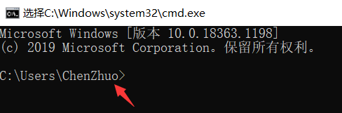

管理员命令进入的初始路径：C盘的Windws目录下面的System32系统目录里面。

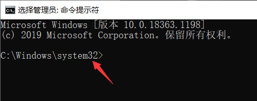

##### 进入下层

```
cd 下层文件夹名称
```

?> 提示：可以使用Tab键来选择或者补全下层文件夹名称。

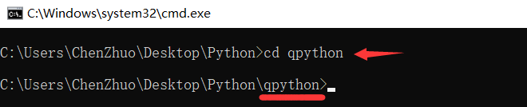

##### 返回上层

```
cd ..
```

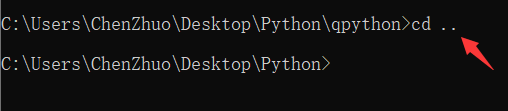

##### 切换盘符

所切换的盘符必须是其他存在的盘符，切换当前盘符路径不变。

```
其他盘符:
```

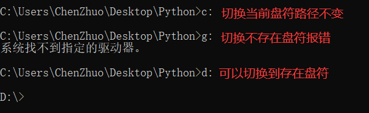

##### 切换路径

所切换的路径必须在当前盘符内，否则就需要先切换盘符。

```
cd 当前盘符:\路径\路径
```

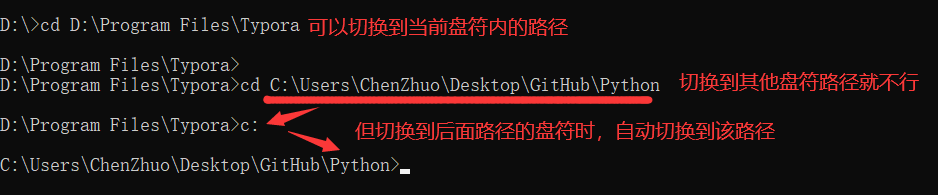

### 目录

##### 查看目录

`dir` 命令：查看当前目录下的文件和文件夹信息。

`dir /a` 命令：查看当前目录下的所有文件（包括隐藏文件、系统文件等）和文件夹信息。

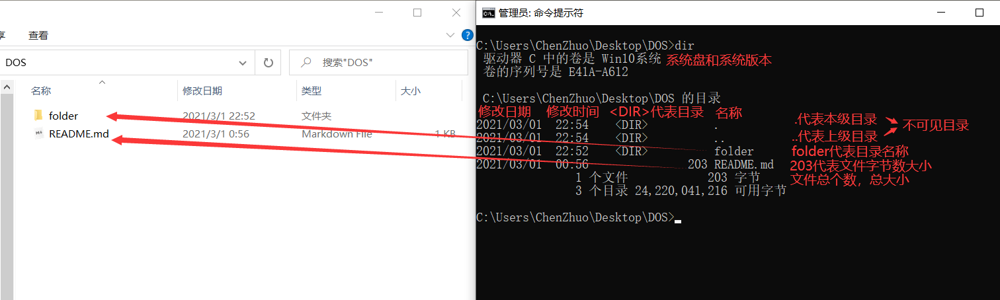

`tree` 命令：查看文件夹的结构命令。

可选参数：`/a` 层级以符号的形式展示，`/f`显示文件夹包括里面的全部文件。

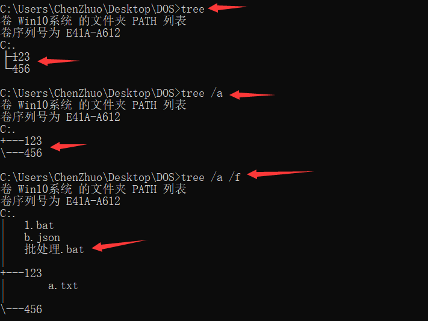

##### 新建目录

新建目录的位置在命令行所在的当前路径下。

```
//在当前位置创建新的目录
md 目录名称

//创建多个目录
md 目录名称1 目录名称2 ...

//创建多级目录
md 盘符:\一级目录\二级目录\三级目录
```

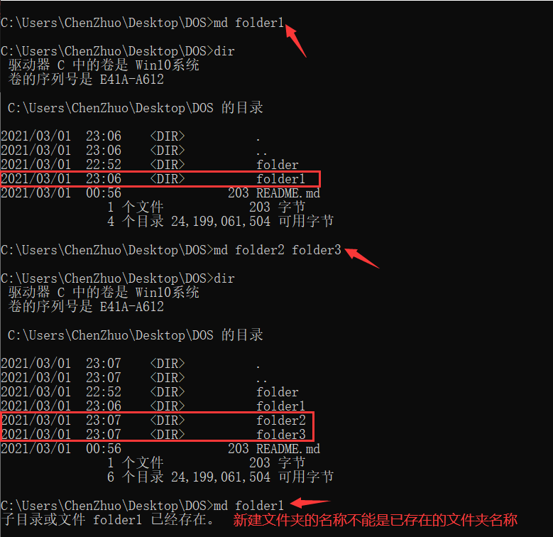

##### 删除目录

```
//删除空目录，若目录不为空是无法删除成功
rd 目录名称

//请求确认删除当前位置下的目录，/s: 除目录本身外，还将删除指定目录下的所有子目录和文件
rd 目录名称 /s

//不请求确认删除当前位置下的目录，/q表示安静模式，删除目录树时不要求确认
rd 目录名称 /s/q
```

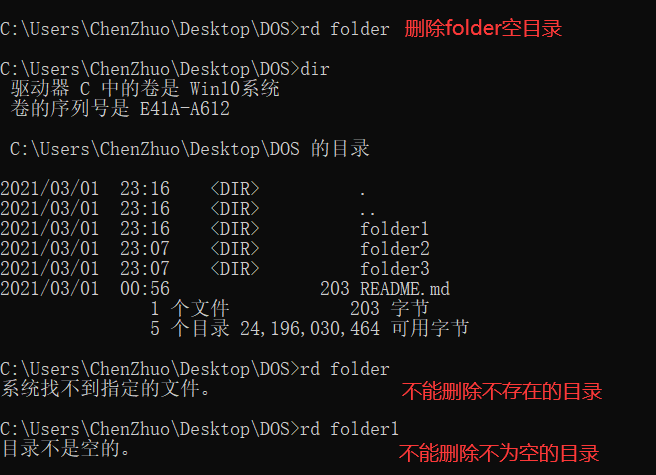

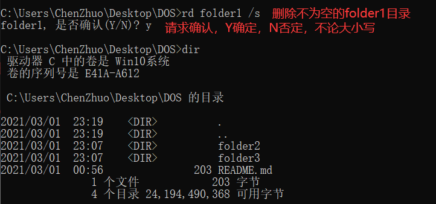

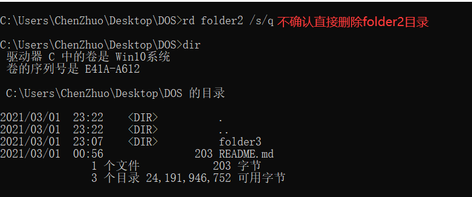

### 文件

##### 新建文件

```
//创建新的空白文件test.txt
echo. > test.txt

//在指定路径下创建新文件test.txt，并将hello world写入该文件中，注意可以不带双引号
echo "hello world" > 盘符:\路径\test.txt
```

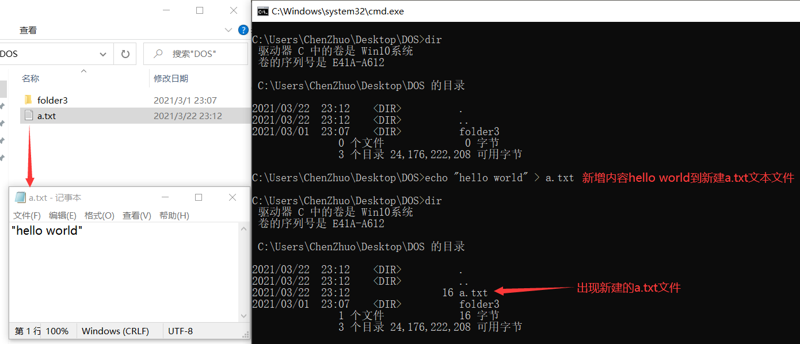

```
//在文件test.txt中追加空白行
echo. >> test.txt

//将hello world内容追加到test.txt文本文件中
echo "hello world" >> 盘符:\路径\test.txt
```

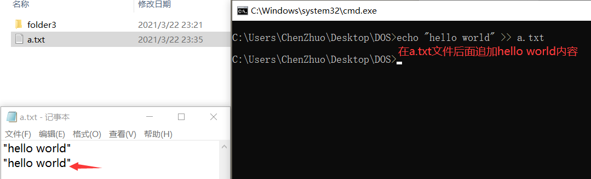

```
//将hello batch file覆盖写入该文件中
echo "hello batch file" > 盘符:\路径\test.txt
```

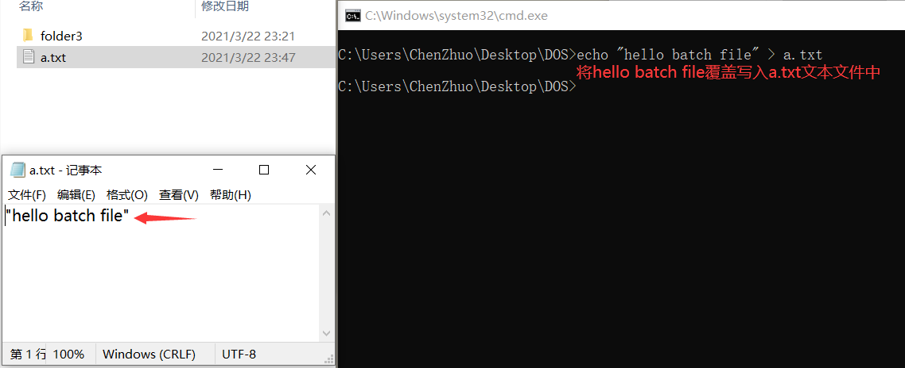

##### 复制文件

```
//复制当前路径下的文件到其他路径下
copy 文件名 盘符:\路径

//复制当前路径下的文件到其他路径下，并重新命名
copy 文件名 盘符:\路径\新文件名

//复制指定路径下所有文件到新的路径下
copy 盘符:\路径 盘符:\路径
```

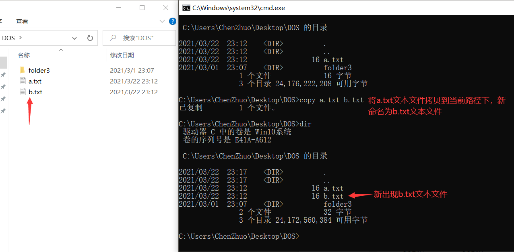

##### 移动文件

```
//移动指定路径的文件移动到其他路径下去
move 盘符:\路径\文件 盘符:\路径
```

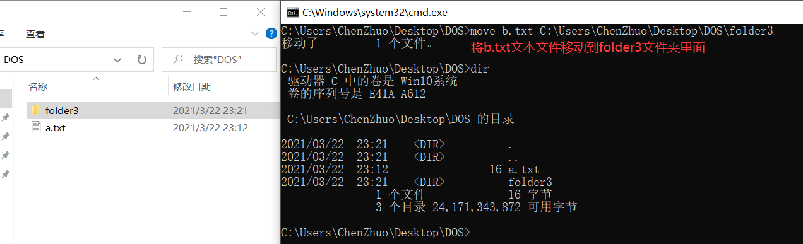

##### 删除文件

```
//删除指定路径的文件
del 盘符:\路径\文件名

//删除指定路径的所有文件，但不包括文件夹
del 盘符:\路径\*.*
```

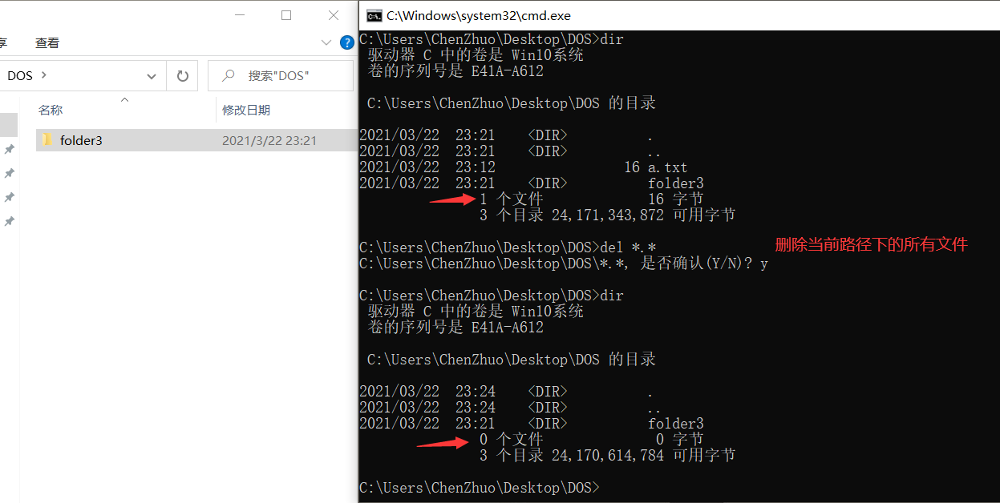

### 快捷功能

##### 重新命名

`ren 文件夹旧名 文件夹新名`： 对文件夹重新命名。

`ren 旧文件名.后缀 新文件名.后缀`：对文件重新命名。

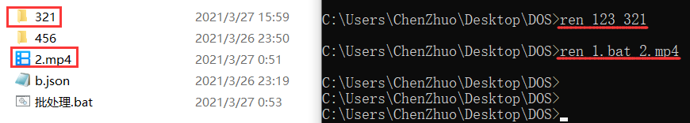

##### 帮助查看

获取关于该命令的相关参数与提示。

```
help 命令
```

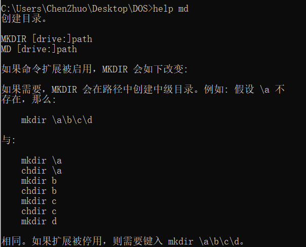

`type`：命令可以查看文本类的文件，例如txt、bat。

```
type 文本文件
```

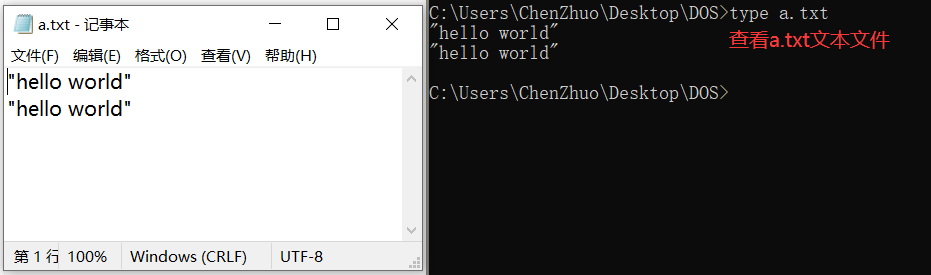

##### 遍历补全

Tab键可以**遍历**或者**补全**其**当前路径**或**指定路径**的**文件名**或**文件夹名**。

##### 翻阅命令

向上键可以快速**向前翻阅**前面执行过的命令。

向下键可以快速**向后翻阅**前面执行过的命令。

##### 复制粘贴

在命令行窗口，选中字符，按下 `ctrl+c` 也可以复制字符内容。

在命令行窗口，选中字符，按下回车键，即可将内容复制到粘贴板上。

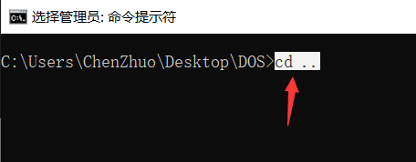

在命令行窗口，按下 `ctrl+v` 可以粘贴所复制的字符内容。

在命令行窗口，点击鼠标右键也可以粘贴所复制的字符内容。

##### 清屏退出

输入 `cls` 清空当前命令行窗口中的操作记录，命令记成"**苍老师**"就记住了。

输入 `exit` 退出命令行窗口。

### 命令分类

##### 内部命令

内部命令包含前面提及的基础DOS命令还有一些其他命令。

Windows 系统常用小工具：

| **工具名称**      | **cmd 命令** | **含义**           |
| ----------------- | ------------ | ------------------ |
| 计算器            | calc         | 与 "工具名称" 相同 |
| 记事本            | notepad      | 与 "工具名称" 相同 |
| 写字板            | write        | 与 "工具名称" 相同 |
| 画图              | mspaint      | 与 "工具名称" 相同 |
| 放大镜            | magnify      | 与 "工具名称" 相同 |
| 屏幕键盘          | osk          | 与 "工具名称" 相同 |
| 字符映射表        | charmap      | 与 "工具名称" 相同 |
| 专用字符编辑程序  | eudcedit     | 造字程序           |
| 远程桌面连接      | mstsc        | 与 "工具名称" 相同 |
| 音量合成器-扬声器 | sndvol       | 调节音量           |

 Windows 系统常用管理工具：

| **工具名称**            | **cmd 命令** | **含义**                                                    |
| ----------------------- | ------------ | ----------------------------------------------------------- |
| 任务管理器              | taskmgr      | 与 "工具名称" 相同                                          |
| 资源监视器              | perfmon.msc  | 对计算机资源（CPU、内存、硬盘、网络）的占用情况进行详细管理 |
| 关于“Windows”           | winver       | 查看Windows版本                                             |
| 资源管理器              | explorer     | 与 "工具名称" 相同                                          |
| 计算机管理              | compmgmt.msc | 与 "工具名称" 相同                                          |
| 设备管理器              | devmgmt.msc  | 与 "工具名称" 相同                                          |
| 事件查看器              | eventvwr.msc | 与 "工具名称" 相同                                          |
| 磁盘管理                | diskmgmt.msc | 与 "工具名称" 相同                                          |
| 组件管理                | dcomcnfg     | 与 "工具名称" 相同                                          |
| 本地安全策略            | secpol.msc   | 与 "工具名称" 相同                                          |
| 本地组策略管理器        | gpedit.msc   | 与 "工具名称" 相同                                          |
| 组策略结果集            | rsop.msc     | 与 "工具名称" 相同                                          |
| 本地用户和组            | lusrmgr.msc  | 与 "工具名称" 相同                                          |
| 服务                    | services.msc | 本地服务设置                                                |
| 注册表编辑器            | regedit      | 与 "工具名称" 相同                                          |
| Registry Editor Utility | regedt32     | 打开注册表编辑器                                            |
| 系统配置实用工具        | msconfig     | 与 "工具名称" 相同                                          |
| DirectX 诊断工具        | dxdiag       | 与 "工具名称" 相同                                          |
| 控制台                  | mmc          | 与 "工具名称" 相同                                          |
| WMI控件                 | wmimgmt.msc  | 配置和控制Windows Management Instrument （WMI）服务         |

##### 外部命令

在Windows系统当中安装了对应的软件并配置好相应的环境变量后，就可以使用相对应的外部命令。

本机装了Python环境就可以直接运行Python命令。

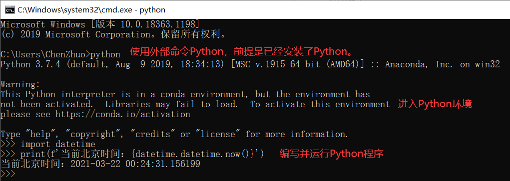