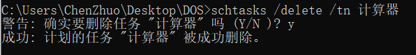

# DOS进阶命令

### 编码设置

代码页是字符集编码的别名，也有人称"内码表"。使用特别数字来标记这些编码，其实大多的这些编码已经有自己的名称了。虽然图形操作系统可以支持很多编码，很多微软程序还使用这些数字来点名某编码。

```
下表列出了常用的代码页及其国家(地区)或者语言： 
代码页       国家(地区)或语言 
936          中国 - 简体中文(GB2312)
950          繁体中文(Big5)
1200         Unicode        
1201         Unicode (Big-Endian)
50000        用户定义的
50001        自动选择
52936        简体中文(HZ)
65001        Unicode (UTF-8)
```
进入DOS窗口，输入：`chcp` 命令，可以得到操作系统的代码页信息。

例如：我的活动代码页为：936，它对于的编码格式为GBK。


设置其他的编码，输入命令：`chcp 代码页`，即可设置成功。


### 日期时间

```
date /t：获取当前日期
time /t：获取当前时间
```


### 进程列表

##### 查看进程

`tasklist` 命令：**显示在本地或远程机器上当前运行的进程列表。**

显示本机/远程机的进程列表：

```
tasklist [/s 远程机ip /u 用户名 /p 登录密码]
```

筛选本机PID为27452的进程：

```
tasklist /fi "PID eq 27452"
```


筛选本机进程名为cmd.exe的进程：

```
tasklist /fi "imagename eq cmd.exe"
```


##### 终止进程

`taskkill`命令 ：**按照进程 ID (PID) 或映像名称终止任务。**

可选参数：`/f` 强行终止，`/t`终止指定进程和它启用的子进程。

强行终止PID为2544的进程：

```
taskkill /PID 2544 /f
```


强行终止进程名称为SunloginClient.exe的进程：

```
taskkill /im SunloginClient.exe /f /t
```


### 用户(组)操作

##### 用户操作

`net user` 命令：查看系统中所有用户。


`net user 用户名` 命令：查看该用户的详细信息。

`net user 用户名 密码 /add` 命令：增加系统普通用户。

`net user 用户名 密码 /delete` 命令：删除系统普通用户。

##### 用户组操作

`net localgroup` 命令：查看系统中的用户组。

`net localgroup 用户组名 用户 /add` 命令：将当用户添加到新的用户组。

`net localgroup 用户组名 用户 /delete` 命令：将当用户从用户组中删除。

?> 如果是普通用户添加到管理员用户组中，则该用户权限提高。

### 网络命令

##### 查看网络配置

`ipconfig` 命令：查看本机网卡配置的信息。

`ipconfig /all` 命令：查看本机网卡配置的详细信息。


##### 网络联通测试

`ping 目标主机IP/网址`：发送4个数据包，测试本机与目标主机连通性。

可选参数：`-t` 一直发送数据包直到ctrl+c强制结束；`-l` 设置发送数据包的大小。

?> 现在防火墙对ping命令的发送数据包做了过滤，大的数据包是发送不了的。

?> 有些网站的目标IP地址是可以访问，根域名服务器就是将ip地址与网址进行对应。


##### 路由跟踪

`tracetr 目标主机IP/网址 `：查询本机到目标机的跳转节点。


##### 网络连接

`netstat `：显示协议统计信息和当前 TCP/IP 网络连接。

`netstat -a`：显示所有连接和侦听端口。

`netstat -n`：以数字形式显示地址和端口号。

`netstat -an`：显示当前正连接和监听的端口，并显示连接端口的外部ip。

`netstat -r`：查看本机的路由表。

##### 端口连接

`telnet 目标机IP 目标机端口`：连接目标机的端口，进行传输。

!> telnet使用的是非加密传输，仅供学习使用。

### 环境变量

`set`：查看当前机器的环境变量。


`echo %变量名%`：查看该环境变量的值。


### 计划任务

`schtasks` 命令：允许管理员创建、删除、查询、更改、运行和中止本地或远程系统上的计划任务。

这个命令有个可视化界面：我的电脑——管理——任务计划程序


创建一个名称为""计算器"在时间15:20只启动一次计算器的任务计划：

参数列表：`/tn` 任务名称；`/tr` 执行程序；`/sc` 执行频率；`/st` 执行时间。

```
schtasks /create /tn 计算器 /tr calc.exe /sc once /st 15:20
```


直接启动上面的计划任务：

参数列表：`/run` 直接运行计划任务；`/tn` 任务名称，因为前面使用的是run，所以这里的任务名称必须是已经存在的。

```
schtasks /run /tn 计算器
```


查询所有的计划任务：

`schtasks /query`：显示所有的计划任务。

删除上面的计划任务：

参数列表：`/delete` 直接运行计划任务；`/tn` 任务名称，因为前面使用的是delete，所以这里的任务名称必须是已经存在的。

```
schtasks /delete /tn 计算器
```



### 关机重启

`shutdown` 命令：显示关于该命令的参数。

`shutdown -p`：立即执行关机操作。

`shutdown -s -t xxx`：xxx秒后执行关机操作，有效范围是 0-315360000 (10 年)，默认值为 30。

`shutdown -a`：取消关机计划。

`shutdown -r`：执行重启操作。

`shutdown -i` 或 `shutdown /i` ：打开GUI可视化界面执行远程机的关机/重庆操作。

