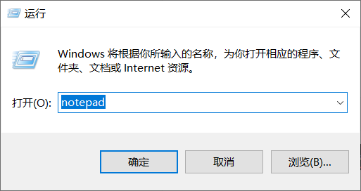

# 批处理

### 认识批处理

##### 批处理简介

**批处理(Batch)，也称为批处理脚本，批处理就是对某对象进行批量的处理，通常被认为是一种简化的脚本语言，它应用于DOS和Windows系统中。**

目前比较常见的批处理包含两类：**PS批处理和DOS批处理。**PS批处理是基于微软强大的PowerShell的，用来批量处理一些任务的脚本；而DOS批处理则是基于DOS命令的，用来自动地批量地执行DOS命令以实现特定操作的脚本。

##### 批处理程序

**批处理使用的是Windows操作系统自带的原生Batch file programming脚本开发语言，由于在系统中已经集成了开发和执行环境，因此可以直接在系统中开发和执行批处理脚本。另外，命令行中是不区分大小写的。**

批处理程序由DOS或者Windows系统内嵌的命令解释器（通常是COMMAND. COM或者CMD.EXE）解释运行。一般情况下，每条命令占据一行；当然也可以将多条命令用特定符号（如：&；、&&；、|、||等）分隔后写入同一行中；还有的情况就是像if、for等较高级的命令则要占据几行、几十甚至几百行的空间。系统在解释运行批处理程序时，首先扫描整个批处理程序，然后从第一行代码开始向下逐句执行所有的命令，直至程序结尾或遇见exit命令或出错意外退出。

命令基本格式：`命令 子命令 参数 操作 [选项]`

命令帮助信息：`命令 /?` 命令帮助信息查看，`命令 /help` 获取命令的详细帮助信息。

命令注释信息：`rem 注释的内容`

##### 批处理文件

**批处理文件具有 `.bat` 或者 `.cmd` 的扩展名，是由一条条的DOS命令组成的普通文本文件，可以用记事本直接编辑或用DOS命令创建，也可以用DOS下的文本编辑器Edit.exe来编辑。**

编写好的批处理文件，在“命令提示”下键入批该处理文件的名称，或者双击该批处理文件，系统就会调用Cmd.exe运行该批处理文件。

##### 批处理作用

批处理使用一系列内置命令和外置命令进行自动化操作，例如：匹配规则删除文件、新建日志、批量创建计算机病毒。

批处理不仅仅能使用命令行软件，而且任何当前系统下可运行的程序都可以放在批处理文件中运行。

### 简单批处理

##### 使用记事本

使用记事本也是可以编写批处理脚本程序的。

右键点击“开始”选择“运行”或者按键“WIN+R”输入 `notepad` 即可打开新的空白记事本。



编写好批处理程序以后，选择好路径直接另存为bat文件即可。


##### 简单批处理

`echo`：输出后面的字符串。

`pause`：暂停（保留窗口，防止太快关闭看不清结果）。

`pause>nul` ：取消“按任意键继续...”的提示。

`exit`：退出程序。

```
echo "hello world!"

pause
```


##### 省略盘符

上面的输出程序中，依然显示了没有必要出现的盘符和路径，可以关闭它的显示。

`@echo off`：关闭显示盘符和路径。

```
@echo off

echo "hello world!"

pause
```


##### 运算符

比较运算符：`>、=、<`，分别对应：`大于、等于、小于`。

算术运算符：`+、-、*、/、%`，分别对应：`加、减、乘、除、余`。

括号：`()`，可以改变优先级，且优先级最高。

算术优先级：`()` > `*、/、%` > `+、-`

**命令模式**：通过命令直接在命令行中执行算术运算得出结果。

```
set /a 算术运算
```


**文本模式**：通过批处理文件执行算术运算。

```
@echo off

set /a 变量名 = 算术运算
echo %变量名%

pause
```


##### 多命令运算

`&&`：连接多条命令，具有短路功能，当第一条命令错误，就不会执行第二条命令，若第一条命令正确才会执行第二条命令。

```
aaa && ipconfig        注释：'aaa'错误命令，也不会执行ipconfig命令。
ipconfig && net user   注释：执行ipconfig命令，也执行net user命令。
```

`||`：连接多条命令，具有短路功能，当第一条命令错误，依然会执行第二条命令，若第一条命令正确不会执行第二条命令。

```
aaa || ipconfig        注释：'aaa'错误命令，依然执行ipconfig命令。
ipconfig || net user   注释：执行ipconfig命令，不会执行net user命令。
```

##### 管道符筛选

`A|B`：A作为输入，|为管道符，B作为输出。

```
dir：查看当前目录的所有文件和文件夹。
find：查找命令，Windows系统是通过后缀名进行查找。
```

查找当前路径中，后缀名为 `txt` 的文件：

```
dir | find ".txt"
```


##### 接受参数

```
.bat文件使用“%num”接受参数，其中num代表数组位置，即第几个数，num从1开始接受参数。
执行方式：批处理文件 参数1 参数2 ...
```

通过批处理脚本新建名称分别为123，456的文件夹：

```
@echo off

md %1
md %2

pause
```


### 逻辑批处理

##### if-else结结构

演示if-else结构，判断字符串是否为规定的字符串：

```
@echo off

set v=hello
if %v%==hello (echo yes) else (echo no)

pause>nul
```

##### exist文件存在

判断指定路径下的文件是否存在：

```
@echo off

if exist C:\Users\ChenZhuo\Desktop\DOS\1.txt (echo yes) else (echo no)

pause>nul
```

判断指定路径下的文件是否存在，存在就删除，不存在就提示：

```
@echo off

if exist C:\Users\ChenZhuo\Desktop\DOS\1.txt (
echo file find!
del C:\Users\ChenZhuo\Desktop\DOS\1.txt
) else (
echo file not find!
)

pause>nul
```

##### 循环遍历操作

`for /l %%变量名 in (start, step, end) do 具体操作`：遍历start到end之间的数字范围，包括start和end，step为步长。

自动化ping命令：

```
@echo off

for /l %%v in (1, 1, 20) do ping %1.%%v

pause>nul
```

执行方法，命令行中输入 `start 文件名.bat 参数1`：


`for /r 路径 %%变量名 in (匹配规则) do 具体操作`：遍历路径下**所有文件**执行具体的操作。

遍历路径下的所有文件，并删除后缀为py的文件：

```
@echo off

for /r "C:\Users\ChenZhuo\Desktop\DOS" %%a in (*.py) do del %%a

pause>nul
```

`for /d %%变量名 in (路径\*) do 具体操作`：遍历路径**文件夹**执行具体的操作。

?> `(路径\*)` 代表指定路径，注意路径后面要加上`\*`；`(*)` 代表当前路径。

遍历当前路径的文件夹，并输出文件夹名称：

```
@echo off

for /d %%a in (*) do echo %%a

pause>nul
```

`for /f %%变量名 in (文件名) do 具体操作`：遍历**文件内容**执行具体的操作。

遍历指定的文件中的内容并输出：

```
@echo off

for /f %%v in (b.json) do echo %%v

pause>nul
```

`goto 代码块`：重复执行代码块。

在指定路径递归重复新建名称为new的文件夹：

```
@echo off

cd C:\Users\ChenZhuo\Desktop\DOS

:loop
md new
cd new
goto loop

pause>nul
```

### 启动批处理

##### 新命令行窗口

`start "新窗口名称"` 命令：启动新的命令行窗口并命名。


##### 原命令行窗口

`start /b` 命令：相当于在原命令行窗口上刷新一次。


##### 运行批处理

例如下面批处理脚本：

```
@echo off

echo "AMD YES！"

pause
```

在本窗口下运行：


开启新窗口运行：


##### 调用其他批处理

`call 文件名.bat`：通过call命令来调用其他的批处理文件。

1.bat文件内容：

```
@echo off

ipconfig

pause
```

批处理.bat文件内容：

```
@echo off

call 1.bat

pause
```


