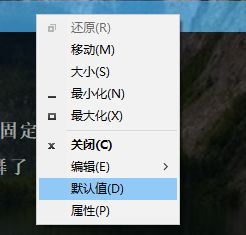
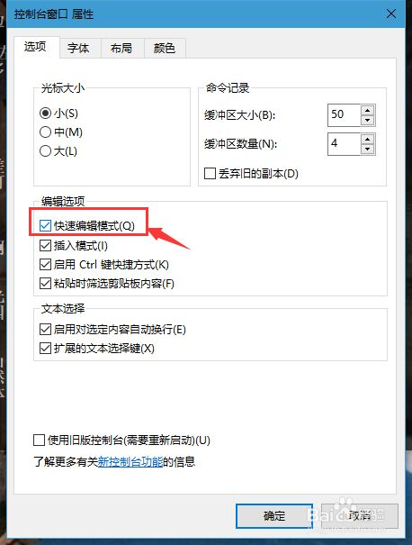

# 批处理实例

## 保存计算机信息

将计算机的时间信息、网络信息、用户信息保存到log.txt的文本文档中：

```cmd
@echo off

echo UserName:%username% > log.txt
echo. >> log.txt
Date /t >> log.txt
Time /t >> log.txt
echo. >> log.txt
tasklist >> log.txt
echo. >> log.txt
net user >> log.txt
echo. >> log.txt
ipconfig /all >> log.txt

exit
```

## 交互式程序

分别输入1、2、3得到不同的信息：ip地址、网络连接、Windows用户

```
@echo off

echo 1.ip address
echo 2.network link
echo 3.show Windows users

:main
echo Enter your option:
set /p opt=
if %opt%==1 goto one
if %opt%==2 goto two
if %opt%==3 goto three
echo Invalid option
goto main

:one
ipconfig
pause>nul
exit

:two
netstat -an
pause>nul
exit

:three
net user
pause>nul
exit
```

## 执行任务计划

执行每天上午10点整执行打开一次记事本的计划任务：

```
@echo off

schtasks /create /tn 记事本 /tr notepad.exe /sc DAILY /st 10:00

exit
```

## 执行Python脚本

```
@echo off

f:

cd f:/路径

start python 脚本.py
```

!> 若脚本里面有引入其他的脚本文件，最好在项目的根目录下运行。

## 命令行设置

在命令行中执行Python脚本有时会自动暂停，按任意键则又继续执行。根本原因在于，命令行在快速编辑模式下，无意点到文字会选中文字，自动进入标记模式，并暂停程序。

解决方法：**在CMD标题栏上右键，然后点击 `默认值`，然后在编辑选项下面，取消 `快速编辑模式`，并确认。**

!> 注意：**取消快速编辑模式下，无法直接复制和选择CMD窗口中的文字。需要在菜单选择编辑。**



