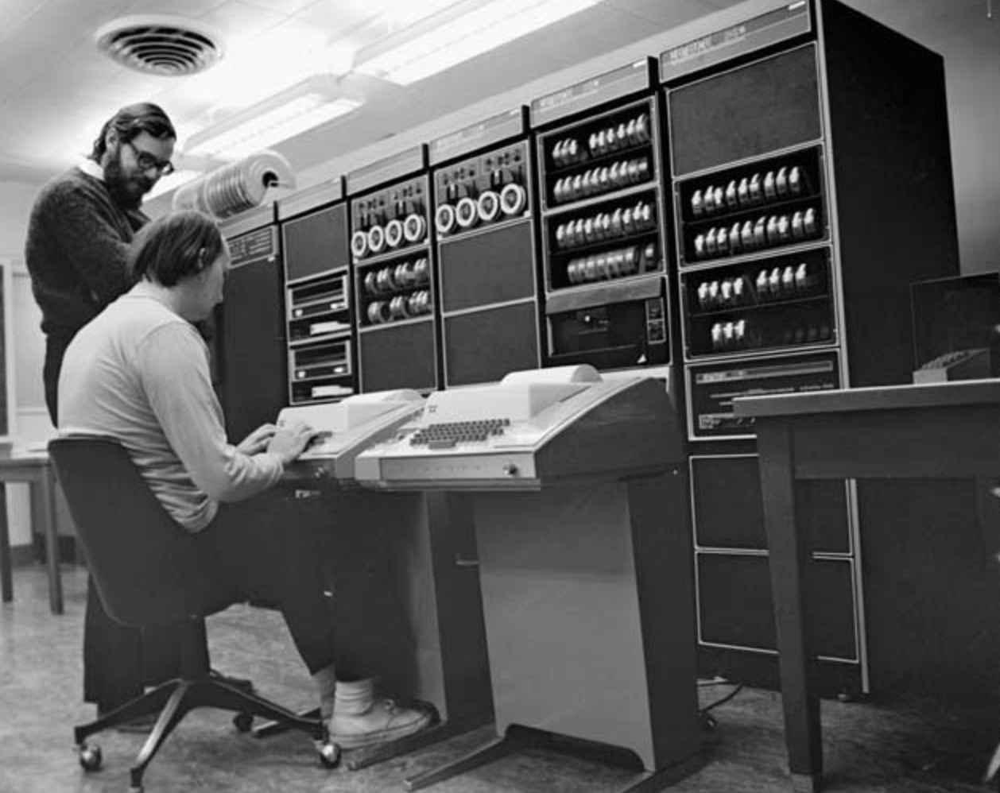

# Linux简介

只有硬件没有软件的计算机系统被称之为“裸机”，我们很难用“裸机”来完成计算机日常的工作（如存储和运算），所以必须用特定的软件来控制硬件的工作。最靠近计算机硬件的软件是系统软件，其中最为重要的就是“操作系统”。**操作系统是控制和管理整个计算机硬件和软件资源、实现资源分配和任务调配、为系统用户以及其他软件提供接口和环境的程序的集合。**

### Linux发展史

1. 1960年：IBM的System/360系列的机器有了统一的操作系统OS/360。

2. 1965年：AT&T的贝尔实验室加入GE和MIT的合作计划开始开发MULTICS。

3. 1969年：MULTICS项目失败，Ken Tompson赋闲在家，为了玩“Space Travel”游戏用汇编语言在当时已经被淘汰的PDP-7上开发了Unix。

    > 注：很难想象，Unix这么伟大的系统，居然是一个赋闲在家的程序员（关键是老婆回娘家还带上了孩子）在一台被淘汰的设备上为了玩游戏开发出来的。

4. 1970年~1971年：Ken Tompson和Dennis Ritchie用B语言在PDP-11上重写了Unics，并在Brian Kernighan的建议下将其更名为Unix。

5. 1972年~1973年：Dennis Ritchie发明了C语言来取代可移植性较差的B语言，并开启了用C语言重写Unix的工作。
6. 1974年：Unix推出了里程碑意义的第5版，几乎完全用C语言来实现。
7. 1979年：从Unix第7版开始，AT&T发布新的使用条款，将Unix私有化。
8. 1987年：Andrew S. Tanenbaum教授为了能在课堂上为学生讲解操作系统运作的细节，决定在不使用任何AT&T的源代码前提下，自行开发与Unix兼容的操作系统以避免版权上的争议，该系统被命名为Minix。

9. 1991年：Linus Torvalds就读于芬兰赫尔辛基大学期间，尝试在Minix上做一些开发工作，但因为Minix只是作为教学用途的操作系统，功能并不强大，为了方便在学校的新闻组和邮件系统中读写和下载文件，Linus编写了磁盘驱动程序和文件系统，这些东西形成了Linux系统内核的雏形。

下图是Unix操作系统家族的图谱

### Linux概述

**Linux是一个通用操作系统。**一个操作系统要负责任务调度、内存分配、处理外围设备I/O等操作。操作系统通常由内核（运行其他程序，管理像磁盘、打印机等硬件设备的核心程序）和系统程序（设备驱动、底层库、shell、服务程序等）两部分组成。

Linux内核是芬兰人Linus Torvalds开发的，于1991年9月发布。而Linux操作系统作为Internet时代的产物，它是由全世界许多开发者共同合作开发的，是一个自由的操作系统（注意自由和免费并不是同一个概念，想了解二者的差别可以[点击这里](https://www.debian.org/intro/free)）。

##### Linux系统优点

1. 通用操作系统，不跟特定的硬件绑定。
2. 用C语言编写，可移植性强，有内核编程接口。
3. 支持多用户和多任务，支持安全的分层文件系统。
4. 大量的实用程序，完善的网络功能以及强大的支持文档。
5. 可靠的安全性和良好的稳定性，对开发者更友好。

##### Linux发行版本

目前市面上较知名的发行版有：[Ubuntu](https://www.ubuntu.com/)、[Redhat](https://www.redhat.com/en)、[CentOS](https://www.centos.org/)、[Debian](https://www.debian.org/)、[Fedora](https://getfedora.org/)、SuSE、[openSUSE](https://www.opensuse.org/)、Arch Linux、SolusOS、Kail Linux（黑客专用）等。

?> 不同系列，基本指令都是一样的，只有软件的安装方式不一样。

##### Linux应用

Linux系统主要应用在服务器端、开发领域，很多程序员都觉得不懂Linux都觉得不好意思，Linux在开源社区的地位岿然不动。

**尤其是作为一个后端程序员，是必须要掌握Linux的，因为这是找工作的额门槛，不得不学习！**

### 简单总结

Unix：是一款收费的操作系统。

Mnix：是一款收费的Unix的简化版系统。

Linux：是一款开源免费、多用户、稳定持久的系统。

>  Linus Torvalds买了Mnix，用着不爽，自己写了Linux内核，后来只要是基于Linux内核的操作系统，统一称为Linux系统。

.jpg)