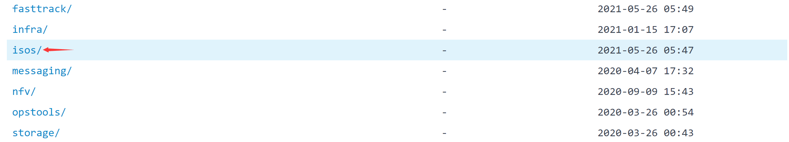
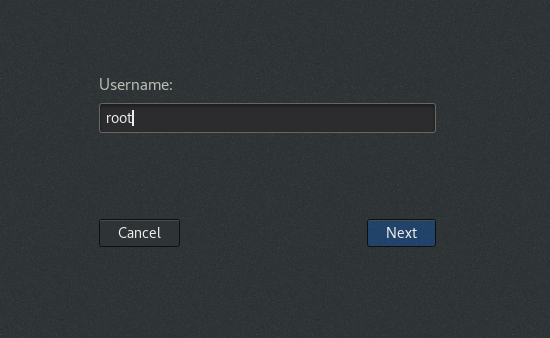

# 环境搭建

学习Linux就需要在Linux系统环境里面进行，一般常用三种方式来搭建环境：

1. 下载Linux系统ISO镜像文件，在电脑中装双系统（不推荐，占用电脑硬件资源）；
2. 下载Linux系统ISO镜像文件，在虚拟机中装系统（不推荐，占用电脑硬件资源）；
3. 直接购买Linux云服务器（推荐）

这里就不讲解电脑装双系统了，自行百度，主要讲解第2、3种方案。

### 虚拟机安装

##### 下载Linux

访问[清华大学开源软件镜像站](https://mirrors.tuna.tsinghua.edu.cn/)搜索“centos”，点击第一个

选择合适版本：

选择文件类型：

选择x86_64：

选择包含dvd文件（标准版）下载：

##### VMware虚拟机

VMware Workstation是一款功能强大的桌面[虚拟计算机](https://baike.baidu.com/item/虚拟计算机/5732003)软件，让用户可在单一的桌面上同时运行不同的操作系统。因其可在一部实体机器上模拟完整的网络环境，以及可便于携带的[虚拟机](https://baike.baidu.com/item/虚拟机)器，其更好的灵活性与先进的技术胜过了市面上其他的虚拟计算机软件。

因为官网下载较慢，VMware虚拟机可以直接在360软件管家中下载：

安装完成后打开软件：

选择“创建新的虚拟机”，选择前面我们下载好的centos镜像文件：

设置用户名、密码：

后面自定义选择安装位置，这样建立好了一个新的虚拟机，并且自动运行安装程序：

##### 账户切换

安装完成以后界面如下：其中“Linux”这个账户就是前面安装centos过程中设置的全名，如果要登录root户点击“Not listed?”：

点击Linux输入之前设置的密码，点击“Sign In”登录：

登录后界面：

点击左上角的"Actitities"就可以看到预装的一些软件了：

点击上图中红框中的命令行：**可以看到一个admin开头的命令头，这个admin就是前面设置的账户名，是一个普通权限的账户。**

点击右上关机键，点击Linux名称，点击“Log Out”角退出登录：

回到登录界面，点击“not listed?”，登录root用户（第一次进入：用户名“root”，密码“123456”）：

和上面一样，点击左上角的"Actitities"，点击命令行：**可以看到一个root开头的命令头，是最高权限的账户。**

### 云服务器

##### 购买云服务器

云服务器推荐购买阿里云，这也是国内用的最多的云服务器，真实模拟线上环境：[阿里云官网](https://www.aliyun.com/?spm=5176.8789780.J_8058803260.1.175b45b5Dy7Bh1)

点击“产品”，点击“云服务器ECS”：

点击“立即购买”：

这里就开始配置服务器的硬件了，价格越高硬件就越好，服务器的性能就越好，根据个人经济实实力来确定：

