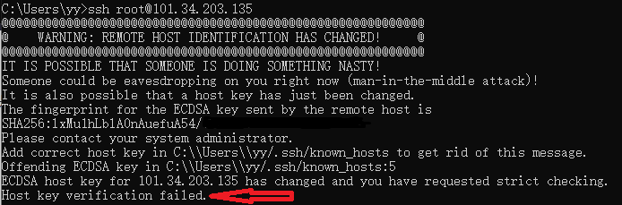
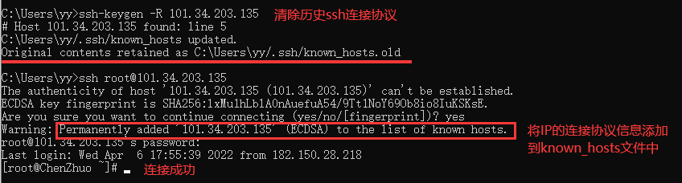
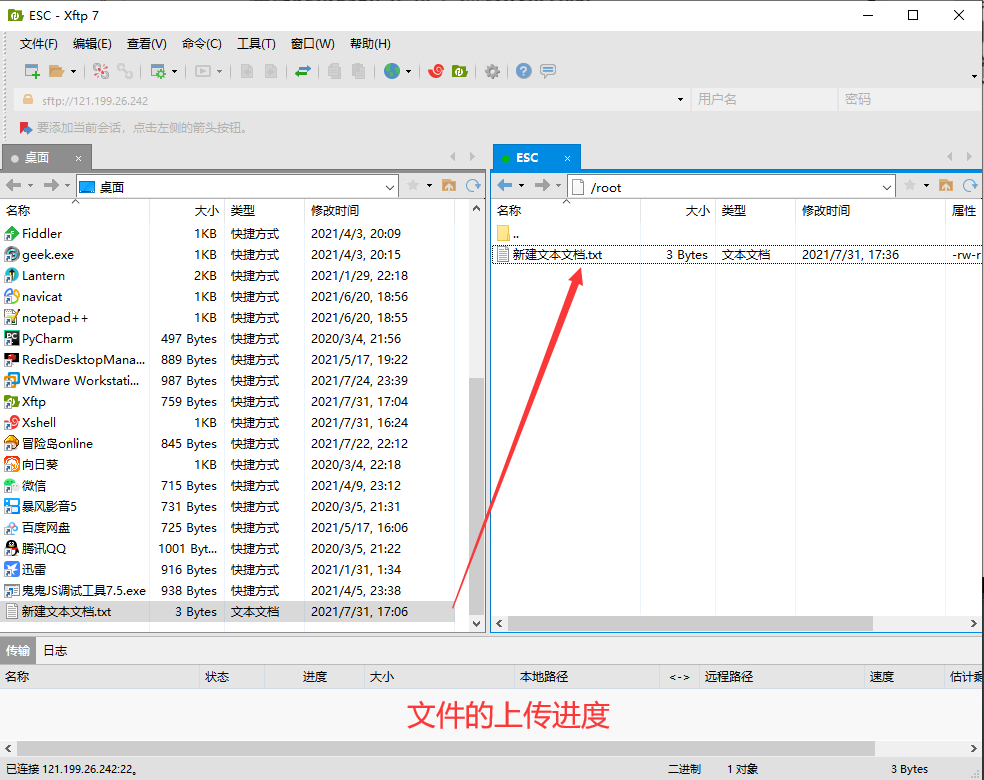
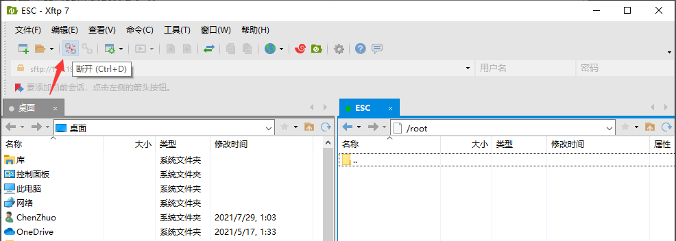

# 常用软件

我们已经购买了云服务器，并且配置好了端口。现在可以开始连接我们的服务器并进行一些操作了，连接云服务器最好使用特定的软件，可以让我们的操作更加流畅。

## Xshell

**Xshell是一个强大的安全终端模拟软件**，它支持SSH1, SSH2, 以及Microsoft Windows 平台的TELNET 协议，可以在Windows界面下用来访问远端不同系统下的服务器，从而比较好的达到远程控制终端的目的。

### 下载Xshell

下载Xshell同样可以在360软件管家中下载，即方便又快捷。


### 连接云服务器

打开Xshell，点击左上角小图标”新建“：


新建连接服务器的会话，输入定义名称，协议默认SSH，主机就是阿里云服务器的公网IP（前面实例信息上有），端口号默认22（因为使用的SSH协议），最后点击”连接“：


第一次连接会有一个主机密匙（后面可以使用密匙登录），点击”接受并保存“：


接收后我们输入用户名，就是我们购买时注册的用户"root"，点击确定：


这里我们输入前面重置后的实例密码，点击确定：


这时我们就连接上了我们的云服务器，并且在左边侧脸多了一个ECS的会话：


### 放大缩小

”Ctrl + 鼠标滚轮“可以放大和缩小字体：


### 断开云服务器

断开云服务器就很简单了，点击左上角的”断开“选项即可断开云服务器的连接：


断开后，就回到最初的界面：


## Finalshell

Finalshell这个软件也是用来连接云服务器的，也很不错，安利一下！下载地址：https://link.zhihu.com/?target=http%3A//www.hostbuf.com/downloads/finalshell_install.exe

## CMD命令行

### 连接云服务器

如果不想下载、使用Xshell软件来连接云服务器，使用命令行也是可以连接的，在命令行输入下面命令：

```
# 后面-p 22可以省略不写，因为ssh一定是用的22端口
ssh root@云服务器公网IP -p 22
```


输入重置后的实例密码（**这里输入密码是没有任何显示的，但密码是输入进去的**），点击回车，就接连接上了云服务器：


### 清除缓存文件

假如我们的**云服务器重新装了系统**，还是直接使用以前的 `ssh root@云服务器公网IP -p 22 ` 命令，可能会出现如下图的错误：



看提示信息中的.ssh最后一句提示的”主机密钥验证失败“，我们大体就能知道是ssh的密钥验证失败了。为什么会出现这样的错误呢？

**其原因就是，ssh会把你每个你访问过计算机的公钥(public key)都记录在~/.ssh/known_hosts。当下次访问相同计算机时，OpenSSH会核对公钥。如果公钥不同，OpenSSH会发出警告。现在我的云服务器重装了系统（清除了与我本地SSH连接协议相关信息），本地的SSH协议信息便失效了。SSH连接相同的ip地址时因有连接记录直接使用失效的协议信息去验证该ip服务器，所以会报错。**

解决办法也很简单，就是清除之前与服务器的known_hosts里旧缓存文件，然后再次通过 命令进行连接：

```
# 清除known_hosts里旧缓存文件
ssh-keygen -R 服务器公网IP

# 再次连接云服务器
ssh root@云服务器公网IP -p 22
```



## Xftp

**Xftp是一个功能强大的SFTP、FTP 文件传输软件。**使用了 Xftp 以后，MS Windows 用户能安全地在 UNIX/Linux 和 Windows PC 之间传输文件。

### 下载Xftp

下载Xftp同样可以在360软件管家中下载，即方便又快捷。


### 连接云服务器

打开Xftp，显示的是我们本地桌面的文件，同样点击左上角的”新建“按钮：


里面填写的内容和Xshell一模一样，这里不再赘述：


同样的输入用户名和密码：


连接上了以后，左边显示的就是我们本地window系统中文件，右边显示的就是云服务器Linux系统中文件：


### 上传文件

这里我们将本地的一个”新建文本文档.txt“拖拽到右边，就完成了文件的上传：



### 配套使用

细心的人可能已经发现，这两个软件的工具栏都有对方的图标，这也就意味着，这两个软是可以配套使用的：


### 查看文件

现在我们通过去查看Xshell去查看我们刚刚上传的文件。点击Xftp中Xshell图标，启动Xshell，输入命令 `ls` 即可：


### 删除文件

现在我们同Xftp将上传的文件删除：


再通过Xshell去查看，就已经没有文件存在了：


### 断开云服务器

断开云服务器同样和Xshell一样，点击左上角断开按钮即可：

