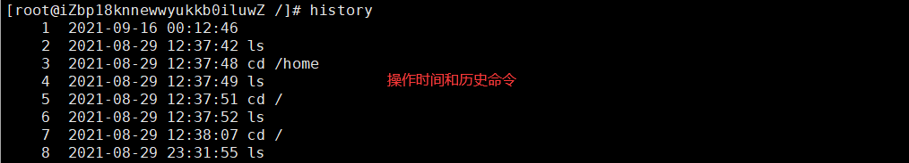
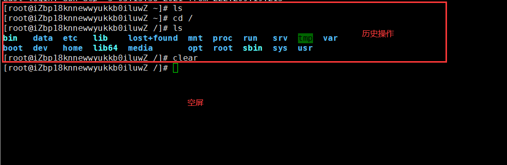
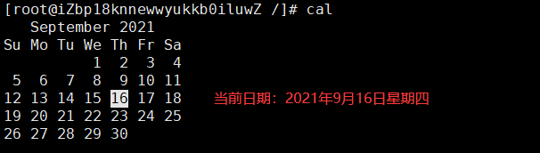
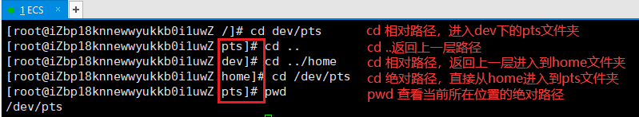

# 基本命令

> **说明**：本文中对Linux命令的讲解都是基于名为CentOS的Linux发行版本，不同的Linux发行版本在Shell命令和工具程序上会有一些差别，但是这些差别是很小的。

**首先我们要知道一点，Linux系统当中没有输出错误就代表执行成功。**

**其次就是，所有Linux命令的参数都可以组合使用。**

**最后确保Linux命令是在英文模式下输入，而且尽量不要使用小键盘（数字键盘）。**

## Linux快捷键

Linux命令行中常用快捷键：

| 快捷键     | 功能说明                                       |
| ---------- | ---------------------------------------------- |
| **Tab**    | 自动补全命令或路径                             |
| Ctrl+A     | 将光标移动到命令行行首                         |
| Ctrl+E     | 将光标移动到命令行行尾                         |
| Ctrl+F     | 将光标向右移动一个字符                         |
| Ctrl+B     | 将光标向左移动一个字符                         |
| Ctrl+K     | 剪切从光标到行尾的字符                         |
| Ctrl+U     | 剪切从光标到行首的字符                         |
| Ctrl+W     | 剪切光标前面的一个单词                         |
| Ctrl+Y     | 复制剪切命名剪切的内容                         |
| **Ctrl+C** | 中断正在执行的任务或者恢复输入没有使用的命令行 |
| Ctrl+H     | 删除光标前面的一个字符                         |
| **Ctrl+D** | 退出当前命令行                                 |
| Ctrl+R     | 搜索历史命令                                   |
| Ctrl+G     | 退出历史命令搜索                               |
| **Ctrl+L** | 清除屏幕上所有内容在屏幕的最上方开启一个新行   |
| **Ctrl+S** | 锁定终端使之暂时无法输入内容                   |
| **Ctrl+Q** | 退出终端锁定                                   |
| Ctrl+Z     | 将正在终端执行的任务停下来放到后台             |
| !!         | 执行上一条命令                                 |
| !数字      | 执行数字对应的历史命令                         |
| !字母      | 执行最近的以字母打头的命令                     |
| !$ / Esc+. | 获得上一条命令最后一个参数                     |
| Esc+B      | 移动到当前单词的开头                           |
| Esc+F      | 移动到当前单词的结尾                           |

## 常用命令

下面将会列举一些在操作Linux系统当中使用的高频基础命令。

### 功能|位置

查询命令执行什么功能 - **whatis**


查询命令手册 - **man**

?> 进入可以看到对指定命令的解释，按Q键退出阅读。


| 手册中的标题 | 功能说明                                                     |
| ------------ | ------------------------------------------------------------ |
| NAME         | 命令的说明和介绍                                             |
| SYNOPSIS     | 使用该命令的基本语法                                         |
| DESCRIPTION  | 使用该命令的详细描述，各个参数的作用，有时候这些信息会出现在OPTIONS中 |
| OPTIONS      | 命令相关参数选项的说明                                       |
| EXAMPLES     | 使用该命令的参考例子                                         |
| EXIT STATUS  | 命令结束的退出状态码，通常0表示成功执行                      |
| SEE ALSO     | 和命令相关的其他命令或信息                                   |
| BUGS         | 和命令相关的缺陷的描述                                       |
| AUTHOR       | 该命令的作者介绍                                             |


查询与命令及有关文件的所在位置 - **whereis**

- -b 只查找二进制文件。
- -m 只查找说明文件。
- -s 只查找原始代码文件。


查看命令的所在位置 -  **which**


### 历史|清屏

查看历史命令 - **history**（-c参数可以清除历史命令）



清空屏幕上的内容 - **clear**

?> 清空操作并不是删除了之前的操作痕迹，而是向下腾出一块空屏，往上滚动还是可以看到之前的操作痕迹，作用和快捷键 Ctrl+L 一样。



### 日期|时间

查看日期 - **cal**



查看日期和时间 - **date**


### 查看|切换

查看目录内容 - **ls**

- `-a`：显示全部文件（包括以点开头的隐藏文件）和目录。
- `-l`：以长格式查看文件和目录（直接输入命令 `ll` 功能一样）。
- `-R`：遇到目录要进行递归展开（继续列出目录下面的文件和目录）。
- `-d`：只列出目录，不列出其他内容。
- `-S`：按大小排序。
- `-t`：按时间排序。
- 命令后面可以指定路径，查看路径里面的目录内容。


以树状图列出目录下的内容 - **tree**

- `-a`：显示所有文件和目录。
- `-C`：在文件和目录清单加上色彩，便于区分各种类型。
- `-d`：只显示目录名称而非内容。
- `-D`：列出文件或目录的更改时间。
- `-f`：在每个文件或目录之前，显示完整的相对路径名称。
- `-g`：列出文件或目录的所属群组名称，没有对应的名称时，则显示群组识别码。
- `-p`：列出权限标示。
- `-s`：列出文件或目录大小。
- `-t`：用文件和目录的更改时间排序。
- `-u`：列出文件或目录的拥有者名称，没有对应的名称时，则显示用户识别码。


**绝对路径：以根目录开头的全部路径，即 `/` 开头的全部路径。**

**相对路径：以当前路径作为起点的参照路径。**

查看当前位置的绝对路径 - **pwd**


切换和查看当前工作目录 - **cd 绝对路径/相对路径**

- `cd`：快速切到家目录。
- `cd /`：快速到根目录。
- `cd ..`：返回上一层路径。

?> `cd` 命令后面可以跟相对路径或绝对路径来切换到指定的目录， 且绝对路径在任何地方都可切换，而相对路径只能在当前路径下进行切换。



> 在目录切换的过程中，命令前方显示的名称也在不断变化，它显示的是当前路径的目录名称。

### grep|管道

按指定的字符串内容查找文件 - **grep 字符串 文件列表**

- 字符串：被查找的字符串

- 文件列表：被匹配的所有文件

```
在当前目录下查找文件内容当中含有“啦”字，且文件后缀名为txt的文件
grep 啦 *txt
```


在Linux当中有一个符号经常被使用就是管道符 - **|**

使用格式：`指令1 | 指令2`

作用：指令1的输出作为指令2的输入，指令2的输出显示到屏幕中。

```
# 查看当前Linux系统安装的软件列表
rpm -aq

# 查寻单个安装的软件
rpm -aq | grep 软件名 

# 显示所有进程
ps -aux

# 只显示MySQL进程
ps -aux | grep mysql

# 查看网络和端口使用情况
netstat -lnp

# 查看包含80端口和网络使用情况
netstat -lnp | grep 80
```

## 自定义命令

### 起别名

起别名格式 - **alias 别名='原命令'**

在Linux当中我们可以通过起别名的方式来自定义命令。例如，我经常通过下面命令来启动服务：

```
/tradeease/HQ-install/hyperic-hq-agent-5.8.6/bin/hq-agent.sh start
```

可以看到这样的命令不仅很长，还很容易输入错误，我们就可以自定义一个简短的命令 `starthq` 来达到和上面的命令同样的效果。

方法一：可以直接执行下面的命令起别名，但这这种方法只能适用于本次登录有效。

```
alias starthq='/tradeease/HQ-install/hyperic-hq-agent-5.8.6/bin/hq-agent.sh start'
```


方法二：修改文件起别名，此设置永久有效。

首先，我们需要修改root文件夹下面的 `.bashrc` 文件：

```
vim /root/.bashrc
```


看到里面其实已经有其他的自定义的命令，我们就可以依葫芦画瓢，在下面定义我们的命令：

```
alias starthq='/tradeease/HQ-install/hyperic-hq-agent-5.8.6/bin/hq-agent.sh start'
```


修改后保存退出，再执行 `starthq` 命令就能达到和之前长命令同样的效果了。

### 显示别名

显示别名的内容 - **alias 别名**

可以看到，不论是 `/root/.bashrc` 文件中定义的别名，还是通过 `alias` 定义的别名都能显示其内容：


### 删除别名

删除别名 - **unalias 别名**

删除全部别名 - **unalias -a**

删除别名后，再次使用该别名，就会提示”找不到该别名“：


