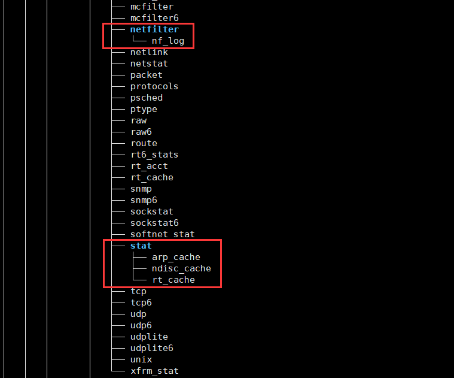

# 基础命令（基本操作）

> **说明**：本文中对Linux命令的讲解都是基于名为CentOS的Linux发行版本，我自己使用的是阿里云服务器，系统版本为CentOS  8.4 64位。不同的Linux发行版本在Shell命令和工具程序上会有一些差别，但是这些差别是很小的。

**首先我们要知道一点，Linux系统当中没有输出错误就代表执行成功。**

**其次就是，所有Linux命令的参数都可以组合使用。**

**最后确保Linux命令是在英文模式下输入，而且尽量不要使用小键盘（数字键盘）。**

## 基本操作

下面将会列举一些在操作Linux系统当中使用的高频基础命令。

### 功能|位置

查询一个命令执行什么功能 - **whatis**

查询一个命令所在什么位置 - **whereis**

- -b 只查找二进制文件。
- -m 只查找说明文件。
- -s 只查找原始代码文件。

### 历史|清屏

查看历史命令 - **history**（-c参数可以清除历史命令）

清除屏幕上显示的内容 - **clear**

?> 清屏操作并不是删除了之前的操作痕迹，而是向下腾出一块空屏，往上滚动还是可以看到之前的操作痕迹。

### 日期|时间

查看日期 - **cal**

查看日期和时间 - **date**

### 查看|切换

查看目录内容 - **ls**

- `-a`：显示全部文件（包括以点开头的隐藏文件）和目录。
- `-l`：以长格式查看文件和目录（直接输入命令 `ll` 功能一样）。
- `-R`：遇到目录要进行递归展开（继续列出目录下面的文件和目录）。
- `-d`：只列出目录，不列出其他内容。
- `-S` / `-t`：按大小/时间排序。

以树状图列出目录下的内容 - **tree**

- `-a` 显示所有文件和目录。
- `-C` 在文件和目录清单加上色彩，便于区分各种类型。
- `-d` 只显示目录名称而非内容。
- `-D` 列出文件或目录的更改时间。
- `-f` 在每个文件或目录之前，显示完整的相对路径名称。
- `-g` 列出文件或目录的所属群组名称，没有对应的名称时，则显示群组识别码。
- `-p` 列出权限标示。
- `-s` 列出文件或目录大小。
- `-t` 用文件和目录的更改时间排序。
- `-u` 列出文件或目录的拥有者名称，没有对应的名称时，则显示用户识别码。

切换和查看当前工作目录 - **cd** / **pwd**。

- `cd`：快速切到家目录。
- `cd /`：快速到根目录。

绝对路径：以根目录开头的全部路径，即 `/` 开头的全部路径。

相对路径：以当前路径作为参照的全部路径。

> **`cd` 命令后面可以跟相对路径或绝对路径来切换到指定的目录， 且绝对路径在任何地方都可切换，而相对路径只能在当前路径下进行切换。**

返回上层：返回上一层路径，使用 `cd ..` 命令。

当前路径：查看当前位置绝对路径，使用 `pwd` 命令。

> 在目录切换的过程中，命令前方显示的名称也在不断变化，它显示的是当前路径的目录名称。

