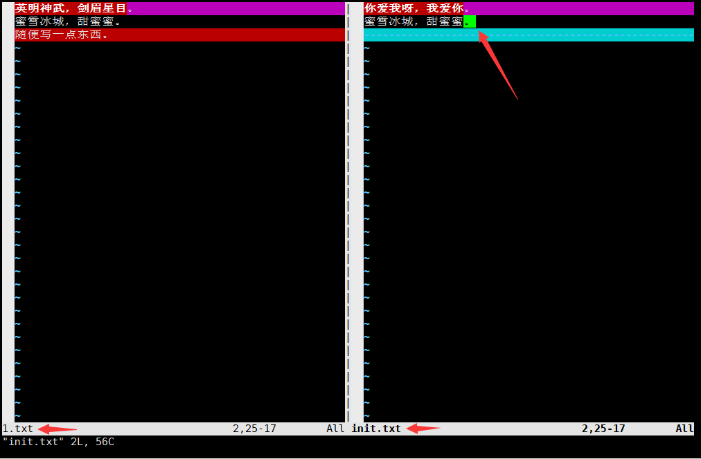
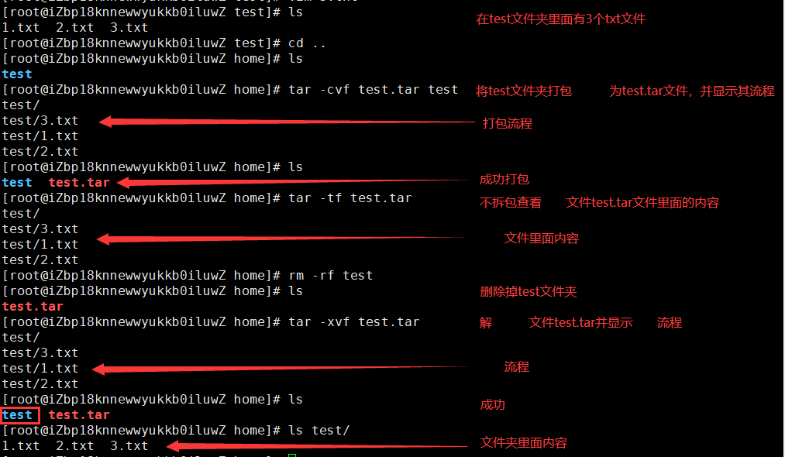

# 基础命令（文件目录）

> **说明**：本文中对Linux命令的讲解都是基于名为CentOS的Linux发行版本，我自己使用的是阿里云服务器，系统版本为CentOS  8.4 64位。不同的Linux发行版本在Shell命令和工具程序上会有一些差别，但是这些差别是很小的。

**首先我们要知道一点，Linux系统当中没有输出错误就代表执行成功。**

**其次就是，所有Linux命令的参数都可以组合使用。**

**最后确保Linux命令是在英文模式下输入，而且尽量不要使用小键盘（数字键盘）。**

## 常用命令

### 查看|切换

查看目录内容 - **ls**

- `-a`：显示全部文件（包括以点开头的隐藏文件）和目录。
- `-l`：以长格式查看文件和目录（直接输入命令 `ll` 功能一样）。
- `-R`：遇到目录要进行递归展开（继续列出目录下面的文件和目录）。
- `-d`：只列出目录，不列出其他内容。
- `-S` / `-t`：按大小/时间排序。


以树状图列出目录下的内容 - **tree**

- `-a` 显示所有文件和目录。
- `-C` 在文件和目录清单加上色彩，便于区分各种类型。
- `-d` 只显示目录名称而非内容。
- `-D` 列出文件或目录的更改时间。
- `-f` 在每个文件或目录之前，显示完整的相对路径名称。
- `-g` 列出文件或目录的所属群组名称，没有对应的名称时，则显示群组识别码。
- `-p` 列出权限标示。
- `-s` 列出文件或目录大小。
- `-t` 用文件和目录的更改时间排序。
- `-u` 列出文件或目录的拥有者名称，没有对应的名称时，则显示用户识别码。


切换和查看当前工作目录 - **cd** / **pwd**。

- `cd`：快速切到家目录。
- `cd /`：快速到根目录。

绝对路径：以根目录开头的全部路径，即 `/` 开头的全部路径。

相对路径：以当前路径作为参照的全部路径。

> **`cd` 命令后面可以跟相对路径或绝对路径来切换到指定的目录， 且绝对路径在任何地方都可切换，而相对路径只能在当前路径下进行切换。**

返回上层：返回上一层路径，使用 `cd ..` 命令。

当前路径：查看当前位置绝对路径，使用 `pwd` 命令。


> 在目录切换的过程中，命令前方显示的名称也在不断变化，它显示的是当前路径的目录名称。

### 创建|删除

创建文件 - **touch**

1. 命名规则：文件名的最大长度与文件系统类型有关，一般情况下，文件名不应该超过255个字符，虽然绝大多数的字符都可以用于文件名，但是最好使用英文大小写字母、数字、下划线、点这样的符号。文件名中虽然可以使用空格，但应该尽可能避免使用空格，否则在输入文件名时需要用将文件名放在双引号中或者通过`\`对空格进行转义。
2. 扩展名：在Linux系统下文件的扩展名是可选的，但是使用扩展名有助于对文件内容的理解。有些应用程序要通过扩展名来识别文件，但是更多的应用程序并不依赖文件的扩展名，就像`file`命令在识别文件时并不是依据扩展名来判定文件的类型。
3. 隐藏文件：以点开头的文件在Linux系统中是隐藏文件（不可见文件）。

```
touch files：在当前路径下创建空白文件files
touch program files：在当前路径下创建空白文件program和文件files
touch "program files"：在当前路径下创建文件program files（不建议文件命名包含空格）
```


创建目录 - **mkdir**

- `-p`：当目录不存在时，自动创建目录（递归创建）。

```
mkdir tmp：创建一个名称为tmp的新文件夹
mkdir tmp/Japan：创建一个名称为Japan的新文件夹（tmp文件夹必须存在）
```


```
# 递归创建
mkdir -p tmp1/USA：创建一个名称为USA的新文件夹（tmp1文件夹可以不存在）
```


```
# 多目录创建
mkdir tmp/Korea tmp1/China：同时创建名为USA和China的文件夹（tmp文件夹和tmp1文件夹必须存在必须存在）
```


```
# 递归多目录创建
mkdir -p tmp2/Union tmp3/Russia：同时创建名为Union和Russia的文件夹（tmp2文件夹和tmp3文件夹可以不存在）
```


删除**空**目录 -  **rmdir**

- `-p`：递归删除多个空目录。

```
rmdir /tmp/Japan：删除Japan目录（只能删除空目录）
```


如果删除的目录里面还有一层目录，不管里面这层目录是否为空目录都删除不了，并且会提示：当前目录不为空。


```
rmdir -p tmp/Korea/：删除tmp目录（递归删除多级空目录）
```


删除文件或目录 - **rm**

- `-f`：就是 force 的意思，忽略不存在的文件，不会出现警告信息。
- `-i`：互动模式，在删除前会询问使用者是否动作。
- `-r`：递归删除啊！最常用在目录的删除了！这是非常危险的选项！！！


!> `rm -rf /*` 递归强制删除根目录下的所有文件，跑路命令，切勿使用！虚拟机上可以玩玩。


### 复制|移动|重命名

复制文件或目录 - **cp**

- 不加参数直接只能复制文件。

- `-r`：复制目录。

```
cp -r tmp1/China tmp2：将tmp1目录下的China目录复制到root目录下
```


移动文件或目录 - **mv**

- `-b`：当目标文件或目录存在时，在执行覆盖前，会为其创建一个备份。
- `-i`：如果指定移动的源目录或文件与目标的目录或文件同名，则会先询问是否覆盖旧文件，输入 y 表示直接覆盖，输入 n 表示取消该操作。
- `-f`：如果指定移动的源目录或文件与目标的目录或文件同名，不会询问，直接覆盖旧文件。
- `-n`：不要覆盖任何已存在的文件或目录。
- `-u`：当源文件比目标文件新或者目标文件不存在时，才执行移动操作。

```
mv tmp3/Russia tmp2：将tmp3目录下的Russia目录移动到tmp2目录下
```


重命名可以直接使用 `cp` 或 `mv` 命令来完成：

```
cp -r tmp1/USA tmp3/Japan：将USA目录复制到tmp3目录下并更名为Japan
mv tmp3 tmp：在同一文件夹下将tmp3文件夹更名为tmp
```


## 基础属性

### 文件分类

**linux系统不同类型文件会有不同的颜色**，如下图：


```
白色：表示普通文件
蓝色：表示目录
绿色：表示可执行文件
红色：表示压缩文件
浅蓝色：链接文件
红色闪烁：表示链接的文件有问题
黄色：表示设备文件
灰色：表示其他文件
```

### 文件属性

**前面讲过，Linux系统是一个稳定、安全的多用户系统。Linux系统对不同的用户访问同一文件（包括目录文件）的权限做了不同的规定。**

我们可以使用 `ll` 或者 `ls –l` 命令来显示一个文件的属性以及文件所属的用户和组，如：


每个文件的属性由左边第一部分的10个字符来确定（如下图）：


第一个字符代表目录、文件或链接文件等等：

- [ d ]代表目录；
- [ - ]代表文件；
- [ l ]代表链接文档 ( link file )，同时会显示指向的文件；
- [ b ]代表装置文件里面的可供储存的接口设备 ( 可随机存取装置 )；
- [ c ]代表装置文件里面的串行端口设备，例如键盘、鼠标 ( 一次性读取装置 )；

后面九个字符中，每三个字符为一组，且固定为『rwx』组合：

- [ r ]代表可读(read)；
- [ w ]代表可写(write)；
- [ x ]代表可执行(execute)；
- [ - ]代表没有该权限；
- 第1、4、7位表示读权限，用"r"字符表示，没有读权限，用"-"字符表示；
- 第2、5、8位表示写权限，用"w"字符表示，没有写权限，用"-"字符表示；
- 第3、6、9位表示执行权限，用"x"字符表示，没有执行权限，用"-"字符表示；

后面九个字符中，每三个字符为一组，代表不同的属主、属组、其他用户：

- 第1-3位确定属主（该文件的所有者）拥有该文件的权限；
- 第4-6位确定属组（所有者的同组用户）拥有该文件的权限；
- 第7-9位确定其他用户拥有该文件的权限；

**在Linux系统中，用户是按组分类的，一个用户属于一个或多个组。**

**每个文件都有一个特定的所有者，也就是对该文件具有所有权的用户，文件所有者以外的用户又可以分为"文件所有者的同组用户"和"其他用户"。**因此，Linux系统按文件所有者、文件所有者同组用户和其他用户来规定了不同的文件访问权限。

### 属性更改

更改文件属主 - **chown**

- `-R`：递归更改文件属主，更改某个目录文件的属主时，该目录下的所有文件的属主都会更改。

```
chown [–R] 属主名 文件名

# 只有管理员可以改变文件的所有者，所有者必须是存在的用户
chown root /tmp/a.file：将a文件的所有者改为root（不管是谁创建的）
```

更改文件属组 - **chgrp**

- `-R`：递归更改文件属组，更改某个目录文件的属组时，该目录下的所有文件的属组都会更改。

```
chgrp [-R] 属组名 文件名

# 只有管理员可以改变文件的所属组，所有者必须是存在的所属组
chgrp brother /tmp/a.file：将a文件的所属组更改为brother（不管是谁创建的）
```

更改文件权限 - **chmod**

- `-R`：递归更改文件权限，更改某个目录文件的权限时，该目录下的所有文件的权限都会更改。

```
chmod [-R] 数字/字符 文件或目录
```

目前最常用的就是通过数字更改文件的权限，权限数字对应关系：

```
读 —— r —— 4    写 —— w —— 2    执行 —— x —— 1  无权限 —— - —— 0

权限数字相加：
--- —— 0    --x —— 1    -w- —— 2    -wx —— 3
r-- —— 4    r-x —— 5    rw- —— 6    rwx —— 7

三个权限字符为一组：
--------- —— 000
r-x-wxrwx —— 567
...
rw-rw-rw- —— 666
rwxrwxrwx —— 777
```


虽然改变了tmp1文件夹权限，但因为没有加上参数R，tmp1文件夹下的文件和文件夹的权限保持不变。


另一种修改文件权限的方式就是通过字符进行修改：

```
chmod u+x Japan.list：给Japan.list文件的u（所有者）加x（执行权限）
chmod g+w Japan.list：给Japan.list文件的g（所属组）加w（写权限）
chmod o-r Japan.list：给Japan.list文件的o（其他人）减r（读权限）
chomd g=rwx Japan.list：给Japan.list文件的g（所属组）设置rwx（所有权限）
```

?> `umask -S`：显示创建文件夹的默认权限rwxr-xr-x

!> 注意：更改文件的权限只能是文件的所有者（文件创建者）或者是root（超级管理员）。

## 文件内容

### 内容新增

内容新增 - **echo**

- `-e`：支持反斜线控制的字符转换（具体参见表 1）
- `-n`：取消输出后行末的换行符号（内容输出后不换行）

| 控制字符 | 作 用                                                        |
| -------- | ------------------------------------------------------------ |
| \\       | 输出\本身                                                    |
| \a       | 输出警告音                                                   |
| \b       | 退格键，也就是向左删除键                                     |
| \c       | 取消输出行末的换行符。和“-n”选项一致                         |
| \e       | Esc键                                                        |
| \f       | 换页符                                                       |
| \n       | 换行符                                                       |
| \r       | 回车键                                                       |
| \t       | 制表符，也就是Tab键                                          |
| \v       | 垂直制表符                                                   |
| \Onnn    | 按照八进制 ASCII 码表输出字符。其中 0 为数字 0，nnn 是三位八进制数 |
| \xhh     | 按照十六进制 ASCH 码表输出字符。其中 hh 是两位十六进制数     |


### 内容查看

Linux中有许多查看文件内容的命令，根据使用场景选择合适的命令：

从第一行开始显示文件内容 - **cat**

- `-n`：列印出行号，连同空白行也会有行号。


自带行号从第一行开始显示文件内容 - **nl**


分页显示文件内容 - **more**

- 空格键或F键，向下翻页；Enter键下翻一行；q键退出


分页显示文件内容 - **less**

- 上下键上下翻一行；PageUp键向上翻页；PageDown键向下翻页；q键退出


查看文件内容开始几行 - **head**

- `-n`：后面接数字，代表显示几行的意思！


查看文件内容结尾几行 - **tail**

- `-n`：后面接数字，代表显示几行的意思！


### 内容查找

使用在 `less` 命令里面查找字符串 - **/字符串**或**\?字符串**

- “/字符串”代表查找顺序从上到下；“?字符串”代表查找顺序从下到上
- n键，查找下一个字符串；N键，查找上一个字符串


## Vim编辑器

### Vim简介

#### Vi与Vim

**Vi 是Unix及Linux系统下自带的功能齐全的标准编辑器，相当于Windows系统中的记事本一样。**

**Vim 是从 Vi 发展出来的一个文本编辑器，可以当作 Vi 的升级版本。**它提供了许多新的特性：

1. 代码补完、语法加亮、编译及错误跳转等方便编程的功能特别丰富，在程序员中被广泛使用，可以说是程序开发者的一项很好用的工具。
2. 多级撤销，可以无限制的撤消上一步操作。
3. 易用性，Vi只能运行于unix中，而Vim不仅可以运行于unix，windows ，mac等多操作平台。
4. 对vi的完全兼容，某些情况下，你可以把vim当成vi来使用。

#### Vim安装

所有的 Unix Like 系统都会内建 Vi 编辑器，也就是说 Linux 自带 Vi 编辑器，Vim是增强版的编辑器，需要安装才能使用。

Vim 的官方网站 (http://www.vim.org) 表示自己是一个程序开发工具而不是文字处理软件。

```
yum install vim
```

#### 键盘图


### 三种使用模式

vim编辑器有三种使用模式，分别是**命令模式（Command mode）**，**输入模式（Insert mode）**和**底线命令模式（Last line mode）**。

#### 命令模式

**在命令模式下，用户可以执行最基本的命令。**用户启动 vim，便进入了命令模式，例如：vim init.txt：打开init.txt，就进入命令模式。**此状态下敲击键盘动作会被 Vim 识别为命令，而非输入字符。比如我们此时按下i，并不会输入一个字符，i被当作了一个命令。**以下是常用的几个命令：

- **h 或 向左箭头键(←)** 光标向左移动一个字符
- **j 或 向下箭头键(↓)** 光标向下移动一个字符
- **k 或 向上箭头键(↑)** 光标向上移动一个字符
- **l 或 向右箭头键(→)** 光标向右移动一个字符
- **i** 在光标所在处切换到输入模式。
- **x** 删除当前光标所在处的字符。
- **:** 切换到底线命令模式，以在最底一行输入命令。
- **gg** 快速切换到第一行的行首。
- **ngg** 快速切换到指定行的行首。
- **G** 快速切换到最后一行的行首。
- **^** 快速切换到该行行首。
- **$** 快速切换到该行行尾。
- **dd** 删除光标所在行。
- **ndd** 删除光标下n行，包含光标所在行。
- **yy** 复制光标所在行。
- **nyy** 复制光标下n行，包含光标所在行。
- **p** 粘贴复制的内容。
- **np** 复制几次。
- **n** 光标向下移动 n 行(常用)。
- **u** 撤销操作。
- **ctrl + f** 下一页  forward(pagedown键)。
- **ctrl + b** 上一页  backward(pageup键)。


?> 启动 vim 可以指定文件名来打开一个文件，如果没有指定文件名，也可以在保存的时候指定文件名。

#### 输入模式

**在命令模式下按下 i 就进入了输入模式，输入模式下可以对文件内容进行编辑。**在输入模式中，可以使用以下按键：

- **字符按键以及Shift组合**，输入字符。
- **ENTER**，回车键，换行。
- **BACK SPACE**，退格键，删除光标前一个字符。
- **DEL**，删除键，删除光标后一个字符。
- **方向键**，在文本中移动光标。
- **HOME**/**END**，移动光标到行首/行尾。
- **Page Up**/**Page Down**，上/下翻页。
- **Insert**，切换光标为输入/替换模式，光标将变成竖线/下划线。
- **ESC**，退出输入模式，切换到命令模式。


#### 底线命令模式

**在命令模式下按 : 就进入了底线命令模式，基本的命令带有英文冒号**：

- **:q** 退出Vim
- **:w** 保存文件
- **:wq** 保存文件并退出Vim
- **:q!** 不保存文件并退出Vim
- **:set nu** 就会显示行号
- **:set nonu** 取消显示行号
- **:n** 快速跳到n行
- **:/字符串** 查找含有该字符串的内容（按n/N查找下/上一个）
- **:%s/ftp/ym/g** 将全文的ftp替换为ym
- **:1000,1002d** 删除1000行到1002行
- **:r /etc/issue** 将issue文件的内容，导入当前文件中
- **:r !date** 将当前时间导入当前文件中
- 按ESC键可随时退出底线命令模式


?> 非法编辑退出vi的时候，会产生一个后缀名.swp 的交换文件，只要有这个文件存在, 那么打开这个文件的时候就会有提示，不想要这个提示，删除这个文件即可。

#### 关系图谱

简单的说，我们可以将这三个模式想成底下的图标来表示：


### 高级技巧

#### 文件比较

vim加上 `-d` 参数还可以比较多个文件的内容，终端屏幕也会被分为两部分，左边第一个文件，右边第二个文件：

```
[root ~]# vim -d 文件1 文件2
```


#### 切换窗口

按下CTRL+w键，再按h键既是跳到左边的窗口

按下CTRL+w键，再按l键既是跳到右边的窗口

按下CTRL+w键，再按j键既是跳到下边的窗口

按下CTRL+w键，再按k键既是跳到上边的窗口


按下两次CTRL+w键，就可以实现编辑窗口的切换



?> 在一个窗口中执行退出操作只会关闭对应的窗口，其他的窗口继续保留。

#### 打开多个文件

```
[root ~]# vim 1.txt init.txt
```

启动vim后只有一个窗口显示的是1.txt，可以在末行模式中输入`ls`查看到打开的两个文件：


在底线命令模式中输入 `:b <num>` 来显示另一个文件，例如可以用 `:b 2` 将init.txt显示出来：


#### 窗口拆分

继续上面的操作，在末行模式中输入 `:sp` 或 `:vs` 可以实现对窗口的水平或垂直拆分，这样我们就可以同时打开多个编辑窗口：


按下两次CTRL+w键，切换到下面的窗口：


在底线命令模式中输入 `:b <num>` 来显示另一个文件，例如可以用 `:b 1` 将1.txt显示出来：


#### 窗口退出

`:wqa` 或 `:wqall`：保存所有修改过的缓冲区并退出Vim。

`:qa!` 或 `:qall!`：强制退出所有打开的Vim窗口，不保存任何修改的内容。

## 压缩解压

### zip格式

将文件或目录压缩为zip格式 - **zip 压缩文件.zip 文件或目录名称**


将zip格式的文件解压 - **unzip 压缩文件.zip**


### gzip格式

将文件压缩为gzip格式 - **gzip 文件名称**


将gzip格式的文件解压 - **gunzip 文件名称.gz**


!> gzip格式不能压缩文件夹，且在压缩或解压后均不会保留源文件。

### bzip2格式

bzip2格式文件的压缩和解压方式和gzip格式完全一样。

### tar打包

在Linux当中常见的压缩格式：`.zip`、`.tgz`、`.tbz`。

前面提到，gzip格式、bzip2格式不能对文件夹进行压缩，如果我们使用tar打包命令将文件夹打包为一个文件，就可以进行压缩了。

?> tar常规打包不会对内容进行压缩，反而还会变大。

打包命令 - **tar 参数 打包文件 要打包文件**

- **-c** 打包
- **-x** 拆包
- **-t** 不拆包，查看内容
- **-f** 指定文件
- **-v** 查看过程
- **-z** 使用gzip压缩解压
- **-j** 使用bzip2压缩解压

```
常规打包解包：
tar -cvf test.tar test 将test文件夹打包为test.tar文件
tar -tf test.tar       不拆包查看test.tar文件里面的文件
tar -xvf test.tar      将test.tar文件解包

使用gzip压缩解压：
tar -zcvf test.tgz test 使用gzip方式将test文件夹打包并压缩为test.tgz文件
tar -zxvf test.tgz      使用gzip方式将test.tgz文件解压缩解包

使用bzip2压缩解压：
tar -jcvf test.tbz test 使用bzip2方式将test文件夹打包并压缩为test.tbz文件
tar -jxvf test.tbz      使用bzip2方式将test.tbz文件解压缩解包
```



