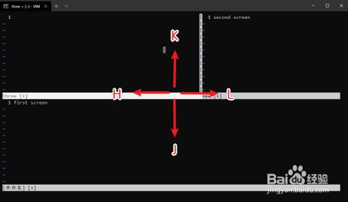
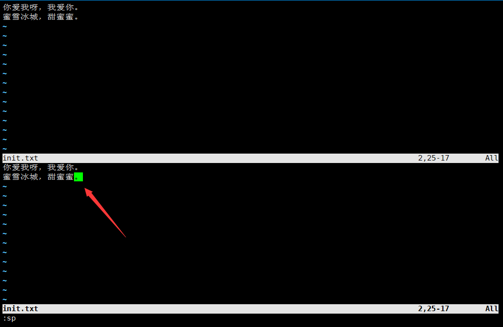
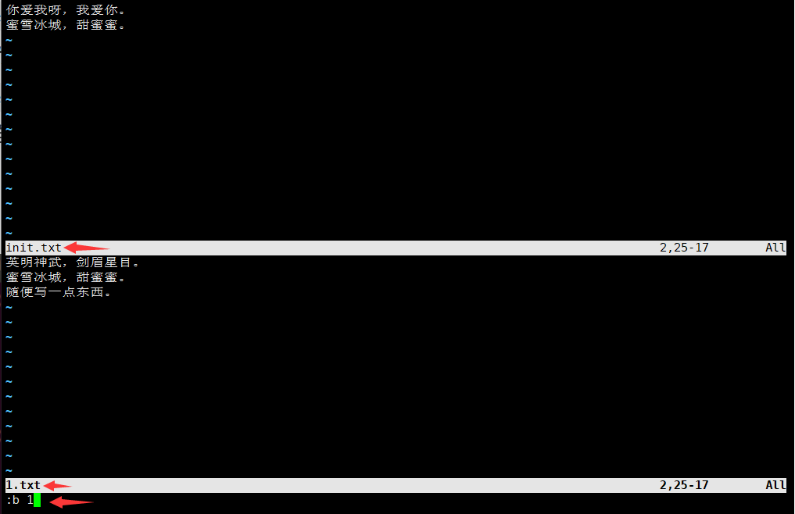

# 基础命令（Vim编辑器）

## Vim简介

### Vi与Vim

**Vi 是Unix及Linux系统下自带的功能齐全的标准编辑器，相当于Windows系统中的记事本一样。**

**Vim 是从 Vi 发展出来的一个文本编辑器，可以当作 Vi 的升级版本。**它提供了许多新的特性：

1. 代码补完、语法加亮、编译及错误跳转等方便编程的功能特别丰富，在程序员中被广泛使用，可以说是程序开发者的一项很好用的工具。
2. 多级撤销，可以无限制的撤消上一步操作。
3. 易用性，Vi只能运行于unix中，而Vim不仅可以运行于unix，windows ，mac等多操作平台。
4. 对vi的完全兼容，某些情况下，你可以把vim当成vi来使用。

### Vim安装

所有的 Unix Like 系统都会内建 Vi 编辑器，也就是说 Linux 自带 Vi 编辑器，Vim是增强版的编辑器，需要安装才能使用。

Vim 的官方网站 (http://www.vim.org) 表示自己是一个程序开发工具而不是文字处理软件。

```
yum install vim
```

### 键盘图


## 三种使用模式

vim编辑器有三种使用模式，分别是**命令模式（Command mode）**，**输入模式（Insert mode）**和**底线命令模式（Last line mode）**。

### 命令模式

**在命令模式下，用户可以执行最基本的命令。**用户启动 vim，便进入了命令模式，例如：vim init.txt：打开init.txt，就进入命令模式。**此状态下敲击键盘动作会被 Vim 识别为命令，而非输入字符。比如我们此时按下i，并不会输入一个字符，i被当作了一个命令。**以下是常用的几个命令：

- **h 或 向左箭头键(←)** 光标向左移动一个字符
- **j 或 向下箭头键(↓)** 光标向下移动一个字符
- **k 或 向上箭头键(↑)** 光标向上移动一个字符
- **l 或 向右箭头键(→)** 光标向右移动一个字符
- **i** 在光标所在处切换到输入模式。
- **x** 删除当前光标所在处的字符。
- **:** 切换到底线命令模式，以在最底一行输入命令。
- **gg** 快速切换到第一行的行首。
- **ngg** 快速切换到指定行的行首。
- **G** 快速切换到最后一行的行首。
- **^** 快速切换到该行行首。
- **$** 快速切换到该行行尾。
- **dd** 删除光标所在行。
- **ndd** 删除光标下n行，包含光标所在行。
- **yy** 复制光标所在行。
- **nyy** 复制光标下n行，包含光标所在行。
- **p** 粘贴复制的内容。
- **np** 复制几次。
- **n** 光标向下移动 n 行(常用)。
- **u** 撤销操作。
- **ctrl + f** 下一页  forward(pagedown键)。
- **ctrl + b** 上一页  backward(pageup键)。


?> 启动 vim 可以指定文件名来打开一个文件，如果没有指定文件名，也可以在保存的时候指定文件名。

### 输入模式

**在命令模式下按下 i 就进入了输入模式，输入模式下可以对文件内容进行编辑。**在输入模式中，可以使用以下按键：

- **字符按键以及Shift组合**，输入字符。
- **ENTER**，回车键，换行。
- **BACK SPACE**，退格键，删除光标前一个字符。
- **DEL**，删除键，删除光标后一个字符。
- **方向键**，在文本中移动光标。
- **HOME**/**END**，移动光标到行首/行尾。
- **Page Up**/**Page Down**，上/下翻页。
- **Insert**，切换光标为输入/替换模式，光标将变成竖线/下划线。
- **ESC**，退出输入模式，切换到命令模式。


### 底线命令模式

**在命令模式下按 : 就进入了底线命令模式，基本的命令带有英文冒号**：

- **:q** 退出Vim
- **:w** 保存文件
- **:wq** 保存文件并退出Vim
- **:q!** 不保存文件并退出Vim
- **:set nu** 就会显示行号
- **:set nonu** 取消显示行号
- **:n** 快速跳到n行
- **:/字符串** 查找含有该字符串的内容（按n/N查找下/上一个）
- **:%s/ftp/ym/g** 将全文的ftp替换为ym
- **:1000,1002d** 删除1000行到1002行
- **:r /etc/issue** 将issue文件的内容，导入当前文件中
- **:r !date** 将当前时间导入当前文件中
- 按ESC键可随时退出底线命令模式


?> 非法编辑退出vi的时候，会产生一个后缀名.swp 的交换文件，只要有这个文件存在, 那么打开这个文件的时候就会有提示，不想要这个提示，删除这个文件即可。

### 关系图谱

简单的说，我们可以将这三个模式想成底下的图标来表示：


## 高级技巧

### 文件比较

vim加上 `-d` 参数还可以比较多个文件的内容，终端屏幕也会被分为两部分，左边第一个文件，右边第二个文件：

```
[root ~]# vim -d 文件1 文件2
```


### 切换窗口

按下CTRL+w键，再按h键既是跳到左边的窗口

按下CTRL+w键，再按l键既是跳到右边的窗口

按下CTRL+w键，再按j键既是跳到下边的窗口

按下CTRL+w键，再按k键既是跳到上边的窗口



按下两次CTRL+w键，就可以实现编辑窗口的切换


?> 在一个窗口中执行退出操作只会关闭对应的窗口，其他的窗口继续保留。

### 打开多个文件

```
[root ~]# vim 1.txt init.txt
```

启动vim后只有一个窗口显示的是1.txt，可以在末行模式中输入`ls`查看到打开的两个文件：


在底线命令模式中输入 `:b <num>` 来显示另一个文件，例如可以用 `:b 2` 将init.txt显示出来：


### 窗口拆分

继续上面的操作，在末行模式中输入 `:sp` 或 `:vs` 可以实现对窗口的水平或垂直拆分，这样我们就可以同时打开多个编辑窗口：


按下两次CTRL+w键，切换到下面的窗口：



在底线命令模式中输入 `:b <num>` 来显示另一个文件，例如可以用 `:b 1` 将1.txt显示出来：



### 窗口退出

`:wqa` 或 `:wqall`：保存所有修改过的缓冲区并退出Vim。

`:qa!` 或 `:qall!`：强制退出所有打开的Vim窗口，不保存任何修改的内容。