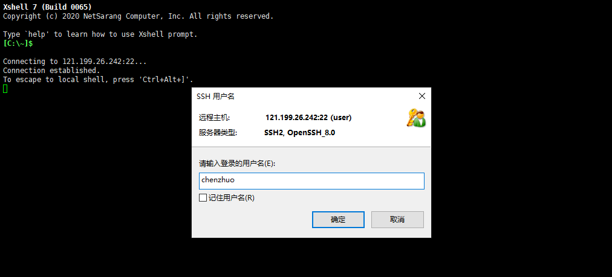
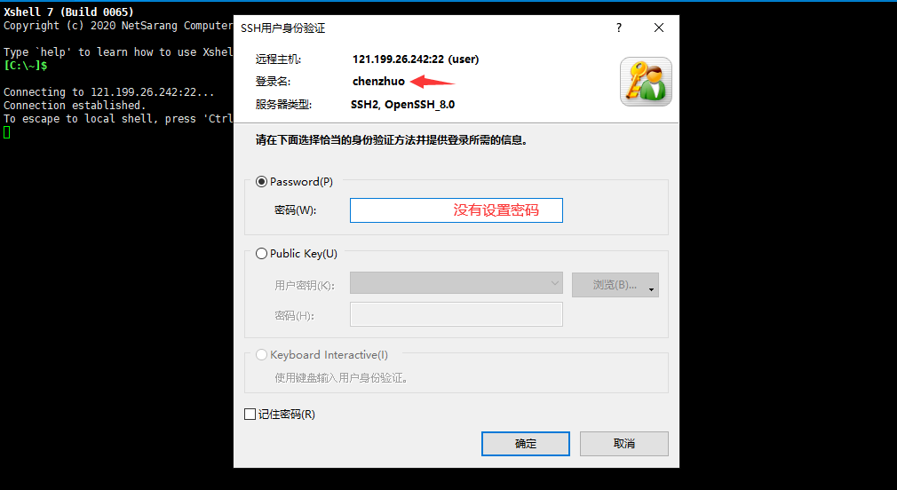
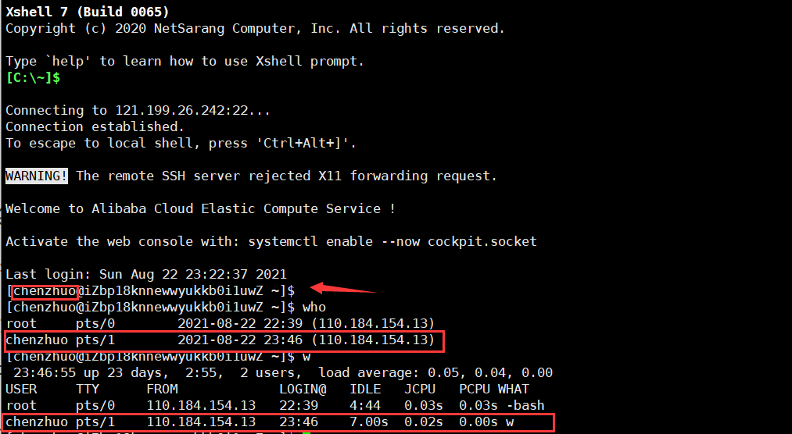
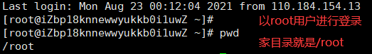
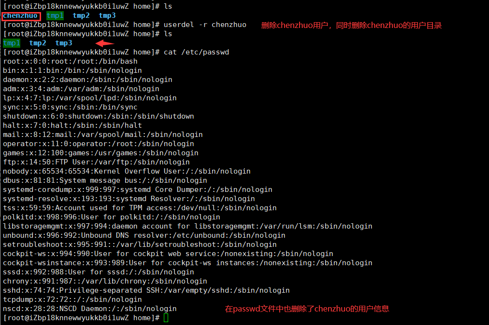

# 基础命令（组户管理）

**Linux系统是一个多用户多任务的分时操作系统，任何一个要使用系统资源的用户，都必须首先向root系统管理员申请一个账号，然后以这个账号的身份进入系统。**

**每个用户账号都拥有一个唯一的用户名和各自的口令，用户在登录时键入正确的用户名和口令后，就能够进入系统和自己的主目录。**

实现用户账号的管理，要完成的工作主要有如下几个方面：

- 用户账号的添加、删除与修改。
- 用户口令的管理。
- 用户组的管理。

## 用户管理

用户的管理工作主要涉及到用户账号的添加、修改和删除。

### 当前用户

现在我们已经知道Linux系统当中最高权限的是root用户，其他用户则没有那么高的权限，因此操作Linux系统时，我们有必要知道我是以什么用户的身份来进行操作的，权限有多大。

通过前面命令行获取信息：

- `[root@主机名称 当前目录]#` 当前在Linux当中使用的是root用户
- `[其他用户名@主机名称 当前目录]$` 当前在Linux当中使用的是普通用户
- 上面的 `#` 代表超级用户，也就是root用户；`$` 代表普通用户


获取登录信息 - **w** / **who**


!> 注意这里的登录信息还显示了目前只有root用户在线，若有其他用户也登录了此系统，就会增加显示该用户信息。

!> 注意这里获取的是登录的用户信息，也就是说我使用的用户1登录Linux系统，但我在里面切换为了用户2，以用户2的身份执行该命令，仍然显示的是用户1的信息。

### 新增用户

**添加用户账号就是在系统中创建一个新账号，然后为新账号分配用户号、用户组、主目录和登录Shell等资源。**

**新增用户的操作只能由最高权限的root用户完成，其他用户是没有这个权限的。**

#### 添加用户

添加用户命令 - **useradd 参数 用户名**

参数说明：

- **-c** 指定一段注释性描述。

- **-d** 创建用户时为用户指定用户主目录。
- **-m** 使用者目录如不存在则自动建立。
- **-g 用户组** 指定用户所属的用户组。
- **-G 用户组** 指定用户所属的附加组。
- **-u 用户号** 指定用户的用户号。


添加用户同时会在/etc/passwd文件中写入用户信息，并同时更新其他系统文件如/etc/shadow, /etc/group等：


#### 设置密码

**现在我们已经新建了一个chenzhuo用户，但这个用户是没有密码的，处于一种被锁定的状态的，即外部连接软件不能使用该用户名直接进行登录：**



后面接着输入密码，但chenzhuo没有设置密码所以连接不上：



但在内部可以通过root用户切换过去：


为了让新建用户通过外部可以连接，我们需要给chenzhuo用户设置密码：

用户设置密码 - **passwd 参数 用户名**

- 无参数，键入用户后回车，设置密码
- **-l**/**-u** 锁定/解锁用户（锁定后账户就不能进行登录，必须解锁才能登录）。
- **-d** 清除用户密码（用户密码清空以后，该用户也不能进行登录）。
- **-f** 强迫用户下次登录时修改口令。
- **-e** 设置密码立即过期，用户登录时会强制要求修改密码。
- **-i** 设置密码过期多少天以后禁用该用户。


?> 说明：输入密码和确认密码没有回显且必须一气呵成的输入完成（不能使用退格键），密码和确认密码需要一致。如果使用`passwd`命令时没有指定命令作用的对象，则表示要修改当前用户的密码。如果想批量修改用户密码，可以使用`chpasswd`命令。

现在我们通过xshell使用chenzhuo这个用户来输入密码进行登录：


可以看到chenzhuo用户现在可以正常登录使用了，且当前的登录信息当中也显示的chenzhuo用户：



!> 注意：普通用户只能更改自己的密码，管理员可以更改所有人的密码。

### 修改用户

修改用户账号就是根据实际情况更改用户的有关属性，如用户号、主目录、用户组、登录Shell等。

修改已有用户的信息使用usermod命令，其格式如下：

添加用户命令 - **usermod 参数 用户名**

参数说明：

- **-c** 指定一段注释性描述。

- **-d** 创建用户时为用户指定用户主目录。
- **-m** 使用者目录如不存在则自动建立。
- **-g 用户组** 指定用户所属的用户组。
- **-G 用户组** 指定用户所属的附加组。
- **-u 用户号** 指定用户的用户号。

例如：

```
# usermod -s /bin/ksh -d /home/z –g developer chenzhuo
```

此命令将用户kuangshen的登录Shell修改为ksh，主目录改为/home/z，用户组改为developer。

### 用户家目录

**每个用户登录Linux系统以后，所在的初始路径就是当前用户的家目录，不同用户的家目录所在路径不一样，但在命令行的表示都是同一个字符 `~` 来表示。**

root用户的家目录就是：`/root`



chenzhuo用户的家目录就是创建该用户时生成的用户目录：


### 切换用户

切换用户命令 - **su 要切换到用户名**


?> root是最高权限的用户，可以不进行密码验证，直接切换到其他用户上去，但其它用户之间切换需要通过登录密码进行验证。

退出当前用户 - **exit**


### 删除用户

删除用户 - **userdel 参数 要删除的用户名**

- **-r** 把用户的主目录一起删除。



## 用户组管理

##### 管理组

**每个用户都有自己的所属组**


### 主机名

查看主机名（hostname）

修改主机名（hostname 新名字），再重连云服务器修改成功。

### 用户管理

1. 创建和删除用户组 - **groupadd** / **groupdel**。

    > 说明：用户组主要是为了方便对一个组里面所有用户的管理。

4. 查看和修改密码有效期 - **chage**。

    设置hellokitty用户100天后必须修改密码，过期前15天通知该用户，过期后15天禁用该用户。

    ```
    chage -M 100 -W 15 -I 7 hellokitty
    ```

5. 切换用户 - **su**。

    ```
    [root ~]# su hellokitty[hellokitty root]$
    ```

6. 以管理员身份执行命令 - **sudo**。

    ```
    [hellokitty ~]$ ls /rootls: cannot open directory /root: Permission denied[hellokitty ~]$ sudo ls /root[sudo] password for hellokitty:
    ```

    > **说明**：如果希望用户能够以管理员身份执行命令，用户必须要出现在sudoers名单中，sudoers文件在 `/etc`目录下，如果希望直接编辑该文件也可以使用下面的命令。

7. 编辑sudoers文件 - **visudo**。

    这里使用的编辑器是vi，关于vi的知识在后面有讲解。该文件的部分内容如下所示：

    ```
    ## Allow root to run any commands anywhere root    ALL=(ALL)   ALL## Allows members of the 'sys' group to run networking, software, ## service management apps and more.# %sys ALL = NETWORKING, SOFTWARE, SERVICES, STORAGE, DELEGATING, PROCESSES, LOCATE, DRIVERS## Allows people in group wheel to run all commands%wheel  ALL=(ALL)   ALL## Same thing without a password# %wheel    ALL=(ALL)   NOPASSWD: ALL## Allows members of the users group to mount and unmount the## cdrom as root# %users  ALL=/sbin/mount /mnt/cdrom, /sbin/umount /mnt/cdrom## Allows members of the users group to shutdown this system# %users  localhost=/sbin/shutdown -h now
    ```

8. 显示用户与用户组的信息 - **id**。

9. 给其他用户发消息 -**write** / **wall**。

    发送方：

    ```
    [root ~]# write hellokittyDinner is on me.Call me at 6pm.
    ```

    接收方：

    ```
    [hellokitty ~]$ Message from root on pts/0 at 17:41 ...Dinner is on me.Call me at 6pm.EOF
    ```

10. 查看/设置是否接收其他用户发送的消息 - **mesg**。

```
[hellokitty ~]$ mesgis y[hellokitty ~]$ mesg n[hellokitty ~]$ mesgis n
```


## 运行

### 关机重启

在linux领域内大多用在服务器上，很少遇到关机的操作。毕竟服务器上跑一个服务是永无止境的，除非特殊情况下，不得已才会关机。**但不管是重启系统还是关闭系统，首先要运行 `sync` 命令，把内存中的数据写到磁盘中。**

```
sync # 将数据由内存同步到硬盘中。

shutdown # 关机指令，你可以man shutdown 来看一下帮助文档。例如你可以运行如下命令关机：

shutdown –h 10 # 这个命令告诉大家，计算机将在10分钟后关机

shutdown –h now # 立马关机

shutdown –h 20:25 # 系统会在今天20:25关机

shutdown –h +10 # 十分钟后关机

shutdown –r now # 系统立马重启

shutdown –r +10 # 系统十分钟后重启

reboot # 立即重启，等同于 shutdown –r now

halt # 关闭系统，等同于shutdown –h now 和 poweroff
```

重启和关机 - **reboot** / **shutdown**。

> 说明：在执行`shutdown`命令时会向登录系统的用户发出警告，可以在命令后面跟上警告消息来替换默认的警告消息，也可以在`-h`参数后通过`now`来表示立刻关机。


##### sudo权限

```
# 给普通用户赋予超级用户才能执行的命令权限，前提是要root修改sudo命令的配置文件，给出权利才能使用sudo
sudo -l：查看能使用超级管理员才能执行的命令
sudo 命令的绝对路径 命令：执行超级管理员才能执行的命令
sudo /sbin/shtdown -r now：执行这条命令的前提是超级管理员给了这条命令的权限
```

##### ACL权限

ACL权限用于身份不足的情况（即所有者、所属组、其他人，三种情况外）。相当于不给用户添加身份，直接给他权限。

```
df -h：查询系统分区状况

dumpe2fs -h/dev/sda5：查询指定分区详细文件系统信息（sda5就是上面命令查询显示的root分区）（在当中查看Default mount options这行是否有acl，有就表明能开启ACL权限）

mount -o remount,acl/：重新挂载根分区，并加入acl权限（临时挂载）

vim /etc/fstab：修改配置文件（UUID=c2....../ ext4 defaults,acl 1 1）（加入acl,永久挂载）
mount -o remount/：挂在后重启生效
```

##### chattr权限

```
chattr +i 文件或目录：改变文件或目录权限
（+：增加权限，-：删除权限，=：等于某权限）
（i：锁住文件，不能对文件删除、改名，也不能修改文件数据；如果是目录，只能修改目录下文件的数据，但不能建立和删除文件，root也会受到该限制。a：如果是文件，只能在文件中增加数据，但不能删除也不能修改数据；如果是目录，只能在目录中建立和修改文件，但不能删除）

lsattr -a abc：查看abc文件属性（-a显示所有文件和目录，-d若目标是目录，列出目录本身的属性）
```


1. 查看自己使用的Shell - **ps**。

    Shell也被称为“壳”或“壳程序”，它是用户与操作系统内核交流的翻译官，简单的说就是人与计算机交互的界面和接口。目前很多Linux系统默认的Shell都是bash（Bourne Again SHell），因为它可以使用tab键进行命令和路径补全、可以保存历史命令、可以方便的配置环境变量以及执行批处理操作。
    
    ```
    [root ~]# ps
      PID TTY          TIME CMD
     3531 pts/0    00:00:00 bash
     3553 pts/0    00:00:00 ps
    ```
    
3. 查看命令的说明和位置 - **whatis** / **which** / **whereis**。

    ```
    [root ~]# whatis ps
    ps (1)        - report a snapshot of the current processes.
    [root ~]# whatis python
    python (1)    - an interpreted, interactive, object-oriented programming language
    [root ~]# whereis ps
    ps: /usr/bin/ps /usr/share/man/man1/ps.1.gz
    [root ~]# whereis python
    python: /usr/bin/python /usr/bin/python2.7 /usr/lib/python2.7 /usr/lib64/python2.7 /etc/python /usr/include/python2.7 /usr/share/man/man1/python.1.gz
    [root ~]# which ps
    /usr/bin/ps
    [root ~]# which python
    /usr/bin/python
    ```

4. 清除屏幕上显示的内容 - **clear**。

5. 查看帮助文档 - **man** / **info** / **--help** / **apropos**。

    ```
    [root@izwz97tbgo9lkabnat2lo8z ~]# ps --help
    Usage:
     ps [options]
     Try 'ps --help <simple|list|output|threads|misc|all>'
      or 'ps --help <s|l|o|t|m|a>'
     for additional help text.
    For more details see ps(1).
    [root@izwz97tbgo9lkabnat2lo8z ~]# man ps
    PS(1)                                User Commands                                PS(1)
    NAME
           ps - report a snapshot of the current processes.
    SYNOPSIS
           ps [options]
    DESCRIPTION
    ...
    ```

6. 查看系统和主机名 - **uname** / **hostname**。

    ```
    [root@izwz97tbgo9lkabnat2lo8z ~]# unameLinux[root@izwz97tbgo9lkabnat2lo8z ~]# hostnameizwz97tbgo9lkabnat2lo8z[root@iZwz97tbgo9lkabnat2lo8Z ~]# cat /etc/centos-releaseCentOS Linux release 7.6.1810 (Core)
    ```

    > 说明：`cat`是连接文件内容并打印到标准输出的命令，后面会讲到该命令；`/etc`是Linux系统上的一个非常重要的目录，它保存了很多的配置文件；`centos-release`是该目录下的一个文件，因为我自己使用的Linux发行版本是CentOS 7.6，因此这里会有一个这样的文件。

7. 时间和日期 - **date** / **cal**。

    ```
    [root@iZwz97tbgo9lkabnat2lo8Z ~]# dateWed Jun 20 12:53:19 CST 2018[root@iZwz97tbgo9lkabnat2lo8Z ~]# cal      June 2018Su Mo Tu We Th Fr Sa                1  2 3  4  5  6  7  8  910 11 12 13 14 15 1617 18 19 20 21 22 2324 25 26 27 28 29 30[root@iZwz97tbgo9lkabnat2lo8Z ~]# cal 5 2017      May 2017Su Mo Tu We Th Fr Sa    1  2  3  4  5  6 7  8  9 10 11 12 1314 15 16 17 18 19 2021 22 23 24 25 26 2728 29 30 31
    ```

8. 退出登录 - **exit** / **logout**。

9. 查看历史命令 - **history**。

```
[root@iZwz97tbgo9lkabnat2lo8Z ~]# history...452  ls453  cd Python-3.6.5/454  clear455  history[root@iZwz97tbgo9lkabnat2lo8Z ~]# !454
```

> **说明**：查看到历史命令之后，可以用`!历史命令编号`来重新执行该命令；通过`history -c`可以清除历史命令。

5. 查看文件内容 - **cat** / **tac** / **head** / **tail** / **more** / **less** / **rev** / **od**。

    ```
    [root ~]# wget http://www.sohu.com/ -O sohu.html--2018-06-20 18:42:34--  http://www.sohu.com/Resolving www.sohu.com (www.sohu.com)... 14.18.240.6Connecting to www.sohu.com (www.sohu.com)|14.18.240.6|:80... connected.HTTP request sent, awaiting response... 200 OKLength: 212527 (208K) [text/html]Saving to: ‘sohu.html’100%[==================================================>] 212,527     --.-K/s   in 0.03s2018-06-20 18:42:34 (7.48 MB/s) - ‘sohu.html’ saved [212527/212527][root ~]# cat sohu.html...[root ~]# head -10 sohu.html<!DOCTYPE html><html><head><title>搜狐</title><meta name="Keywords" content="搜狐,门户网站,新媒体,网络媒体,新闻,财经,体育,娱乐,时尚,汽车,房产,科技,图片,论坛,微博,博客,视频,电影,电视剧"/><meta name="Description" content="搜狐网为用户提供24小时不间断的最新资讯，及搜索、邮件等网络服务。内容包括全球热点事件、突发新闻、时事评论、热播影视剧、体育赛事、行业动态、生活服务信息，以及论坛、博客、微博、我的搜狐等互动空间。" /><meta name="shenma-site-verification" content="1237e4d02a3d8d73e96cbd97b699e9c3_1504254750"><meta charset="utf-8"/><meta http-equiv="X-UA-Compatible" content="IE=Edge,chrome=1"/>[root ~]# tail -2 sohu.html</body></html>[root ~]# less sohu.html...[root ~]# cat -n sohu.html | more...
    ```

    > **说明**：上面用到了一个名为`wget`的命令，它是一个网络下载器程序，可以从指定的URL下载资源。

6. 拷贝/移动文件 - **cp** / **mv**。

    ```
    [root ~]# mkdir backup[root ~]# cp sohu.html backup/[root ~]# cd backup[root backup]# lssohu.html[root backup]# mv sohu.html sohu_index.html[root backup]# lssohu_index.html
    ```

7. 文件重命名 - **rename**。

```
[root@iZwz97tbgo9lkabnat2lo8Z ~]# rename .htm .html *.htm
```

1. 查找文件和查找内容 - **find** / **grep**。

    ```
    [root@iZwz97tbgo9lkabnat2lo8Z ~]# find / -name "*.html"/root/sohu.html/root/backup/sohu_index.html[root@izwz97tbgo9lkabnat2lo8z ~]# find . -atime 7 -type f -print[root@izwz97tbgo9lkabnat2lo8z ~]# find . -type f -size +2k[root@izwz97tbgo9lkabnat2lo8z ~]# find . -type f -name "*.swp" -delete[root@iZwz97tbgo9lkabnat2lo8Z ~]# grep "<script>" sohu.html -n20:<script>[root@iZwz97tbgo9lkabnat2lo8Z ~]# grep -E \<\/?script.*\> sohu.html -n20:<script>22:</script>24:<script src="//statics.itc.cn/web/v3/static/js/es5-shim-08e41cfc3e.min.js"></script>25:<script src="//statics.itc.cn/web/v3/static/js/es5-sham-1d5fa1124b.min.js"></script>26:<script src="//statics.itc.cn/web/v3/static/js/html5shiv-21fc8c2ba6.js"></script>29:<script type="text/javascript">52:</script>...
    ```

    > **说明**：`grep`在搜索字符串时可以使用正则表达式，如果需要使用正则表达式可以用`grep -E`或者直接使用`egrep`。

2. 创建链接和查看链接 - **ln** / **readlink**。

    ```
    [root@iZwz97tbgo9lkabnat2lo8Z ~]# ls -l sohu.html-rw-r--r-- 1 root root 212131 Jun 20 19:15 sohu.html[root@iZwz97tbgo9lkabnat2lo8Z ~]# ln /root/sohu.html /root/backup/sohu_backup[root@iZwz97tbgo9lkabnat2lo8Z ~]# ls -l sohu.html-rw-r--r-- 2 root root 212131 Jun 20 19:15 sohu.html[root@iZwz97tbgo9lkabnat2lo8Z ~]# ln /root/sohu.html /root/backup/sohu_backup2[root@iZwz97tbgo9lkabnat2lo8Z ~]# ls -l sohu.html-rw-r--r-- 3 root root 212131 Jun 20 19:15 sohu.html[root@iZwz97tbgo9lkabnat2lo8Z ~]# ln -s /etc/centos-release sysinfo[root@iZwz97tbgo9lkabnat2lo8Z ~]# ls -l sysinfolrwxrwxrwx 1 root root 19 Jun 20 19:21 sysinfo -> /etc/centos-release[root@iZwz97tbgo9lkabnat2lo8Z ~]# cat sysinfoCentOS Linux release 7.4.1708 (Core)[root@iZwz97tbgo9lkabnat2lo8Z ~]# cat /etc/centos-releaseCentOS Linux release 7.4.1708 (Core)
    ```

    > **说明**：链接可以分为硬链接和软链接（符号链接）。硬链接可以认为是一个指向文件数据的指针，就像Python中对象的引用计数，每添加一个硬链接，文件的对应链接数就增加1，只有当文件的链接数为0时，文件所对应的存储空间才有可能被其他文件覆盖。我们平常删除文件时其实并没有删除硬盘上的数据，我们删除的只是一个指针，或者说是数据的一条使用记录，所以类似于“文件粉碎机”之类的软件在“粉碎”文件时除了删除文件指针，还会在文件对应的存储区域填入数据来保证文件无法再恢复。软链接类似于Windows系统下的快捷方式，当软链接链接的文件被删除时，软链接也就失效了。

3. 压缩/解压缩和归档/解归档 - **gzip** / **gunzip** / **xz**。

```
[root@iZwz97tbgo9lkabnat2lo8Z ~]# wget http://download.redis.io/releases/redis-4.0.10.tar.gz--2018-06-20 19:29:59--  http://download.redis.io/releases/redis-4.0.10.tar.gzResolving download.redis.io (download.redis.io)... 109.74.203.151Connecting to download.redis.io (download.redis.io)|109.74.203.151|:80... connected.HTTP request sent, awaiting response... 200 OKLength: 1738465 (1.7M) [application/x-gzip]Saving to: ‘redis-4.0.10.tar.gz’100%[==================================================>] 1,738,465   70.1KB/s   in 74s2018-06-20 19:31:14 (22.9 KB/s) - ‘redis-4.0.10.tar.gz’ saved [1738465/1738465][root@iZwz97tbgo9lkabnat2lo8Z ~]# ls redis*redis-4.0.10.tar.gz[root@iZwz97tbgo9lkabnat2lo8Z ~]# gunzip redis-4.0.10.tar.gz[root@iZwz97tbgo9lkabnat2lo8Z ~]# ls redis*redis-4.0.10.tar
```

1. 归档和解归档 - **tar**。

```
[root@iZwz97tbgo9lkabnat2lo8Z ~]# tar -xvf redis-4.0.10.tarredis-4.0.10/redis-4.0.10/.gitignoreredis-4.0.10/00-RELEASENOTESredis-4.0.10/BUGSredis-4.0.10/CONTRIBUTINGredis-4.0.10/COPYINGredis-4.0.10/INSTALLredis-4.0.10/MANIFESTOredis-4.0.10/Makefileredis-4.0.10/README.mdredis-4.0.10/deps/redis-4.0.10/deps/Makefileredis-4.0.10/deps/README.md...
```

> 说明：归档（也称为创建归档）和解归档都使用`tar`命令，通常创建归档需要`-cvf`三个参数，其中`c`表示创建（create），`v`表示显示创建归档详情（verbose），`f`表示指定归档的文件（file）；解归档需要加上`-xvf`参数，其中`x`表示抽取（extract），其他两个参数跟创建归档相同。

1. 将标准输入转成命令行参数 - **xargs**。

下面的命令会将查找当前路径下的html文件，然后通过`xargs`将这些文件作为参数传给`rm`命令，实现查找并删除文件的操作。

```
[root@iZwz97tbgo9lkabnat2lo8Z ~]# find . -type f -name "*.html" | xargs rm -f
```

下面的命令将a.txt文件中的多行内容变成一行输出到b.txt文件中，其中`<`表示从a.txt中读取输入，`>`表示将命令的执行结果输出到b.txt中。

```
[root@iZwz97tbgo9lkabnat2lo8Z ~]# xargs < a.txt > b.txt
```

> **说明**：这个命令就像上面演示的那样常在管道（实现进程间通信的一种方式）和重定向（重新指定输入输出的位置）操作中用到，后面的内容中会讲到管道操作和输入输出重定向操作。

1. 显示文件或目录 - **basename** / **dirname**。
2. 其他相关工具。

- **sort** - 对内容排序
- **uniq** - 去掉相邻重复内容
- **tr** - 替换指定内容为新内容
- **cut** / **paste** - 剪切/黏贴内容
- **split** - 拆分文件
- **file** - 判断文件类型
- **wc** - 统计文件行数、单词数、字节数
- **iconv** - 编码转换

```
[root ~]# cat foo.txtgrapeapplepitaya[root ~]# cat bar.txt100200300400[root ~]# paste foo.txt bar.txtgrape   100apple   200pitaya  300        400[root ~]# paste foo.txt bar.txt > hello.txt[root ~]# cut -b 4-8 hello.txtpe      10le      20aya     30[root ~]# cat hello.txt | tr '\t' ','grape,100apple,200pitaya,300,400[root ~]# split -l 100 sohu.html hello[root ~]# wget https://www.baidu.com/img/bd_logo1.png[root ~]# file bd_logo1.pngbd_logo1.png: PNG image data, 540 x 258, 8-bit colormap, non-interlaced[root ~]# wc sohu.html  2979   6355 212527 sohu.html[root ~]# wc -l sohu.html2979 sohu.html[root ~]# wget http://www.qq.com -O qq.html[root ~]# iconv -f gb2312 -t utf-8 qq.html
```

#### 管道和重定向

1. 管道的使用 - **|**。

    例子：查找当前目录下文件个数。

    ```
    [root ~]# find ./ | wc -l6152
    ```

    例子：列出当前路径下的文件和文件夹，给每一项加一个编号。

    ```
    [root ~]# ls | cat -n     1  dump.rdb     2  mongodb-3.6.5     3  Python-3.6.5     4  redis-3.2.11     5  redis.conf
    ```

    例子：查找record.log中包含AAA，但不包含BBB的记录的总数

    ```
    [root ~]# cat record.log | grep AAA | grep -v BBB | wc -l
    ```

2. 输出重定向和错误重定向 - **>** / **>>** / **2>**。

    ```
    [root ~]# cat readme.txtbananaapplegrapeapplegrapewatermelonpearpitaya[root ~]# cat readme.txt | sort | uniq > result.txt[root ~]# cat result.txtapplebananagrapepearpitayawatermelon
    ```

3. 输入重定向 - **<**。

    ```
    [root ~]# echo 'hello, world!' > hello.txt[root ~]# wall < hello.txt[root ~]#Broadcast message from root (Wed Jun 20 19:43:05 2018):hello, world![root ~]# echo 'I will show you some code.' >> hello.txt[root ~]# wall < hello.txt[root ~]#Broadcast message from root (Wed Jun 20 19:43:55 2018):hello, world!I will show you some code.
    ```

4. 多重定向 - **tee**。

    下面的命令除了在终端显示命令`ls`的结果之外，还会追加输出到`ls.txt`文件中。

    ```
    [root ~]# ls | tee -a ls.txt
    ```

#### 别名

1. **alias**

    ```
    [root ~]# alias ll='ls -l'[root ~]# alias frm='rm -rf'[root ~]# ll...drwxr-xr-x  2 root       root   4096 Jun 20 12:52 abc...[root ~]# frm abc
    ```

2. **unalias**

    ```
    [root ~]# unalias frm[root ~]# frm sohu.html-bash: frm: command not found
    ```

#### 文本处理

1. 字符流编辑器 - **sed**。

    sed是操作、过滤和转换文本内容的工具。假设有一个名为fruit.txt的文件，内容如下所示。

    ```
    [root ~]# cat -n fruit.txt      1  banana     2  grape     3  apple     4  watermelon     5  orange
    ```

    接下来，我们在第2行后面添加一个pitaya。

    ```
    [root ~]# sed '2a pitaya' fruit.txt bananagrapepitayaapplewatermelonorange
    ```

    > 注意：刚才的命令和之前我们讲过的很多命令一样并没有改变fruit.txt文件，而是将添加了新行的内容输出到终端中，如果想保存到fruit.txt中，可以使用输出重定向操作。

    在第2行前面插入一个waxberry。

    ```
    [root ~]# sed '2i waxberry' fruit.txtbananawaxberrygrapeapplewatermelonorange
    ```

    删除第3行。

    ```
    [root ~]# sed '3d' fruit.txtbananagrapewatermelonorange
    ```

    删除第2行到第4行。

    ```
    [root ~]# sed '2,4d' fruit.txtbananaorange
    ```

    将文本中的字符a替换为@。

    ```
    [root ~]# sed 's#a#@#' fruit.txt b@nanagr@pe@pplew@termelonor@nge
    ```

    将文本中的字符a替换为@，使用全局模式。

    ```
    [root ~]# sed 's#a#@#g' fruit.txt b@n@n@gr@pe@pplew@termelonor@nge
    ```

2. 模式匹配和处理语言 - **awk**。

    awk是一种编程语言，也是Linux系统中处理文本最为强大的工具，它的作者之一和现在的维护者就是之前提到过的Brian Kernighan（ken和dmr最亲密的伙伴）。通过该命令可以从文本中提取出指定的列、用正则表达式从文本中取出我们想要的内容、显示指定的行以及进行统计和运算，总之它非常强大。

    假设有一个名为fruit2.txt的文件，内容如下所示。

    ```
    [root ~]# cat fruit2.txt 1       banana      1202       grape       5003       apple       12304       watermelon  805       orange      400
    ```

    显示文件的第3行。

    ```
    [root ~]# awk 'NR==3' fruit2.txt 3       apple       1230
    ```

    显示文件的第2列。

    ```
    [root ~]# awk '{print $2}' fruit2.txt bananagrapeapplewatermelonorange
    ```

    显示文件的最后一列。

    ```
    [root ~]# awk '{print $NF}' fruit2.txt 120500123080400
    ```

    输出末尾数字大于等于300的行。

    ```
    [root ~]# awk '{if($3 >= 300) {print $0}}' fruit2.txt 2       grape       5003       apple       12305       orange      400
    ```

    上面展示的只是awk命令的冰山一角，更多的内容留给读者自己在实践中去探索。

### 文件系统

#### 文件和路径

1. 命名规则：文件名的最大长度与文件系统类型有关，一般情况下，文件名不应该超过255个字符，虽然绝大多数的字符都可以用于文件名，但是最好使用英文大小写字母、数字、下划线、点这样的符号。文件名中虽然可以使用空格，但应该尽可能避免使用空格，否则在输入文件名时需要用将文件名放在双引号中或者通过`\`对空格进行转义。
2. 扩展名：在Linux系统下文件的扩展名是可选的，但是使用扩展名有助于对文件内容的理解。有些应用程序要通过扩展名来识别文件，但是更多的应用程序并不依赖文件的扩展名，就像`file`命令在识别文件时并不是依据扩展名来判定文件的类型。
3. 隐藏文件：以点开头的文件在Linux系统中是隐藏文件（不可见文件）。

#### 磁盘管理

1. 列出文件系统的磁盘使用状况 - **df**。

    ```
    [root ~]# df -hFilesystem      Size  Used Avail Use% Mounted on/dev/vda1        40G  5.0G   33G  14% /devtmpfs        486M     0  486M   0% /devtmpfs           497M     0  497M   0% /dev/shmtmpfs           497M  356K  496M   1% /runtmpfs           497M     0  497M   0% /sys/fs/cgrouptmpfs           100M     0  100M   0% /run/user/0
    ```

2. 磁盘分区表操作 - **fdisk**。

    ```
    [root ~]# fdisk -lDisk /dev/vda: 42.9 GB, 42949672960 bytes, 83886080 sectorsUnits = sectors of 1 * 512 = 512 bytesSector size (logical/physical): 512 bytes / 512 bytesI/O size (minimum/optimal): 512 bytes / 512 bytesDisk label type: dosDisk identifier: 0x000a42f4   Device Boot      Start         End      Blocks   Id  System/dev/vda1   *        2048    83884031    41940992   83  LinuxDisk /dev/vdb: 21.5 GB, 21474836480 bytes, 41943040 sectorsUnits = sectors of 1 * 512 = 512 bytesSector size (logical/physical): 512 bytes / 512 bytesI/O size (minimum/optimal): 512 bytes / 512 bytes
    ```

3. 磁盘分区工具 - **parted**。

4. 格式化文件系统 - **mkfs**。

    ```
    [root ~]# mkfs -t ext4 -v /dev/sdb
    ```

    - `-t` - 指定文件系统的类型。
    - `-c` - 创建文件系统时检查磁盘损坏情况。
    - `-v` - 显示详细信息。

5. 文件系统检查 - **fsck**。

6. 转换或拷贝文件 - **dd**。

7. 挂载/卸载 - **mount** / **umount**。

8. 创建/激活/关闭交换分区 - **mkswap** / **swapon** / **swapoff**。

> **说明**：执行上面这些命令会带有一定的风险，如果不清楚这些命令的用法，最好不用随意使用，在使用的过程中，最好对照参考资料进行操作，并在操作前确认是否要这么做。

### 软件安装和配置

#### 使用包管理工具

1. yum

    ​    

    \- Yellowdog Updater Modified。

    - `yum search`：搜索软件包，例如`yum search nginx`。
    - `yum list installed`：列出已经安装的软件包，例如`yum list installed | grep zlib`。
    - `yum install`：安装软件包，例如`yum install nginx`。
    - `yum remove`：删除软件包，例如`yum remove nginx`。
    - `yum update`：更新软件包，例如`yum update`可以更新所有软件包，而`yum update tar`只会更新tar。
    - `yum check-update`：检查有哪些可以更新的软件包。
    - `yum info`：显示软件包的相关信息，例如`yum info nginx`。

2. rpm

    ​    

    \- Redhat Package Manager。

    - 安装软件包：`rpm -ivh <packagename>.rpm`。
    - 移除软件包：`rpm -e <packagename>`。
    - 查询软件包：`rpm -qa`，例如可以用`rpm -qa | grep mysql`来检查是否安装了MySQL相关的软件包。

下面以Nginx为例，演示如何使用yum安装软件。

```
[root ~]# yum -y install nginx...Installed:  nginx.x86_64 1:1.12.2-2.el7Dependency Installed:  nginx-all-modules.noarch 1:1.12.2-2.el7  nginx-mod-http-geoip.x86_64 1:1.12.2-2.el7  nginx-mod-http-image-filter.x86_64 1:1.12.2-2.el7  nginx-mod-http-perl.x86_64 1:1.12.2-2.el7  nginx-mod-http-xslt-filter.x86_64 1:1.12.2-2.el7  nginx-mod-mail.x86_64 1:1.12.2-2.el7  nginx-mod-stream.x86_64 1:1.12.2-2.el7Complete![root ~]# yum info nginxLoaded plugins: fastestmirrorLoading mirror speeds from cached hostfileInstalled PackagesName        : nginxArch        : x86_64Epoch       : 1Version     : 1.12.2Release     : 2.el7Size        : 1.5 MRepo        : installedFrom repo   : epelSummary     : A high performance web server and reverse proxy serverURL         : http://nginx.org/License     : BSDDescription : Nginx is a web server and a reverse proxy server for HTTP, SMTP, POP3 and            : IMAP protocols, with a strong focus on high concurrency, performance and low            : memory usage.[root ~]# nginx -vnginx version: nginx/1.12.2
```

移除Nginx。

```
[root ~]# yum -y remove nginx
```

下面以MySQL为例，演示如何使用rpm安装软件。要安装MySQL需要先到[MySQL官方网站](https://www.mysql.com/)下载对应的[RPM文件](https://dev.mysql.com/downloads/mysql/)，当然要选择和你使用的Linux系统对应的版本。MySQL现在是Oracle公司旗下的产品，在MySQL被收购后，MySQL的作者重新制作了一个MySQL的分支MariaDB，可以通过yum进行安装。

```
[root mysql]# lsmysql-community-client-5.7.22-1.el7.x86_64.rpmmysql-community-common-5.7.22-1.el7.x86_64.rpmmysql-community-libs-5.7.22-1.el7.x86_64.rpmmysql-community-server-5.7.22-1.el7.x86_64.rpm[root mysql]# yum -y remove mariadb-libs[root mysql]# yum -y install libaio[root mysql]#rpm -ivh mysql-community-common-5.7.26-1.el7.x86_64.rpm...[root mysql]#rpm -ivh mysql-community-libs-5.7.26-1.el7.x86_64.rpm...[root mysql]#rpm -ivh mysql-community-client-5.7.26-1.el7.x86_64.rpm...[root mysql]#rpm -ivh mysql-community-server-5.7.26-1.el7.x86_64.rpm...
```

> 说明：由于MySQL和[MariaDB](https://mariadb.org/)的底层依赖库是有冲突的，所以上面我们首先用`yum`移除了名为mariadb-libs的依赖库并安装了名为libaio支持异步I/O操作的依赖库。关于MySQL和MariaDB之间的关系，可以阅读[维基百科](https://zh.wikipedia.org/wiki/MariaDB)上关于MariaDB的介绍。

移除安装的MySQL。

```
[root ~]# rpm -qa | grep mysql | xargs rpm -e
```

#### 下载解压配置环境变量

下面以安装MongoDB为例，演示这类软件应该如何安装。

```
[root ~]# wget https://fastdl.mongodb.org/linux/mongodb-linux-x86_64-rhel70-3.6.5.tgz--2018-06-21 18:32:53--  https://fastdl.mongodb.org/linux/mongodb-linux-x86_64-rhel70-3.6.5.tgzResolving fastdl.mongodb.org (fastdl.mongodb.org)... 52.85.83.16, 52.85.83.228, 52.85.83.186, ...Connecting to fastdl.mongodb.org (fastdl.mongodb.org)|52.85.83.16|:443... connected.HTTP request sent, awaiting response... 200 OKLength: 100564462 (96M) [application/x-gzip]Saving to: ‘mongodb-linux-x86_64-rhel70-3.6.5.tgz’100%[==================================================>] 100,564,462  630KB/s   in 2m 9s2018-06-21 18:35:04 (760 KB/s) - ‘mongodb-linux-x86_64-rhel70-3.6.5.tgz’ saved [100564462/100564462][root ~]# gunzip mongodb-linux-x86_64-rhel70-3.6.5.tgz[root ~]# tar -xvf mongodb-linux-x86_64-rhel70-3.6.5.tarmongodb-linux-x86_64-rhel70-3.6.5/READMEmongodb-linux-x86_64-rhel70-3.6.5/THIRD-PARTY-NOTICESmongodb-linux-x86_64-rhel70-3.6.5/MPL-2mongodb-linux-x86_64-rhel70-3.6.5/GNU-AGPL-3.0mongodb-linux-x86_64-rhel70-3.6.5/bin/mongodumpmongodb-linux-x86_64-rhel70-3.6.5/bin/mongorestoremongodb-linux-x86_64-rhel70-3.6.5/bin/mongoexportmongodb-linux-x86_64-rhel70-3.6.5/bin/mongoimportmongodb-linux-x86_64-rhel70-3.6.5/bin/mongostatmongodb-linux-x86_64-rhel70-3.6.5/bin/mongotopmongodb-linux-x86_64-rhel70-3.6.5/bin/bsondumpmongodb-linux-x86_64-rhel70-3.6.5/bin/mongofilesmongodb-linux-x86_64-rhel70-3.6.5/bin/mongoreplaymongodb-linux-x86_64-rhel70-3.6.5/bin/mongoperfmongodb-linux-x86_64-rhel70-3.6.5/bin/mongodmongodb-linux-x86_64-rhel70-3.6.5/bin/mongosmongodb-linux-x86_64-rhel70-3.6.5/bin/mongomongodb-linux-x86_64-rhel70-3.6.5/bin/install_compass[root ~]# vim .bash_profile...PATH=$PATH:$HOME/bin:$HOME/mongodb-linux-x86_64-rhel70-3.6.5/binexport PATH...[root ~]# source .bash_profile[root ~]# mongod --versiondb version v3.6.5git version: a20ecd3e3a174162052ff99913bc2ca9a839d618OpenSSL version: OpenSSL 1.0.1e-fips 11 Feb 2013allocator: tcmallocmodules: nonebuild environment:    distmod: rhel70    distarch: x86_64    target_arch: x86_64[root ~]# mongo --versionMongoDB shell version v3.6.5git version: a20ecd3e3a174162052ff99913bc2ca9a839d618OpenSSL version: OpenSSL 1.0.1e-fips 11 Feb 2013allocator: tcmallocmodules: nonebuild environment:    distmod: rhel70    distarch: x86_64    target_arch: x86_64
```

> 说明：当然也可以通过yum来安装MongoDB，具体可以参照[官方网站](https://docs.mongodb.com/master/administration/install-on-linux/)上给出的说明。

#### 源代码构建安装

1. 安装Python 3.6。

    ```
    [root ~]# yum install gcc[root ~]# wget https://www.python.org/ftp/python/3.6.5/Python-3.6.5.tgz[root ~]# gunzip Python-3.6.5.tgz[root ~]# tar -xvf Python-3.6.5.tar[root ~]# cd Python-3.6.5[root ~]# ./configure --prefix=/usr/local/python36 --enable-optimizations[root ~]# yum -y install zlib-devel bzip2-devel openssl-devel ncurses-devel sqlite-devel readline-devel tk-devel gdbm-devel db4-devel libpcap-devel xz-devel[root ~]# make && make install...[root ~]# ln -s /usr/local/python36/bin/python3.6 /usr/bin/python3[root ~]# python3 --versionPython 3.6.5[root ~]# python3 -m pip install -U pip[root ~]# pip3 --version
    ```

    > 说明：上面在安装好Python之后还需要注册PATH环境变量，将Python安装路径下bin文件夹的绝对路径注册到PATH环境变量中。注册环境变量可以修改用户主目录下的.bash_profile或者/etc目录下的profile文件，二者的区别在于前者相当于是用户环境变量，而后者相当于是系统环境变量。

2. 安装Redis-3.2.12。

    ```
    [root ~]# wget http://download.redis.io/releases/redis-3.2.12.tar.gz[root ~]# gunzip redis-3.2.12.tar.gz[root ~]# tar -xvf redis-3.2.12.tar[root ~]# cd redis-3.2.12[root ~]# make && make install[root ~]# redis-server --versionRedis server v=3.2.12 sha=00000000:0 malloc=jemalloc-4.0.3 bits=64 build=5bc5cd3c03d6ceb6[root ~]# redis-cli --versionredis-cli 3.2.12
    ```

### 配置服务

我们可以Linux系统下安装和配置各种服务，也就是说我们可以把Linux系统打造成数据库服务器、Web服务器、缓存服务器、文件服务器、消息队列服务器等等。Linux下的大多数服务都被设置为守护进程（驻留在系统后台运行，但不会因为服务还在运行而导致Linux无法停止运行），所以我们安装的服务通常名字后面都有一个字母`d`，它是英文单词`daemon`的缩写，例如：防火墙服务叫firewalld，我们之前安装的MySQL服务叫mysqld，Apache服务器叫httpd等。在安装好服务之后，可以使用`systemctl`命令或`service`命令来完成对服务的启动、停止等操作，具体操作如下所示。

1. 启动防火墙服务。

    ```
    [root ~]# systemctl start firewalld
    ```

2. 终止防火墙服务。

    ```
    [root ~]# systemctl stop firewalld
    ```

3. 重启防火墙服务。

    ```
    [root ~]# systemctl restart firewalld
    ```

4. 查看防火墙服务状态。

    ```
    [root ~]# systemctl status firewalld
    ```

5. 设置/禁用防火墙服务开机自启。

    ```
    [root ~]# systemctl enable firewalldCreated symlink from /etc/systemd/system/dbus-org.fedoraproject.FirewallD1.service to /usr/lib/systemd/system/firewalld.service.Created symlink from /etc/systemd/system/multi-user.target.wants/firewalld.service to /usr/lib/systemd/system/firewalld.service.[root ~]# systemctl disable firewalldRemoved symlink /etc/systemd/system/multi-user.target.wants/firewalld.service.Removed symlink /etc/systemd/system/dbus-org.fedoraproject.FirewallD1.service.
    ```

### 计划任务

1. 在指定的时间执行命令。

    - **at** - 将任务排队，在指定的时间执行。
    - **atq** - 查看待执行的任务队列。
    - **atrm** - 从队列中删除待执行的任务。

    指定3天以后下午5点要执行的任务。

    ```
    [root ~]# at 5pm+3daysat> rm -f /root/*.htmlat> <EOT>job 9 at Wed Jun  5 17:00:00 2019
    ```

    查看待执行的任务队列。

    ```
    [root ~]# atq9       Wed Jun  5 17:00:00 2019 a root
    ```

    从队列中删除指定的任务。

    ```
    [root ~]$ atrm 9
    ```

2. 计划任务表 - **crontab**。

    ```
    [root ~]# crontab -e* * * * * echo "hello, world!" >> /root/hello.txt59 23 * * * rm -f /root/*.log
    ```

    > 说明：输入`crontab -e`命令会打开vim来编辑Cron表达式并指定触发的任务，上面我们定制了两个计划任务，一个是每分钟向/root目录下的hello.txt中追加输出`hello, world!`；另一个是每天23时59分执行删除/root目录下以log为后缀名的文件。如果不知道Cron表达式如何书写，可以参照/etc/crontab文件中的提示（下面会讲到）或者用搜索引擎找一下“Cron表达式在线生成器”来生成Cron表达式。

    和crontab相关的文件在`/etc`目录下，通过修改`/etc`目录下的crontab文件也能够定制计划任务。

    ```
    [root ~]# cd /etc[root etc]# ls -l | grep cron-rw-------.  1 root root      541 Aug  3  2017 anacrontabdrwxr-xr-x.  2 root root     4096 Mar 27 11:56 cron.ddrwxr-xr-x.  2 root root     4096 Mar 27 11:51 cron.daily-rw-------.  1 root root        0 Aug  3  2017 cron.denydrwxr-xr-x.  2 root root     4096 Mar 27 11:50 cron.hourlydrwxr-xr-x.  2 root root     4096 Jun 10  2014 cron.monthly-rw-r--r--   1 root root      493 Jun 23 15:09 crontabdrwxr-xr-x.  2 root root     4096 Jun 10  2014 cron.weekly[root etc]# vim crontab  1 SHELL=/bin/bash  2 PATH=/sbin:/bin:/usr/sbin:/usr/bin  3 MAILTO=root  4  5 # For details see man 4 crontabs  6  7 # Example of job definition:  8 # .---------------- minute (0 - 59)  9 # |  .------------- hour (0 - 23) 10 # |  |  .---------- day of month (1 - 31) 11 # |  |  |  .------- month (1 - 12) OR jan,feb,mar,apr ... 12 # |  |  |  |  .---- day of week (0 - 6) (Sunday=0 or 7) OR sun,mon,tue,wed,thu,fri,sat 13 # |  |  |  |  | 14 # *  *  *  *  * user-name  command to be executed
    ```

### 网络访问和管理

1. 安全远程连接 - **ssh**。

    ```
    [root ~]$ ssh root@120.77.222.217The authenticity of host '120.77.222.217 (120.77.222.217)' can't be established.ECDSA key fingerprint is SHA256:BhUhykv+FvnIL03I9cLRpWpaCxI91m9n7zBWrcXRa8w.ECDSA key fingerprint is MD5:cc:85:e9:f0:d7:07:1a:26:41:92:77:6b:7f:a0:92:65.Are you sure you want to continue connecting (yes/no)? yesWarning: Permanently added '120.77.222.217' (ECDSA) to the list of known hosts.root@120.77.222.217's password: 
    ```

2. 通过网络获取资源 - **wget**。

    - -b 后台下载模式
    - -O 下载到指定的目录
    - -r 递归下载

3. 发送和接收邮件 - **mail**。

4. 网络配置工具（旧） - **ifconfig**。

    ```
    [root ~]# ifconfig eth0eth0: flags=4163<UP,BROADCAST,RUNNING,MULTICAST>  mtu 1500        inet 172.18.61.250  netmask 255.255.240.0  broadcast 172.18.63.255        ether 00:16:3e:02:b6:46  txqueuelen 1000  (Ethernet)        RX packets 1067841  bytes 1296732947 (1.2 GiB)        RX errors 0  dropped 0  overruns 0  frame 0        TX packets 409912  bytes 43569163 (41.5 MiB)        TX errors 0  dropped 0 overruns 0  carrier 0  collisions 
    ```

5. 网络配置工具（新） - **ip**。

    ```
    [root ~]# ip address1: lo: <LOOPBACK,UP,LOWER_UP> mtu 65536 qdisc noqueue state UNKNOWN qlen 1    link/loopback 00:00:00:00:00:00 brd 00:00:00:00:00:00    inet 127.0.0.1/8 scope host lo       valid_lft forever preferred_lft forever2: eth0: <BROADCAST,MULTICAST,UP,LOWER_UP> mtu 1500 qdisc pfifo_fast state UP qlen 1000    link/ether 00:16:3e:02:b6:46 brd ff:ff:ff:ff:ff:ff    inet 172.18.61.250/20 brd 172.18.63.255 scope global eth0       valid_lft forever preferred_lft forever
    ```

6. 网络可达性检查 - **ping**。

    ```
    [root ~]# ping www.baidu.com -c 3PING www.a.shifen.com (220.181.111.188) 56(84) bytes of data.64 bytes from 220.181.111.188 (220.181.111.188): icmp_seq=1 ttl=51 time=36.3 ms64 bytes from 220.181.111.188 (220.181.111.188): icmp_seq=2 ttl=51 time=36.4 ms64 bytes from 220.181.111.188 (220.181.111.188): icmp_seq=3 ttl=51 time=36.4 ms--- www.a.shifen.com ping statistics ---3 packets transmitted, 3 received, 0% packet loss, time 2002msrtt min/avg/max/mdev = 36.392/36.406/36.427/0.156 ms
    ```

7. 显示或管理路由表 - **route**。

8. 查看网络服务和端口 - **netstat** / **ss**。

    ```
    [root ~]# netstat -nap | grep nginx
    ```

9. 网络监听抓包 - **tcpdump**。

10. 安全文件拷贝 - **scp**。

```
[root ~]# scp root@1.2.3.4:/root/guido.jpg hellokitty@4.3.2.1:/home/hellokitty/pic.jpg
```

1. 文件同步工具 - **rsync**。

    > 说明：使用`rsync`可以实现文件的自动同步，这个对于文件服务器来说相当重要。关于这个命令的用法，我们在后面讲项目部署的时候为大家详细说明。

2. 安全文件传输 - **sftp**。

    ```
    [root ~]# sftp root@1.2.3.4root@1.2.3.4's password:Connected to 1.2.3.4.sftp>
    ```

    - `help`：显示帮助信息。
    - `ls`/`lls`：显示远端/本地目录列表。
    - `cd`/`lcd`：切换远端/本地路径。
    - `mkdir`/`lmkdir`：创建远端/本地目录。
    - `pwd`/`lpwd`：显示远端/本地当前工作目录。
    - `get`：下载文件。
    - `put`：上传文件。
    - `rm`：删除远端文件。
    - `bye`/`exit`/`quit`：退出sftp。

### 进程管理

1. 查看进程 - **ps**。

    ```
    [root ~]# ps -efUID        PID  PPID  C STIME TTY          TIME CMDroot         1     0  0 Jun23 ?        00:00:05 /usr/lib/systemd/systemd --switched-root --system --deserialize 21root         2     0  0 Jun23 ?        00:00:00 [kthreadd]...[root ~]# ps -ef | grep mysqldroot      4943  4581  0 22:45 pts/0    00:00:00 grep --color=auto mysqldmysql    25257     1  0 Jun25 ?        00:00:39 /usr/sbin/mysqld --daemonize --pid-file=/var/run/mysqld/mysqld.pid
    ```

2. 显示进程状态树 - **pstree**。

    ```
    [root ~]# pstreesystemd─┬─AliYunDun───18*[{AliYunDun}]        ├─AliYunDunUpdate───3*[{AliYunDunUpdate}]        ├─2*[agetty]        ├─aliyun-service───2*[{aliyun-service}]        ├─atd        ├─auditd───{auditd}        ├─dbus-daemon        ├─dhclient        ├─irqbalance        ├─lvmetad        ├─mysqld───28*[{mysqld}]        ├─nginx───2*[nginx]        ├─ntpd        ├─polkitd───6*[{polkitd}]        ├─rsyslogd───2*[{rsyslogd}]        ├─sshd───sshd───bash───pstree        ├─systemd-journal        ├─systemd-logind        ├─systemd-udevd        └─tuned───4*[{tuned}]
    ```

3. 查找与指定条件匹配的进程 - **pgrep**。

    ```
    [root ~]$ pgrep mysqld3584
    ```

4. 通过进程号终止进程 - **kill**。

    ```
    [root ~]$ kill -l 1) SIGHUP       2) SIGINT       3) SIGQUIT      4) SIGILL       5) SIGTRAP 6) SIGABRT      7) SIGBUS       8) SIGFPE       9) SIGKILL     10) SIGUSR111) SIGSEGV     12) SIGUSR2     13) SIGPIPE     14) SIGALRM     15) SIGTERM16) SIGSTKFLT   17) SIGCHLD     18) SIGCONT     19) SIGSTOP     20) SIGTSTP21) SIGTTIN     22) SIGTTOU     23) SIGURG      24) SIGXCPU     25) SIGXFSZ26) SIGVTALRM   27) SIGPROF     28) SIGWINCH    29) SIGIO       30) SIGPWR31) SIGSYS      34) SIGRTMIN    35) SIGRTMIN+1  36) SIGRTMIN+2  37) SIGRTMIN+338) SIGRTMIN+4  39) SIGRTMIN+5  40) SIGRTMIN+6  41) SIGRTMIN+7  42) SIGRTMIN+843) SIGRTMIN+9  44) SIGRTMIN+10 45) SIGRTMIN+11 46) SIGRTMIN+12 47) SIGRTMIN+1348) SIGRTMIN+14 49) SIGRTMIN+15 50) SIGRTMAX-14 51) SIGRTMAX-13 52) SIGRTMAX-1253) SIGRTMAX-11 54) SIGRTMAX-10 55) SIGRTMAX-9  56) SIGRTMAX-8  57) SIGRTMAX-758) SIGRTMAX-6  59) SIGRTMAX-5  60) SIGRTMAX-4  61) SIGRTMAX-3  62) SIGRTMAX-263) SIGRTMAX-1  64) SIGRTMAX[root ~]# kill 1234[root ~]# kill -9 1234
    ```

    例子：用一条命令强制终止正在运行的Redis进程。

    ```
    ps -ef | grep redis | grep -v grep | awk '{print $2}' | xargs kill
    ```

5. 通过进程名终止进程 - **killall** / **pkill**。

    结束名为mysqld的进程。

    ```
    [root ~]# pkill mysqld
    ```

    结束hellokitty用户的所有进程。

    ```
    [root ~]# pkill -u hellokitty
    ```

    > 说明：这样的操作会让hellokitty用户和服务器断开连接。

6. 将进程置于后台运行。

    - `Ctrl+Z` - 快捷键，用于停止进程并置于后台。
    - `&` - 将进程置于后台运行。

    ```
    [root ~]# mongod &[root ~]# redis-server...^Z[4]+  Stopped                 redis-server
    ```

7. 查询后台进程 - **jobs**。

    ```
    [root ~]# jobs[2]   Running                 mongod &[3]-  Stopped                 cat[4]+  Stopped                 redis-server
    ```

8. 让进程在后台继续运行 - **bg**。

    ```
    [root ~]# bg %4[4]+ redis-server &[root ~]# jobs[2]   Running                 mongod &[3]+  Stopped                 cat[4]-  Running                 redis-server &
    ```

9. 将后台进程置于前台 - **fg**。

    ```
    [root ~]# fg %4redis-server
    ```

    > 说明：置于前台的进程可以使用`Ctrl+C`来终止它。

10. 调整程序/进程运行时优先级 - **nice** / **renice**。

11. 用户登出后进程继续工作 - **nohup**。

    ```
    [root ~]# nohup ping www.baidu.com > result.txt &
    ```

12. 跟踪进程系统调用情况 - **strace**。

    ```
    [root ~]# pgrep mysqld8803[root ~]# strace -c -p 8803strace: Process 8803 attached^Cstrace: Process 8803 detached% time     seconds  usecs/call     calls    errors syscall------ ----------- ----------- --------- --------- ---------------- 99.18    0.005719        5719         1           restart_syscall  0.49    0.000028          28         1           mprotect  0.24    0.000014          14         1           clone  0.05    0.000003           3         1           mmap  0.03    0.000002           2         1           accept------ ----------- ----------- --------- --------- ----------------100.00    0.005766                     5           total
    ```

    > 说明：这个命令的用法和参数都比较复杂，建议大家在真正用到这个命令的时候再根据实际需要进行了解。

13. 查看当前运行级别 - **runlevel**。

    ```
    [root ~]# runlevelN 3
    ```

14. 实时监控进程占用资源状况 - **top**。

    ```
    [root ~]# toptop - 23:04:23 up 3 days, 14:10,  1 user,  load average: 0.00, 0.01, 0.05Tasks:  65 total,   1 running,  64 sleeping,   0 stopped,   0 zombie%Cpu(s):  0.3 us,  0.3 sy,  0.0 ni, 99.3 id,  0.0 wa,  0.0 hi,  0.0 si,  0.0 stKiB Mem :  1016168 total,   191060 free,   324700 used,   500408 buff/cacheKiB Swap:        0 total,        0 free,        0 used.   530944 avail Mem...
    ```

    - `-c` - 显示进程的整个路径。
    - `-d` - 指定两次刷屏之间的间隔时间（秒为单位）。
    - `-i` - 不显示闲置进程或僵尸进程。
    - `-p` - 显示指定进程的信息。

### 系统诊断

1. 系统启动异常诊断 - **dmesg**。

2. 查看系统活动信息 - **sar**。

    ```
    [root ~]# sar -u -r 5 10Linux 3.10.0-957.10.1.el7.x86_64 (izwz97tbgo9lkabnat2lo8z)      06/02/2019      _x86_64_        (2 CPU)06:48:30 PM     CPU     %user     %nice   %system   %iowait    %steal     %idle06:48:35 PM     all      0.10      0.00      0.10      0.00      0.00     99.8006:48:30 PM kbmemfree kbmemused  %memused kbbuffers  kbcached  kbcommit   %commit  kbactive   kbinact   kbdirty06:48:35 PM   1772012   2108392     54.33    102816   1634528    784940     20.23    793328   1164704         0
    ```

    - `-A` - 显示所有设备（CPU、内存、磁盘）的运行状况。
    - `-u` - 显示所有CPU的负载情况。
    - `-d` - 显示所有磁盘的使用情况。
    - `-r` - 显示内存的使用情况。
    - `-n` - 显示网络运行状态。

3. 查看内存使用情况 - **free**。

    ```
    [root ~]# free              total        used        free      shared  buff/cache   availableMem:        1016168      323924      190452         356      501792      531800Swap:             0           0           0
    ```

4. 虚拟内存统计 - **vmstat**。

    ```
    [root ~]# vmstatprocs -----------memory---------- ---swap-- -----io---- -system-- ------cpu----- r  b   swpd   free   buff  cache   si   so    bi    bo   in   cs us sy id wa st 2  0      0 204020  79036 667532    0    0     5    18  101   58  1  0 99  0  0
    ```

5. CPU信息统计 - **mpstat**。

    ```
    [root ~]# mpstatLinux 3.10.0-957.5.1.el7.x86_64 (iZ8vba0s66jjlfmo601w4xZ)       05/30/2019      _x86_64_        (1 CPU)01:51:54 AM  CPU    %usr   %nice    %sys %iowait    %irq   %soft  %steal  %guest  %gnice   %idle01:51:54 AM  all    0.71    0.00    0.17    0.04    0.00    0.00    0.00    0.00    0.00   99.07
    ```

6. 查看进程使用内存状况 - **pmap**。

    ```
    [root ~]# ps  PID TTY          TIME CMD 4581 pts/0    00:00:00 bash 5664 pts/0    00:00:00 ps[root ~]# pmap 45814581:   -bash0000000000400000    884K r-x-- bash00000000006dc000      4K r---- bash00000000006dd000     36K rw--- bash00000000006e6000     24K rw---   [ anon ]0000000001de0000    400K rw---   [ anon ]00007f82fe805000     48K r-x-- libnss_files-2.17.so00007f82fe811000   2044K ----- libnss_files-2.17.so...
    ```

7. 报告设备CPU和I/O统计信息 - **iostat**。

    ```
    [root ~]# iostatLinux 3.10.0-693.11.1.el7.x86_64 (iZwz97tbgo9lkabnat2lo8Z)      06/26/2018      _x86_64_       (1 CPU)avg-cpu:  %user   %nice %system %iowait  %steal   %idle           0.79    0.00    0.20    0.04    0.00   98.97Device:            tps    kB_read/s    kB_wrtn/s    kB_read    kB_wrtnvda               0.85         6.78        21.32    2106565    6623024vdb               0.00         0.01         0.00       2088          0
    ```

8. 显示所有PCI设备 - **lspci**。

    ```
    [root ~]# lspci00:00.0 Host bridge: Intel Corporation 440FX - 82441FX PMC [Natoma] (rev 02)00:01.0 ISA bridge: Intel Corporation 82371SB PIIX3 ISA [Natoma/Triton II]00:01.1 IDE interface: Intel Corporation 82371SB PIIX3 IDE [Natoma/Triton II]00:01.2 USB controller: Intel Corporation 82371SB PIIX3 USB [Natoma/Triton II] (rev 01)00:01.3 Bridge: Intel Corporation 82371AB/EB/MB PIIX4 ACPI (rev 03)00:02.0 VGA compatible controller: Cirrus Logic GD 544600:03.0 Ethernet controller: Red Hat, Inc. Virtio network device00:04.0 Communication controller: Red Hat, Inc. Virtio console00:05.0 SCSI storage controller: Red Hat, Inc. Virtio block device00:06.0 SCSI storage controller: Red Hat, Inc. Virtio block device00:07.0 Unclassified device [00ff]: Red Hat, Inc. Virtio memory balloon
    ```

9. 显示进程间通信设施的状态 - **ipcs**。

    ```
    [root ~]# ipcs------ Message Queues --------key        msqid      owner      perms      used-bytes   messages    ------ Shared Memory Segments --------key        shmid      owner      perms      bytes      nattch     status      ------ Semaphore Arrays --------key        semid      owner      perms      nsems
    ```

### Shell编程

之前我们提到过，Shell是一个连接用户和操作系统的应用程序，它提供了人机交互的界面（接口），用户通过这个界面访问操作系统内核的服务。Shell脚本是一种为Shell编写的脚本程序，我们可以通过Shell脚本来进行系统管理，同时也可以通过它进行文件操作。总之，编写Shell脚本对于使用Linux系统的人来说，应该是一项标配技能。

互联网上有大量关于Shell脚本的相关知识，我不打算再此对Shell脚本做一个全面系统的讲解，我们通过下面的代码来感性的认识下Shell脚本就行了。

例子1：输入两个整数m和n，计算从m到n的整数求和的结果。

```
#!/usr/bin/bashprintf 'm = 'read mprintf 'n = 'read na=$msum=0while [ $a -le $n ]do    sum=$[ sum + a ]    a=$[ a + 1 ]doneecho '结果: '$sum
```

例子2：自动创建文件夹和指定数量的文件。

```
#!/usr/bin/bashprintf '输入文件夹名: 'read dirprintf '输入文件名: 'read fileprintf '输入文件数量(<1000): 'read numif [ $num -ge 1000 ]then    echo '文件数量不能超过1000'else    if [ -e $dir -a -d $dir ]    then        rm -rf $dir    else        if [ -e $dir -a -f $dir ]        then            rm -f $dir        fi    fi    mkdir -p $dir    index=1    while [ $index -le $num ]    do        if [ $index -lt 10 ]        then            pre='00'        elif [ $index -lt 100 ]        then            pre='0'        else            pre=''        fi        touch $dir'/'$file'_'$pre$index        index=$[ index + 1 ]    donefi
```

例子3：自动安装指定版本的Redis。

```
#!/usr/bin/bashinstall_redis() {    if ! which redis-server > /dev/null    then        cd /root        wget $1$2'.tar.gz' >> install.log        gunzip /root/$2'.tar.gz'        tar -xf /root/$2'.tar'        cd /root/$2        make >> install.log        make install >> install.log        echo '安装完成'    else        echo '已经安装过Redis'    fi}install_redis 'http://download.redis.io/releases/' $1
```

### 相关资源

1. Linux命令行常用快捷键

    | 快捷键     | 功能说明                                     |
    | ---------- | -------------------------------------------- |
    | tab        | 自动补全命令或路径                           |
    | Ctrl+a     | 将光标移动到命令行行首                       |
    | Ctrl+e     | 将光标移动到命令行行尾                       |
    | Ctrl+f     | 将光标向右移动一个字符                       |
    | Ctrl+b     | 将光标向左移动一个字符                       |
    | Ctrl+k     | 剪切从光标到行尾的字符                       |
    | Ctrl+u     | 剪切从光标到行首的字符                       |
    | Ctrl+w     | 剪切光标前面的一个单词                       |
    | Ctrl+y     | 复制剪切命名剪切的内容                       |
    | Ctrl+c     | 中断正在执行的任务                           |
    | Ctrl+h     | 删除光标前面的一个字符                       |
    | Ctrl+d     | 退出当前命令行                               |
    | Ctrl+r     | 搜索历史命令                                 |
    | Ctrl+g     | 退出历史命令搜索                             |
    | Ctrl+l     | 清除屏幕上所有内容在屏幕的最上方开启一个新行 |
    | Ctrl+s     | 锁定终端使之暂时无法输入内容                 |
    | Ctrl+q     | 退出终端锁定                                 |
    | Ctrl+z     | 将正在终端执行的任务停下来放到后台           |
    | !!         | 执行上一条命令                               |
    | !数字      | 执行数字对应的历史命令                       |
    | !字母      | 执行最近的以字母打头的命令                   |
    | !$ / Esc+. | 获得上一条命令最后一个参数                   |
    | Esc+b      | 移动到当前单词的开头                         |
    | Esc+f      | 移动到当前单词的结尾                         |

2. man查阅命令手册的内容说明

    | 手册中的标题 | 功能说明                                                     |
    | ------------ | ------------------------------------------------------------ |
    | NAME         | 命令的说明和介绍                                             |
    | SYNOPSIS     | 使用该命令的基本语法                                         |
    | DESCRIPTION  | 使用该命令的详细描述，各个参数的作用，有时候这些信息会出现在OPTIONS中 |
    | OPTIONS      | 命令相关参数选项的说明                                       |
    | EXAMPLES     | 使用该命令的参考例子                                         |
    | EXIT STATUS  | 命令结束的退出状态码，通常0表示成功执行                      |
    | SEE ALSO     | 和命令相关的其他命令或信息                                   |
    | BUGS         | 和命令相关的缺陷的描述                                       |
    | AUTHOR       | 该命令的作者介绍                                             |


##### 目录详解

在根目录下有许多目录，包含不同功能的文件

```
/bin : 二进制文件，存放指令/boot : 存放和启动相关的内容/dev : 存放设备的地方/etc : 存放配置文件/home : 普通用户家目录/lib  /lib64 : 存放都是库文件lost + found : linux系统文件独有的一个目录/media : 媒体设备/mnt : 设备挂载的地方/opt : 可选的附加程序/proc : 和进程相关的文件/root : 超级用户的家目录（）/sbin : 只有超级管理员才能执行的指令/selinux : 一种安全机制，基本没用，还得关掉它/srv : 存放相关服务文件/sys : 存放硬件相关驱动信息/tmp : 存放临时文件/usr : unix系统资源, 手动安装软件时要安装到 /usr/local里面/var : 存放日志、数据库等
```

##### 家目录

**Linux系统中，每个用户都会有家目录，都用 ~ 表示，但表示的路径却不一样。**

超级用户的家目录 ~ 的路径是：/root

普通用户的家目录 ~ 的路径是：/home/用户名

**注意：任何用户登录Linux系统后，起始位置都在是自己的家目录路径下。**

##### 隐藏类型

**在linux中，以 . 开头的文件或文件夹就属于隐藏类型。**

**注意：ls命令查看不到隐藏类型，ls -a命令能查看到。**

```
.     .autofsck    .ssh
```

### 系统基本操作

##### 登录系统

**坑：这里不要用小键盘（数字键盘）来输入密码，因为你不确定num lock（数字锁）是否打开。假如打开了键盘锁，进行了输入，输入的密码虽然不会有任何显示的，但还是会有内容的输入，只不过不是数字。**

```
1.启动或连接Linux系统2.出现login3.输入用户名（管理员为root）和密码4.敲enter进入系统
```

##### 路径命令

**绝对路径**: 相对于根目录的路径
**相对路径**: 相对于当前目录的路径

```
pwd : 当前目录的绝对路径# 注意：cd命令中，在cd后面都要带一个空格。cd .. : 返回上一级目录cd 目录路径 : 切换目录(目录就是文件夹)cd / : 根目录cd ~ : 当前用户的家目录(快捷键cd，因为cd == cd ~)   cd - : 返回上一个目录(注意：是上个目录，不是上级目录)
```

##### 退出系统

```
exit : 退出系统登录logout : 退出登录
```

### 远程连接

**注意：这里针对的是虚拟机，如果是购买的服务器，记住服务器的公网IP就行了。**

##### 虚拟机配置

Workstation——虚拟机——设置——网络适配器——NAT模式——确定

##### ssh

ssh是一个远程登录协议，默认端口号是22

```
yum install sshd-service  # 安装sshd服务
```

配置ssh

```
vim /etc/ssh/sshd_config
```

编辑内容为：

```
Port 22					# 端口号22Protocol 2				# ssh2类型PermitRootLogin yes	    # 允许任何类型登录
```

PermitRootLogin可以限定root用户通过ssh的登录方式，如禁止登陆、禁止密码登录、仅允许密钥登陆和开放登陆，以下是对可选项的概括：

| 参数类别             | ssh登陆 | 登录方式       | 交互shell          |
| -------------------- | ------- | -------------- | ------------------ |
| yes                  | 允许    | 没有限制       | 没有限制           |
| without-password     | 允许    | 除密码以外     | 没有限制           |
| forced-commands-only | 允许    | 仅允许使用密钥 | 仅允许已授权的命令 |
| no                   | 不允许  | N/A            | N/A                |

启动ssh服务

```
service sshd status		  # 查看sshd服务状态service sshd start		  # 启动sshd服务service sshd restart      # 重启sshd服务service sshd stop		  # 停止sshd服务
```

##### 配置IP

执行`ifconfig`命令，记录eth0中网卡MAC地址，即`HWaddr`的值

编辑ifcfg-eth0配置文件

```
vim /etc/sysconfig/network-scripts/ifcfg-eth0 
```

内容为：

**注意：这里设置的IP不能与虚拟网卡VirtualBox、VMnet1、VMnet8中的IP起冲突。**

```
DEVICE=eth0									# 设备名称eth0BOOTPROTO=static							# 地址类型静态HWADDR=00:50:56:2D:C7:70					# 上面记录的HWaddr的值TYPE=Ethernet								# 网络类型UUID=a003d5b9-f6c3-456c-b475-390bdc93f734	# 唯一标识ONBOOT=yes									# 自动加载NM_CONTROLLED=yes							# NNetwork Manager托管IPADDR=192.168.1.120						# IP地址NETMASK=255.255.255.0						# 子网掩码GATEWAY=192.168.1.1							# 网关
```

退出保存后，重启network

```
service network restart
```


### 网络命令

##### 消息命令

```
write shen：给用户shen发送信息（前提shen是登录状态，ctrl+D保存结束并发送）wall hello：给所有在线用户发送一个内容为hello的信息。（广播信息）
```

##### 端口查看

```
netstat：显示网络相关信息（-l监听，-r路由，-n显示IP地址和端口号，-tuln查看监听端口，-an查看所有网络连接（ESTABL LSHED连接状态，发起端口随机，目标端口固定），-rn查看路由表）
```

##### 网络配置

```
ifconfig：查看和设置网卡信息（eth0第一网卡，eth1第二块网卡，lo回环网卡（虚拟））ifconfig eth0 192.168.8.250：设置虚拟网卡eth0的IP地址为192.168.8.250setup：设置IP地址（DHCP[*]自动配置IP地址，没有DHCP服务就去掉*，重启network服务生效（service network restart），永久生效）
```

##### 连接测试

```
ping 192.168.1.1：测试与192.168.1.1的IP地址是否网络相通（它会一直ping，ctrl+c停止）ping -c 4 192.168.1.1：给192.168.1.1的IP地址发送4个数据包
```

##### 挂载

挂载就是给外接设备（U盘）分配一个盘符

```
mkdir /mnt/cdrom：新建一个cdrom文件夹（一般在mnt里面挂载）mount /dev/sr0 /mnt/cdrom：将设备sr0挂载到cdrom上（sr0默认挂载设备标识）umount /dev/sr0：取消挂载设备sr0（前提是不在cdrom挂载文件夹内）
```

### 软件包管理

##### 软件包管理简介

```
源码包（c语言写的包，安装慢，效率高，指定位置安装（一般建议在/user/local/下））
二进制包（RPM包、系统默认包（二进制内容），安装快，默认位置安装）
```

##### 依赖性

```
树形依赖：安装a，需要安装b，需要安装c环形依赖：安装a，需要安装b，需要安装c，需要安装a模块依赖：依赖查询网站www.rpmfind.net解决办法：Linux系统centOS，yum命令安装软件（yum会把依赖的包一并装上）
```

##### 安装、升级、卸载

```
# 没有安装的软件包时，使用包全名，而且要注意路径。如果已经安装软件包是，查询、卸载就不用写全名，使用包名就行。rpm -ivh 包全名：安装软件包（-i安装，-v显示详细信息，-h显示进度，存在依赖性的问题）rpm -Uvh 包全名（-U：升级）# 安装和卸载需要加包全名，其他只需要包名rpm -e 包名（-e：卸载，-q：查询是否安装，-qa：查询所有包，-qi：查询详细信息，-ql：查询包安装位置，-V：查询包文件是否被修改，不用写包全名）# 网络yum源vi /etc/yum.repos.d/CentOS-Base.repo：配置网络yum源（软件池）yum list：查询可用软件包yum search 关键字：查询服务器上和关键字相关的包yum -y install 包名：安装软件包（-y：自动回答yes，不存在依赖性的问题，全自动安装依赖包）yum -y update 包名：升级软件包（-y：自动回答yes，千万要加包名，否则会全部升级，包括内核升级，还会有连接不上等错误）yum -y remove 包名：卸载软件包（-y：自动回答yes，慎用！它会把依赖包也卸载，有可能导致系统错误）yum grouplist：列出所有可用的软件组列表yum grouplist 软件组名：安装指定软件组，组名可以由grouplist查出来（软件组名有空格，则加上引号）yum groupremove 软件组名：卸载指定软件组# 安装源码包# 1.安装C语言编译器（安装gcc）# 2.网站上，下载源码包http://mirror.bit.edu.cn/# 3.复制到Linux系统上# 4.tar -zxvf 包全名：解压安装包，生成软件文件夹# 5.进入软件文件夹（必须要进入cd）# 6../configure --prefix=/usr/local/软件名：软件配置与检查和（prefix）设置安装位置# 7.make：进行编译# 8.make install：编译安装/usr/local/软件名 start：启动该软件服务（指定安装路径启动）rm -rf /usr/local/软件包名：删除该软件包du -sh 文件夹：可以显示文件夹大小# 提醒：同一软件，安装了RPM包，还可以安装源码包，因为安装位置不一样，但启动只能启动一个，因为要占用相同的端口（一般不会装两种包）# 脚本安装包（自动化安装的源码包）# 1.webmin网页图形Linux管理界面# 2.网址：http://sourceforge.net/projects/webadmin/files/webmin/# 3.解压缩，进入压缩目录（tar -zxvf 包全名）# 4.执行安装脚本（Linux一般的执行脚本以.sh结尾，就直接./setup.sh就开始安装了）# 提醒：ctrl+退格键（backspace）删除已输入的字符
```

##### 压缩解压命令

```
zip init.zip init：将init文件压缩为init.zip（保留源文件，-r压缩目录）gzip init：压缩init文件，生成一个init.gz的压缩文件（不保存init文件）gzip Janpan.tar：压缩Janpan.tar就会生成Japan.tar.gz文件（Janpan.tar就不存在了）gunzip init.gz：解压缩文件init.gztar -cvf Japan.tar Japan：将Japan目录打包压缩为Japan.tar(-c打包，v显示详细信息，f指定文件名，保留源文件及目录)tar -zcf Japan.tar.gz Japan：将Japan目录直接压缩打包为Japan.tar.gz（打包同时解压缩）tar -zxf Japan.tar.gz：将Japan.tar.gz解包解压缩（z解压缩，x解包）tar -cjf Japan.tar.bz2 Japan：压缩Japan生成Japan.tar.bz2文件tar -xjf Japan.tar.bz2：解压缩Japan.tar.bz2文件bzip2 -k init：压缩文件init，生成init.bz2（-k保留源文件）unzip init.zip：解压缩文件init.zipbunzip2 init.bz2：解压缩文件init.bz2
```

##### 服务命令

```
# 一般服务放在/etc/rc.d/init.d下/etc/rc.d/init.d/服务名 start：启动该服务（绝对路径启动）service 服务名 status : 查看项目状态service 服务名 start : 启动该项目（源码包安装的服务不能用，因为安装位置不同）service 服务名 restart : 重启该项目service 服务名 stop : 停止该项目
```

### 链接命令


##### 硬链接

```
ln /etc/issue /tmp/study.hard：创建文件issue的硬链接study.hard    1. study.hard文件和issue文件，内容、大小、属性都一样    2. study.hard文件能和issue文件同步更新（修改文件任何内容，另一个文件都会更新）    3. 删除源文件，也能正常运行study.hard文件    4. 硬链接类似于拷贝    5. 硬链接文件和源文件i节点一样    6. 不能跨分区    7. 不能对目录使用
```

##### 软链接

```
ln -s /etc/issue /tmp/study.soft：创建文件issue的软链接study.soft    1. study.soft的作用类似于windows的快捷方式，运行study.soft文件就是运行issue文件。    2. study.soft文件的权限是三个rwx，但归根结底使用权限还是issue文件的权限    3. study.soft文件很小，它只是一个符号指向，文件详细信息后面有符号指向。    4. 删除源文件，运行study.soft文件会报错    5. 可以夸分区    6. 可以对目录使用
```

### 时间命令

```
date：获取时间date 031410272014.18：将时间更改为2014年03月14日 10：27：18
```

### 帮助命令

```
man ls：查看ls命令的帮助信息（空格或F向下翻页，回车下翻一行，q退出）man service：查看配置文件service的帮助信息（前面不要加路径）whatis ls：看ls命令的简要的帮助信息ls --help：获取ls命令的选项
```


2、文件相关指令
    文件和文件夹的相关指令，创建、删除、拷贝、移动、查看
    创建：
        文件：  vi 文件路径      touch 文件路径
        文件夹： mkdir 目录路径   创建指定的目录
            mkdir -p dudu/haha/xixi   递归创建目录
    删除
        文件： rm 文件路径     rm -f 文件路径   强制删除
        一般都不删除文件，一般都是备份一下，编辑新的文件
        通配符：*
        rm -f *.txt   删除所有txt文件
        rm -f *       删除所有文件
    

        目录：rmdir 目录路径    只能删除空目录        rm -rf 目录路径    删除非空目录拷贝    cp 源文件路径 目标文件路径        拷贝文件的时候可以修改名字    cp -r 源文件夹 目标文件夹        拷贝文件夹的时候可以修改        cp -r lihong jielun/       使用原来的名字        cp -r lihong jielun/hong   修改名字移动    mv 源文件路径 目标文件路径        移动的时候可以修改文件名字        移动文件夹不用加 -r 参数查看文件    vi就能查看    cat 文件名           -n 显示行号    tac 文件名   倒着查看    head 文件名   默认查看文件前十行        -5  查看文件前五行      tail 文件名   默认查看文件后十行        -5 查看文件后五行    more 文件名        enter ： 往下走一行        空格 ： 往下走一页        不能向上看，按q退出    less 文件名        enter ： 往下走一行        空格 ： 往下走一页        按q退出        pageup   上翻页        pagedown 下翻页        /要查找的字符     也可与查找

4、用户和组
    linux是一个多用户多组的操作系统
    一个用户能否属于多个组  yes
    一个组能否拥有多个用户  yes
    一个用户至少必须属于一个组，一个用户必须拥有自己的主组，其他组称之为附加组
    用户创建
        useradd bajie
        创建成功之后会留下记录，  tail /etc/passwd
        创建一个用户的同时，会给当前用户创建一个名字一模一样的组作为该用户的主组
        给用户添加密码
            passwd 用户名
            这个操作只能在root去给某个普通用户设置密码，在普通用户下只能给自己修改密码，不能设置其他普通用户密码
        -d ： 创建用户的时候指定家目录，不指定会在home下面创建一个和用户名一模一样的目录，一般不指定
        -g : 指定主组，如果不指定，默认创建一个和用户名一模一样的组作为主组
        -G : 指定附加组
        -u ：指定用户id    一般都不用

​    用户删除
​        userdel
​            userdel 用户名     只删除文件中的记录
​            userdel -r 用户名  将家目录一并删除
​            如果操作不规范，家目录也可手动干掉
​    用户切换
​        centos里面
​        su 用户名
​        从root切换到普通不用密码
​        从普通切换到root，需要输入root的密码，通过exit返回上一个用户
​        这里面不能sudo，因为不支持，如果要支持，需要相关配置
​    

        Ubuntu里面    不允许root直接登录，需要配置才可以。    用普通用户登录。  sudo 指令，提示输入密码，这个密码是当前用户的密码组创建    查看当前组，  tail /etc/group    groupadd 组名    -g : 可以指定组id删除组    groupdel 组名    【注】如果一个组是主组的话，这个组删不掉    【注】如果一个组是一个用户的主组，并且仅仅是这个用户的主组，而且组名和用户名相同，那么在删除用户的同时，该组也就删除了修改组    groupmod    -g : 修改组的id号    groupmod -g 513 dudu    -n : 修改组名        groupmod -n xixi dudu

5、文件权限
    权限什么意思？系统中，文件的权限都有哪些？读、写、执行
    读：read   r   写：write   w    执行：execute  x
    如果写一个-代表没有这个权限
    权限表示
    rwx     111     7   
    rw-     110     6
    r-x     101     5
    r--     100     4
    -wx     011     3
    -w-     010     2
    --x     001     1
    ---     000     0
    

    rwx             r-x             r-x所属用户权限     组内用户权限     组外用户权限权限表示法：0755   0777   0644修改权限修改组的指令不是乱用的，需要root用户的权限才能修改，Ubuntu下需要使用sudo，centos需要切换root执行修改权限：chmod    格式  chmod 权限 文件路径    chmod 755 1.txt    chmod g+w,g-x 1.txt        u : 修改所属用户        g : 修改组内用户        o : 修改组外用户    目录权限修改        chmod 777 目录路径    只修改该目录的权限        chmod -R 777 目录路径   递归修改目录里面所有文件的权限修改用户：chown    chown 用户名 文件路径         只修改用户名    chown 用户名:组名 文件路径     用户和组都修改    chown :组名 文件路径          只修改组名    chown -R 用户名:组名 目录路径             递归修改目录里面所有文件的用户和组修改组：chgrp    chgrp 组名 文件路径    chgrp -R 组名 目录路径      递归修改umask    是什么？    系统创建文件默认权限是  644    系统创建目录默认权限是  755    目录默认比文件多了一个可执行权限，对目录来说，可执行就是打开目录    umask就决定了文件和目录的默认权限        0777-0022 = 0755  这就是默认权限，文件都少可执行权限    指定umask进行修改，将umask指定为0011        0777-0011 = 0766(目录)  0666（文件）

6、文件搜索
    find
    用法如下：
    find   在哪找   怎么找   找什么
    在哪找：就是一个路径，默认是当前路径
    怎么找：按照名字、大小、用户，其实就是参数
        -name : 按照名字找
        -size : 按照大小找
        -user : 按照用户找
        -group : 按照组找
        -maxdepth : 查找最大目录级别
        -mindepth : 查找最小目录级别
    找什么：1.mp3  *.txt
    

    find / -name dudu.pyfind / -size 10k     等于10k的文件             +10k     大于10k的文件            -10k     小于10k的文件find / *.txt -user liuyanfind / -maxdepth 3 -mindepth 2 -name *.txt  找指定级别的文件

day09-linux

1、文件内容搜索
    grep 内容 文件路径
    参数：
    -i ：忽略大小写
    --color=auto : 颜色自动提示，将grep设置为默认颜色提示，其实就是可以给grep指令器别名
        vi ~/.bashrc
        添加一句  alias grep='grep --color=auto'
        source ~/.bashrc
    -n : 显示内容出现的行号
    -l : 显示内容出现的文件名
    -c : 显示出现该内容的次数
    

    也可以写正则表达式, 注意使用 -P    13838384380    \d{11}    ^1\d{10}    3456789    ^1[3-9]\d{9}    test@qq.com   duduxixi@163.com  lalahehe@sina.cn    \w+@\w+\.(com|cn|net)grep 王者荣耀 1.txtgrep 王者荣耀 *.txtgrep 王者荣耀 ~/.txtgrep -P '1[3-9]\d{9}' 3.txt 

2、管道
    格式： 指令1 | 指令2
    指令1的输出作为指令2的输入，指令2的输出显示到屏幕中
    常用的管道指令有：
        ls -l /etc | less
        ls -l /etc | head -5
        ls -l /etc | tail -5
        ls -l /etc | head -10 | tail -5
        ls -l /etc | grep 找的内容
    查看进程相关
        ps -ef | grep ssh
3、搭建主机信任
    密码学的内容，加密-解密，用到一个东西  秘钥
    加密-解密秘钥相同-对称加解密
    加密-解密秘钥不相同-非对称加解密
    一对儿秘钥：公钥和私钥
    公钥：给你们，你们拿的都是公钥
    私钥：我自己拥有，
    公钥加密-私钥解密，私钥加密-公钥解密
    实现免密码登录，linux1登录linux2，实现免密码登录
    （1）在linux1上，生成公钥和私钥
        ssh-keygen   一路敲enter即可
    （2）来到生成秘钥的文件中
        id_rsa : 私钥
        id_rsa.pub : 公钥
    （3）复制公钥
    （4）来到linux2中
        vi ~/.ssh/authorized_keys
        将公钥粘贴进来即可
    这样在通过linux1登录linux2的时候就实现了免密码登录
6、scp
    scp：基于ssh的cp，cp是实现本机之间来回拷贝，scp在两台linux之间进行拷贝
    scp的用法：
        scp 源路径 目标路径
        scp 1.txt root@ip地址:路径
        如果发送文件夹，需要添加 -r 选项
    linux和linux之间使用scp进行互发，如果搭建了主机信任，不用输入密码
    winscp，实现windows和linux之间使用scp进行互发
        安装，使用即可，左边：windows目录，右边：linux目录，相互拖动即可
4、重定向
    标准输入（stdin, 键盘）、标准输出（stdout, 屏幕）
    输出重定向：意思就是不输出到屏幕，输出到其他地方
    ls -l > 1.txt      >作用：首先清空文件，然后写入文件
    ls -l >> 1.txt     >>作用：追加内容
    

    错误重定向：指令有错，错误信息显示到哪里ls /lala 2> 1.txt   将错误信息显示到指定文件中ls /lala 2>> 1.txt  将错误信息追加到指定文件中

5、挂载、磁盘相关指令
    挂载：神马意思？看图形
    将u盘和目录对应的过程就是挂载
    （1）插上u盘
        u盘只能让你的linux识别，如果是虚拟机，在虚拟机设置里面点击让虚拟机识别，
    （2）linux识别成功之后，通过指令查看你的设备
        fdisk -l
        /dev/sda   就是linux系统的硬盘设备
        如果有分区  /dev/sda1   /dev/sda2  xxx
    

        u盘设备往下走    /dev/sdb   就是你的u盘设备    如果有分区  /dev/sdb1   /dev/sdb2    挂载u盘    mount -t  需要挂载的设备  挂载点        auto : 自动识别        vfat : fat32        ntfs-3g : ntfs格式   需要插件支持    -o iocharset=utf8  如果有中文，可以指定字符集    mount /dev/sdb1 /mnt/usb    取消挂载，不能再挂载的目录中取消挂载    umount /dev/sdb1 /mnt/usb    umount /dev/sdb1    umount /mnt/usb    如果取消挂载时候显示该设备正在忙，需要输入指令把使用的进程给干掉，再取消挂载即可    fuser -m -k /mnt/usb和磁盘相关的指令df    显示当前可用的设备的使用情况    -h  人性化的显示大小du    当前目录的使用情况    -h  人性化的方式显示大小配置开机挂载vi /etc/fstab添加一行信息/dev/sdb1     /mnt/usb      vfat    defaults      0 0

7、软硬链接
    link，为了解决文件的共享问题，引入了链接机制。分为软链接和硬链接，以软链接使用居多
    硬链接
        ln 源文件 目标文件
        也可以使用link
        链接之后，目标文件和源文件内容相同，修改其中一个，另外一个也被修改
        在ll之后，可以看见硬链接个数，增加
        删除其中一个，另外一个不受影响
        可以理解为，给一个文件起了一个外号、别名  
        【注1】不能给目录创建
        【注2】创建完硬链接之后，你的用户名和组信息不变
    软链接
        ln -s 源文件 目标文件
        软链接创建之后，修改其中一个，另一个也修改
        【注1】可以给目录创建
        【注2】创建完之后，用户和组信息是创建时候的信息
    软硬链接的不同之处
        在linux里面，存放一个文件，由三部分组成，一个文件名，一个是文件索引（inode），一个是数据部分
        见百鸟朝凤图
8、压缩和解压（很常用）
    在linux里面，常见压缩格式有两种，一种叫做gz，一种叫做bz2
    gzip\gunzip(后缀名是.gz)
        gzip 文件1 文件2
        生成之后，源文件不在了，只有压缩文件，每一个都生成一个压缩文件
        gunzip 文件
        不能实现打包压缩，不能实现保留源文件
    bzip2\bunzip2(后缀名是.bz2)
        bzip2 文件1 文件2
        每一个生成一个压缩文件
        -k : 保留源文件
        bunzip2 压缩文件1 压缩文件2
    tar（可以实现压缩和解压，可以实现打包的功能）
        如果打包压缩使用的gzip压缩的，那么后缀名  .tar.gz    .tgz
        如果打包压缩使用的bzip2压缩的，那么后缀名  .tar.bz2   
        常用的参数有：
        -z : 使用gzip压缩
        -j : 使用bzip2压缩
        -f : 打包压缩的时候指定压缩后的文件名
        -c : 打包文件
        -x : 解压缩使用的
        -v : 压缩和解压缩时候显示进度
    

    打包使用gzip压缩：    tar -zcvf 压缩后的名字.tar.gz 文件1 文件2 文件3使用gzip解压缩    tar -zxvf 压缩包.tar.gz打包使用bzip2压缩    tar -jcvf 压缩后的名字.tar.bz2 文件1 文件2 文件3使用bzip2解压缩    tar -jxvf 压缩包.tar.bz2

9、软件安装之yum安装
    红帽系列软件安装使用  yum安装
    大便系列软件安装使用  apt-get安装
    去哪下载软件呢？yum源，这个源在哪呢？默认都有自己的源，但是这个源是在国外的。所以使用linux经常将源设置为国内源，阿里源、清华源、搜狐源、网易源、中科大源
    如何配置为国内源？
    打开阿里源，点击帮助
    （1）mv /etc/yum.repos.d/CentOS-Base.repo /etc/yum.repos.d/CentOS-Base.repo.backup
    （2）下载对应的源配置文件
    wget是一个专业的下载软件，但是需要安装
    wget -O /etc/yum.repos.d/CentOS-Base.repo http://mirrors.aliyun.com/repo/Centos-6.repo
    或者
    curl是自带的，不用安装
    curl -o /etc/yum.repos.d/CentOS-Base.repo http://mirrors.aliyun.com/repo/Centos-6.repo
    （3）执行
        如果是本地，需要网络，吃饭的时候执行，晚上执行，热点执行
        yum clean all
        yum make cache


day10-linux

1、软件安装
    （1）yum安装（多）
        yum install -y 包名   中间一路yes
        yum remove -y 包名
        可以只下载安装包，不安装
        yum install -y --downloadonly --downloaddir=./ wget
        下载就是.rpm的包。
    （2）rpm安装
        不论你用的是yum还是用的rpm安装，其实安装的都是rpm包。在linux里面，安装软件的时候，不仅仅是安装这么一个软件，与之对应的要按照很多的依赖软件
        a ==》 b===》c==》d
        如果使用rpm安装，你要知道软件依赖关系才能安装，但是使用yum的话，不用知道依赖关系，yum自动为你解决
        比如  yum install -y --downloadonly --downloaddir=./ vim
            包含vim的包以及vim依赖的包，全部下载下来之后，估计10个包，这10个都是rpm，请问先装哪个后装哪个。
            yum install -y vim   依赖关系自动解决
        -ivh ：安装     rpm -ivh 包.rpm
        -e ：卸载       rpm -e wget
        -ql : 列出包安装路径   rpm -ql wget
        -qi : 列出指定包的详细信息  rpm -qi wget
    （3）编译安装（多）
        相对来说，编译安装是需要编译源码的，安装的软件更加适合你的电脑，你的软硬件环境，更加的稳定，相比较yum来说稳定
        编译安装3个步骤：
        （1）配置
            ./configure --prefix=你安装路径 --以及其它参数
        （2）编译
            linux里面的软件都是使用c、c++写的，所以你得有编译器
            gcc gcc-c++
            yum install -y gcc gcc-c++
            make 
        （3）安装
            make install
        走完一步之后，可以执行一个指令  echo $?  ,如果返回0，代表上面指令执行成功，如果返回其它，说明执行失败
        指令可以连写：   make && make install
        安装ntfs-3g
        安装python
2、服务和进程相关指令
    linux的启动等级，打开这个文件   vi /etc/inittab
    0 : 关机等级
    1 : 单用户模式
    2 : 多用户的无网络模式
    3 : 多用户模式，有网络
    4 : 保留模式
    5 : 界面模式
    6 : 重启模式
    

    切换等级   init 0   init 1   init 6
    查看当前等级  runlevel   who -r
    whoami  : 我是谁，查看当前用户
    
    查看随开机启动的服务
    chkconfig --list
    赵灵儿
    随开机启动的服务，我们给他们起了一个非常好听的名字，守护进程（daemon）
    sshd   httpd   mysqld  其实就是一个随机开机启动的服务
    
    开启、关闭服务
        要有控制开启、关闭服务的脚本，比如iptables（防火墙）
        /etc/init.d/iptables start | stop | restart
        /etc/init.d/network start | stop | restart
        经常找脚本，太不方便了，将服务脚本放到  /etc/init.d ,如果支持服务模式，那么就可以使用如下指令开启和关闭
        service iptables start | stop | restart
        service network start | stop | restart
    
        一般情况，安装服务的时候，控制服务的脚本在安装包就有，但是有的没有，比如nginx没有
        自己按照的服务，你就可以将脚本放到  /etc/init.d 里面，然后通过service控制它的开启和关闭  service nginx start
    
    自己按照的服务随开机启动
        chkconfig nginx on   默认设置的等级为2345
        chkconfig nginx off
        还得给脚本权限，权限一般设置为755
        通过chkconfig --list 查看有没有配置成功
    
    进程相关指令
        top ： 实时查看系统的运行情况
        w ：查看系统的当前用户的链接情况
        free : -h  内存的使用情况
        ps : 查看进程相关信息
            ps -ef | grep ssh
            ps aux | grep ssh
        kill : 杀死一个进程
            kill -9 进程id
        netstat -lnp : 查看网络和端口使用情况
            netstat -lnp | grep 80

3、shell简介(了解一下)
    shell编程   wget url    包.tar.gz
    python break : 终止循环
           continue : 结束当次循环，进入下一次循环
4、ftp服务搭建
    ftp是什么？文件传输协议，用在将本地文件上传到服务器
5、nfs搭建
    nfs是什么？可以实现linux之间的文件共享
    nfs客户端还有服务端
6、nginx服务搭建
    nginx是什么? web服务器   apache打交道
    nginx服务器的根目录（www）在   /usr/local/nginx/html
    ip:端口     域名（jd.com   baidu.com   taobao.com   mi.com）  sb.com
    DNS服务商，阿里云、腾讯云都有
    

    一个服务器是否能放多个网站呢？可以的，配置虚拟主机

7、各系统指令区别总结
    centos6.8
    centos7.0
    ubuntu16.04

需要执行的下载指令有
yum install -y gcc gcc-c++
yum install -y zlib*
yum install -y nfs-utils
yum install -y gcc openssl-devel perl
yum install -y gcc gcc-c++ autoconf automake zlib zlib-devel openssl openssl-devel pcre pcre-devel

### 包管理

```
# 安装安装包
yum install (包名) 
```

```
# 卸载软件
yum remove (包名)
```

### 文件管理

删除文件

```
rm -f name	强行删除当前文件夹下名为name的文件
```

删除文件

```
rm -rf name/  强行删除当前文件夹下名为name的文件夹，包括name文件夹里的所有内容
```

### 服务管理

启动服务（以docker服务为例）

```
systemctl start docker.service
```

关闭服务

```
systemctl stop docker.service
```

重启服务

```
systemctl restart docker.service
```

显示服务状态

```
systemctl status docker.service
```

设置服务自启动

```
systemctl enable docker.service
```

禁止服务自启动

```
systemctl disable docker.service
```

查看服务是否自启动

```
systemctl is-enabled docker.service
```

列出所有自启动服务

```
systemctl list-unit-files|grep enabled
```

列出系统所有服务的启动情况

```
systemctl list-units --type=service
```

### 进程管理

查看进程

```
ps -A 						显示所有进程
```

结束进程

```
killall -9 mysql 			结束名称为mysql的进程（包括同名进程） 
```

