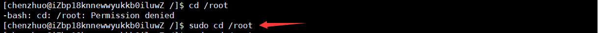

# 户组管理

**Linux系统是一个多用户多任务的分时操作系统，任何一个要使用系统资源的用户，都必须首先向root系统管理员申请一个账号，然后以这个账号的身份进入系统。**

**每个用户账号都拥有一个唯一的用户名和各自的口令，用户在登录时键入正确的用户名和口令后，就能够进入系统和自己的主目录。**

实现用户账号的管理，要完成的工作主要有如下几个方面：

- 用户账号的添加、删除与修改。
- 用户口令的管理。
- 用户组的管理。

## 用户管理

**用户的管理工作主要涉及到用户账号的添加、修改和删除。**

### 当前用户

**现在我们已经知道Linux系统当中最高权限的是root用户，其他用户则没有那么高的权限，因此操作Linux系统时，我们有必要知道我是以什么用户的身份来进行操作的，权限有多大。**

通过前面命令行获取信息：

- `[root@主机名称 当前目录]#`：当前在Linux当中使用的是root用户
- `[其他用户名@主机名称 当前目录]$`：当前在Linux当中使用的是普通用户
- 上面的 `#` 代表超级用户，也就是root用户；`$` 代表普通用户


显示用户与用户组的信息 - **id**


获取登录信息 - **w** / **who**


!> 注意登录信息中目前只有root用户在线，若有其他用户也登录了此系统，就会增加显示该用户信息。另外我使用用户1登录Linux系统，但我在里面切换为了用户2，以用户2的身份执行该命令，仍然显示的是用户1的信息。

### 新增用户

**添加用户账号就是在系统中创建一个新账号，然后为新账号分配用户号、用户组、主目录和登录Shell等资源。**

**新增用户的操作只能由最高权限的root用户完成，其他用户是没有这个权限的。**

#### 添加用户

添加用户命令 - **useradd 参数 用户名**

参数说明：

- **-c** 指定一段注释性描述。

- **-d** 创建用户时为用户指定用户主目录。
- **-m** 使用者目录如不存在则自动建立。
- **-g 用户组** 指定用户所属的用户组。
- **-G 用户组** 指定用户所属的附加组。
- **-u 用户号** 指定用户的用户号。


添加用户同时会在/etc/passwd文件中写入用户信息，并同时更新其他系统文件如/etc/shadow, /etc/group等：


#### 设置密码

**现在我们已经新建了一个chenzhuo用户，但这个用户是没有密码的，处于一种被锁定的状态的，即外部连接软件不能使用该用户名直接进行登录：**


后面接着输入密码，但chenzhuo没有设置密码所以无法连接：


但在内部可以通过root用户切换过去：


为了让新建用户通过外部可以连接，我们需要给chenzhuo用户设置密码：

用户设置密码 - **passwd 参数 用户名**

- 无参数，键入用户后回车，设置密码
- **-l**/**-u** 锁定/解锁用户（锁定后账户就不能进行登录，必须解锁才能登录）。
- **-d** 清除用户密码（用户密码清空以后，该用户也不能进行登录）。
- **-f** 强迫用户下次登录时修改口令。
- **-e** 设置密码立即过期，用户登录时会强制要求修改密码。
- **-i** 设置密码过期多少天以后禁用该用户。


?> 说明：输入密码和确认密码没有回显且必须一气呵成的输入完成（不能使用退格键），密码和确认密码需要一致。如果使用`passwd`命令时没有指定命令作用的对象，则表示要修改当前用户的密码。如果想批量修改用户密码，可以使用`chpasswd`命令。

现在我们通过xshell使用chenzhuo这个用户来输入密码进行登录：


可以看到chenzhuo用户现在可以正常登录使用了，且当前的登录信息当中也显示的chenzhuo用户：


!> 注意：普通用户只能更改自己的密码，管理员可以更改所有人的密码。

### 用户家目录

**每个用户登录Linux系统以后，所在的初始路径就是当前用户的家目录也可以叫主目录，不同用户的家目录所在路径不一样，但在命令行的表示都是同一个字符 `~` 来表示。**

root用户的家目录就是：`/root`


chenzhuo用户的家目录就是创建该用户时生成的用户目录：通常是 `/home/用户名称`


### 修改用户

修改用户账号就是根据实际情况更改用户的有关属性，如用户号、主目录、用户组、登录Shell等。

修改已有用户的信息使用usermod命令，其格式如下：

添加用户命令 - **usermod 参数 用户名**

参数说明：

- **-c** 指定一段注释性描述。

- **-d** 创建用户时为用户指定用户主目录。
- **-m** 使用者目录如不存在则自动建立。
- **-g 用户组** 指定用户所属的用户组。
- **-G 用户组** 指定用户所属的附加组。
- **-u 用户号** 指定用户的用户号。

例如：

```
# usermod -s /bin/ksh -d /home/z –g developer chenzhuo
```

此命令将用户kuangshen的登录Shell修改为ksh，主目录改为/home/z，用户组改为developer。

### 切换用户

**root是最高权限的用户，可以不进行密码验证，直接切换到其他用户上去，但其它用户之间切换或者切换到root用户需要通过登录密码进行验证。**

切换用户 - **su  要切换到用户名**

?> 从其他用户切换到root用户，可以直接执行 `su` 命令。


退出当前用户 - **exit**


### 用户提权

我们在使用普通用户的时候，会出现一种尴尬情况，就是权限不够，毕竟普通用户的权限没有root用户权限那么大，如果想让该命令达到和root用户同样的执行权限，就需要提高我们的权限，简称“提权”。

以管理员身份执行命令 - **sudo 命令**


?> 普通用户执行sudo命令的前提是，要root用户修改 `/etc/sudoers` 配置文件，给出权利才能使用。

使用root用户修改sudoers文件权限：


使用root用户修改sudoers文件内容：`vim /etc/sudoers`

    找到这行 root ALL=(ALL) ALL 在下面任意一行
    
    chenzhuo            ALL=(ALL)                ALL
    %chenzhuo           ALL=(ALL)                ALL
    chenzhuo            ALL=(ALL)                NOPASSWD: ALL
    %chenzhuo           ALL=(ALL)                NOPASSWD: ALL
    
    第一行:允许用户chenzhuo执行sudo命令(需要输入密码).
    第二行:允许用户组chenzhuo里面的用户执行sudo命令(需要输入密码).
    第三行:允许用户chenzhuo执行sudo命令，并且在执行的时候不输入密码.
    第四行:允许用户组chenzhuo里面的用户执行sudo命令，并且在执行的时候不输入密码.


修改后保存退出，用户就可以执行sudo命令了，不会报权限不足的提示了。



!> 注意这里有一个错误就是，`sudo cd` 无法使用是因为 `cd` 是 bash 的内置命令。sudo 让A变成了root，然后 bash 再去查找 sudo 后面跟着的命令，然而找不到cd这个命令，所以也就无法执行成功了

### 删除用户

删除用户 - **userdel 参数 要删除的用户名**

- **-r** 把用户的主目录一起删除。


## 用户组管理

**每个用户都有自己的所属用户组，Linux系统可以对一个用户组中的所有用户进行集中管理。**

**用户组的管理涉及用户组的添加、删除和修改。组的增加、删除和修改实际上就是对/etc/group文件的更新。**

### 创建用户组

创建用户组命令 - **groupadd 参数 用户组名**

- **-g GID** 指定新用户组的组标识号（GID）。
- **-o** 一般与-g选项同时使用，表示新用户组的GID可以与系统已有用户组的GID相同。


### 修改用户组

修改用户组命令 - **groupmod 选项 用户组**

- **-g GID** 为用户组指定新的组标识号。
- **-o** 与-g选项同时使用，用户组的新GID可以与系统已有用户组的GID相同。
- **-n 新用户组** 将用户组的名字改为新名字


### 切换用户组

如果一个用户同时属于多个用户组，那么用户可以在用户组之间切换，以便具有其他用户组的权限。

用户可以在登录后，使用命令newgrp切换到其他用户组，这个命令的参数就是目的用户组。例如：

```
$ newgrp root
```

这条命令将当前用户切换到root用户组，前提条件是root用户组确实是该用户的主组或附加组。

### 删除用户组

删除用户组命令 - **groupdel 用户组名**


## 户组文件

**用户、用户组管理的工作实际上都是对户组有关的系统文件进行修改，这些文件包括/etc/passwd, /etc/shadow, /etc/group等。**

### passwd文件

Linux系统中的每个用户都在/etc/passwd文件中有一个对应的记录行，它记录了这个用户的一些基本属性。

这个文件对所有用户都是可读的。它的内容类似下面的例子：

```
＃ cat /etc/passwd

root:x:0:0:Superuser:/:
daemon:x:1:1:System daemons:/etc:
bin:x:2:2:Owner of system commands:/bin:
sys:x:3:3:Owner of system files:/usr/sys:
adm:x:4:4:System accounting:/usr/adm:
uucp:x:5:5:UUCP administrator:/usr/lib/uucp:
auth:x:7:21:Authentication administrator:/tcb/files/auth:
cron:x:9:16:Cron daemon:/usr/spool/cron:
listen:x:37:4:Network daemon:/usr/net/nls:
lp:x:71:18:Printer administrator:/usr/spool/lp:
```

/etc/passwd中一行记录对应着一个用户，每行记录又被冒号(:)分隔为7个字段，其格式和具体含义如下：

```
用户名:口令:用户标识号:组标识号:注释性描述:主目录:登录Shell
```

1）"用户名"是代表用户账号的字符串。

**通常长度不超过8个字符，并且由大小写字母和/或数字组成。登录名中不能有冒号(:)，因为冒号在这里是分隔符。**为了兼容起见，登录名中最好不要包含点字符(.)，并且不使用连字符(-)和加号(+)打头。

2）“口令”一些系统中，存放着加密后的用户口令。

现在许多Linux 系统（如SVR4）都使用了shadow技术，把真正的加密后的用户口令字存放到/etc/shadow文件中，而在/etc/passwd文件的口令字段中只存放一个特殊的字符，例如“x”或者“*”。

3）“用户标识号”是一个整数，系统内部用它来标识用户。

**一般情况下它与用户名是一一对应的。如果几个用户名对应的用户标识号是一样的，系统内部将把它们视为同一个用户，但是它们可以有不同的口令、不同的主目录以及不同的登录Shell等**。通常用户标识号的取值范围是0～65535。0是超级用户root的标识号，1～99由系统保留，作为管理账号，普通用户的标识号从100开始。在Linux系统中，这个界限是500。

4）“组标识号”字段记录的是用户所属的用户组，对应着/etc/group文件中的一条记录。

5)“注释性描述”字段记录用户个人情况，例如姓名、电话等，没有什么实际用途。

6)“主目录”，用户起始工作目录。

它是用户在登录到系统之后所处的目录。通常，各用户的主目录都被组织在同一个特定的目录下，而用户主目录的名称就是该用户的登录名。各用户对自己的主目录有读、写、执行（搜索）权限，其他用户对此目录的访问权限则根据具体情况设置。

7)用户登录后，要启动一个进程，负责将用户的操作传给内核，这个进程是用户登录到系统后运行的命令解释器或某个特定的程序，即Shell。

Shell是用户与Linux系统之间的接口。Linux的Shell有许多种，每种都有不同的特点。常用的有sh(Bourne Shell), csh(C Shell), ksh(Korn Shell), tcsh(TENEX/TOPS-20 type C Shell), bash(Bourne Again Shell)等。

系统管理员可以根据系统情况和用户习惯为用户指定某个Shell。如果不指定Shell，那么系统使用sh为默认的登录Shell，即这个字段的值为/bin/sh。

用户的登录Shell也可以指定为某个特定的程序（此程序不是一个命令解释器）。利用这一特点，我们可以限制用户只能运行指定的应用程序，在该应用程序运行结束后，用户就自动退出了系统。有些Linux 系统要求只有那些在系统中登记了的程序才能出现在这个字段中。

8)系统中有一类用户称为伪用户（pseudo users）。

这些用户在/etc/passwd文件中也占有一条记录，但是不能登录，因为它们的登录Shell为空。它们的存在主要是方便系统管理，满足相应的系统进程对文件属主的要求。

常见的伪用户如下所示：

```
伪 用 户 含 义
bin 拥有可执行的用户命令文件
sys 拥有系统文件
adm 拥有帐户文件
uucp UUCP使用
lp lp或lpd子系统使用
nobody NFS使用
```

### shadow文件

**1、除了上面列出的伪用户外，还有许多标准的伪用户，例如：audit, cron, mail, usenet等，它们也都各自为相关的进程和文件所需要。**

由于/etc/passwd文件是所有用户都可读的，如果用户的密码太简单或规律比较明显的话，一台普通的计算机就能够很容易地将它破解，因此对安全性要求较高的Linux系统都把加密后的口令字分离出来，单独存放在一个文件中，这个文件是/etc/shadow文件。有超级用户才拥有该文件读权限，这就保证了用户密码的安全性。

**2、/etc/shadow中的记录行与/etc/passwd中的一一对应，它由pwconv命令根据/etc/passwd中的数据自动产生。**


它的文件格式与/etc/passwd类似，由若干个字段组成，字段之间用":"隔开。这些字段是：

```
登录名:加密口令:最后一次修改时间:最小时间间隔:最大时间间隔:警告时间:不活动时间:失效时间:标志
```

1. "登录名"是与/etc/passwd文件中的登录名相一致的用户账号
2. "口令"字段存放的是加密后的用户口令字，长度为13个字符。如果为空，则对应用户没有口令，登录时不需要口令；如果含有不属于集合 { ./0-9A-Za-z }中的字符，则对应的用户不能登录。
3. "最后一次修改时间"表示的是从某个时刻起，到用户最后一次修改口令时的天数。时间起点对不同的系统可能不一样。例如在SCO Linux 中，这个时间起点是1970年1月1日。
4. "最小时间间隔"指的是两次修改口令之间所需的最小天数。
5. "最大时间间隔"指的是口令保持有效的最大天数。
6. "警告时间"字段表示的是从系统开始警告用户到用户密码正式失效之间的天数。
7. "不活动时间"表示的是用户没有登录活动但账号仍能保持有效的最大天数。
8. "失效时间"字段给出的是一个绝对的天数，如果使用了这个字段，那么就给出相应账号的生存期。期满后，该账号就不再是一个合法的账号，也就不能再用来登录了。

### group文件

将用户分组是Linux系统中对用户进行管理及控制访问权限的一种手段。每个用户都属于某个用户组；一个组中可以有多个用户，一个用户也可以属于不同的组。用户组的所有信息都存放在/etc/group文件中。

当一个用户同时是多个组中的成员时，在/etc/passwd文件中记录的是用户所属的主组，也就是登录时所属的默认组，而其他组称为附加组。用户要访问属于附加组的文件时，必须首先使用newgrp命令使自己成为所要访问的组中的成员。


此文件的格式也类似于/etc/passwd文件，由冒号(:)隔开若干个字段，这些字段有：

```
组名:口令:组标识号:组内用户列表
```

1. "组名"是用户组的名称，由字母或数字构成。与/etc/passwd中的登录名一样，组名不应重复。
2. "口令"字段存放的是用户组加密后的口令字。一般Linux 系统的用户组都没有口令，即这个字段一般为空，或者是*。
3. "组标识号"与用户标识号类似，也是一个整数，被系统内部用来标识组。
4. "组内用户列表"是属于这个组的所有用户的列表/b]，不同用户之间用逗号(,)分隔。这个用户组可能是用户的主组，也可能是附加组。