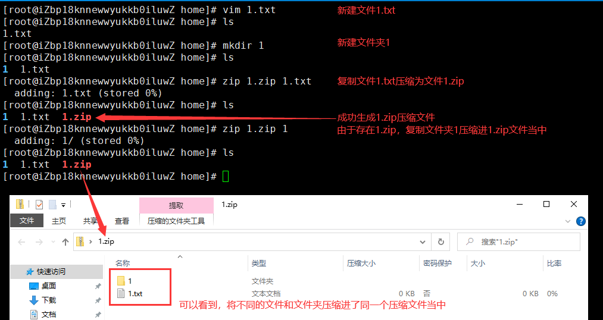

# 基础命令（压缩解压）

## zip格式

将文件或目录压缩为zip格式 - **zip 压缩文件.zip 文件或目录名称**

将zip格式的文件解压 - **unzip 压缩文件.zip**

## gzip格式

将文件压缩为gzip格式 - **gzip 文件名称**

将gzip格式的文件解压 - **gunzip 文件名称.gz**

!> gzip格式不能压缩文件夹，且在压缩或解压后均不会保留源文件。

