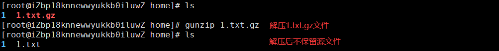

# 基础命令（压缩解压）

## zip格式

将文件或目录压缩为zip格式 - **zip 压缩文件.zip 文件或目录名称**


将zip格式的文件解压 - **unzip 压缩文件.zip**


## gzip格式

将文件压缩为gzip格式 - **gzip 文件名称**


将gzip格式的文件解压 - **gunzip 文件名称.gz**



!> gzip格式不能压缩文件夹，且在压缩或解压后均不会保留源文件。

## bzip2格式

bzip2格式文件的压缩和解压方式和gzip格式完全一样。

## tar打包

在Linux当中常见的压缩格式：`.zip`、`.tgz`、`.tbz`。

前面提到，gzip格式、bzip2格式不能对文件夹进行压缩，如果我们使用tar打包命令将文件夹打包为一个文件，就可以进行压缩了。

?> tar常规打包不会对内容进行压缩，反而还会变大。

打包命令 - **tar 参数 打包文件 要打包文件**

- **-c** 打包
- **-x** 拆包
- **-t** 不拆包，查看内容
- **-f** 指定文件
- **-v** 查看过程
- **-z** 使用gzip压缩解压
- **-j** 使用bzip2压缩解压

```
常规打包解包：
tar -cvf test.tar test 将test文件夹打包为test.tar文件
tar -tf test.tar       不拆包查看test.tar文件里面的文件
tar -xvf test.tar      将test.tar文件解包

使用gzip压缩解压：
tar -zcvf test.tgz test 使用gzip方式将test文件夹打包并压缩为test.tgz文件
tar -zxvf test.tgz      使用gzip方式将test.tgz文件解压缩解包

使用bzip2压缩解压：
tar -jcvf test.tbz test 使用bzip2方式将test文件夹打包并压缩为test.tbz文件
tar -jxvf test.tbz      使用bzip2方式将test.tbz文件解压缩解包
```


