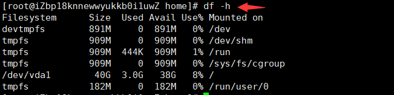
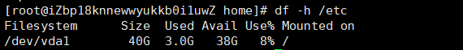
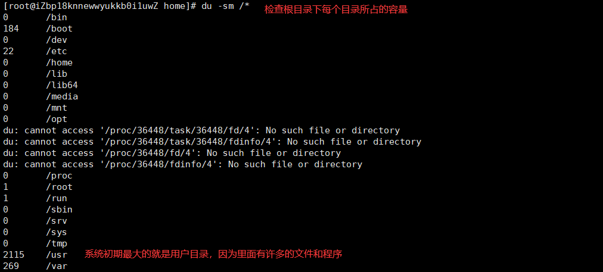

# 基础命令（磁盘管理）

Linux磁盘管理好坏直接关系到整个系统的性能问题。

## 系统磁盘使用量

列出文件系统的整体磁盘使用量 - **df 参数 [目录或文件名]**

- **-a** 列出所有的文件系统，包括系统特有的 /proc 等文件系统；
- **-k** 以 KBytes 的容量显示各文件系统；
- **-m** 以 MBytes 的容量显示各文件系统；
- **-h** 以人们较易阅读的 GBytes, MBytes, KBytes 等格式自行显示；
- **-H** 以 M=1000K 取代 M=1024K 的进位方式；
- **-T** 显示文件系统类型, 连同该 partition 的 filesystem 名称 (例如 ext3) 也列出；
- **-i** 不用硬盘容量，而以 inode 的数量来显示

下图df命令展示了磁盘的：文件系统、总体大小、使用大小、可用空间、使用率、挂载目录。



还可以将指定路径底下的可用的磁盘容量以易读的容量格式显示：



## 目录磁盘使用量

Linux du命令也是查看使用空间的，但是与df命令不同的是Linux du命令是对文件和目录磁盘使用的空间的查看，还是和df命令有一些区别的，这里介绍Linux du命令。

目录磁盘使用量 - **du 参数 文件或目录名称**

- **-a** 列出所有的文件与目录容量，因为默认仅统计目录底下的文件量而已。
- **-h** 以人们较易读的容量格式 (G/M) 显示；
- **-s** 列出总量而已，而不列出每个各别的目录占用容量；
- **-S** 不包括子目录下的总计，与 -s 有点差别。
- **-k** 以 KBytes 列出容量显示；
- **-m** 以 MBytes 列出容量显示；



## 设备挂载卸载

根文件系统之外的其他文件要想能够被访问，都必须通过“关联”至根文件系统上的某个目录来实现，此关联操作即为“挂载”，此目录即为“挂载点”,解除此关联关系的过程称之为“卸载”

### 挂载

外部设备挂载命令 - **mount 参数 装置文件名 挂载点**

- **-t** 文件系统
- **-L** Label名
- **-o** 额外选项

```
# 若插入一个外部U盘，可以将U盘挂载到Linux系统的mnt目录下：
mount /dev/u_disk /mnt/u_disk
```

### 卸载

外部设备卸载命令 - **umount 参数 装置文件名或挂载点**

- **-f** 强制卸除！可用在类似网络文件系统 (NFS) 无法读取到的情况下；
- **-n** 不升级 /etc/mtab 情况下卸除。

```
# 卸载/dev/u_disk
umount /dev/u_disk
```

## 其他磁盘命令

1. 磁盘分区表操作 - **fdisk**。

2. 磁盘分区工具 - **parted**。

3. 格式化文件系统 - **mkfs**。

    ```
    [root ~]# mkfs -t ext4 -v /dev/sdb
    ```

    - `-t` - 指定文件系统的类型。
    - `-c` - 创建文件系统时检查磁盘损坏情况。
    - `-v` - 显示详细信息。

4. 文件系统检查 - **fsck**。

5. 转换或拷贝文件 - **dd**。

6. 创建/激活/关闭交换分区 - **mkswap** / **swapon** / **swapoff**。

> **说明**：执行上面这些命令会带有一定的风险，如果不清楚这些命令的用法，最好不用随意使用，在使用的过程中，最好对照参考资料进行操作，并在操作前确认是否要这么做。