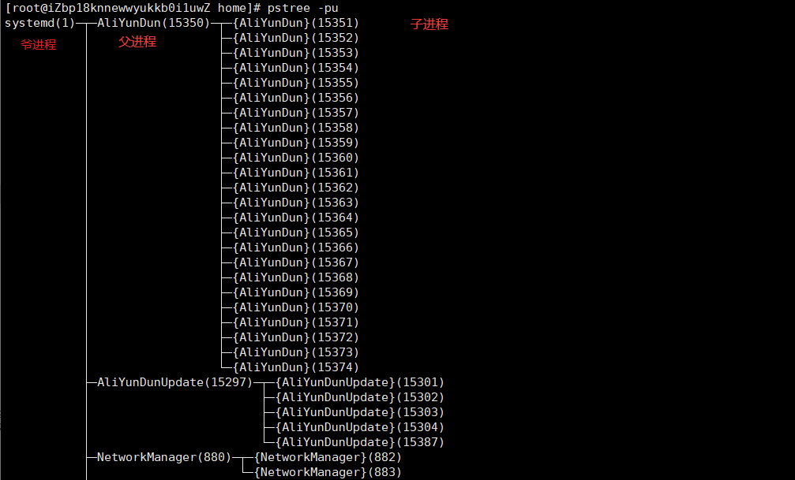
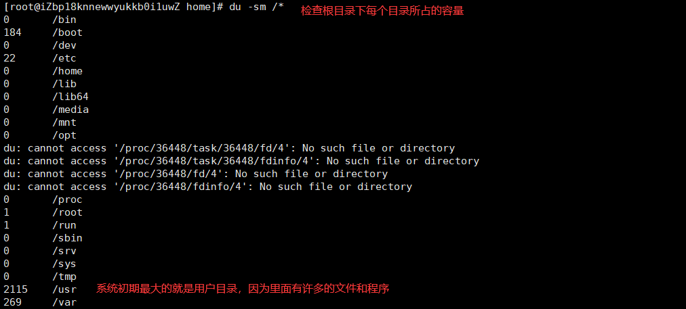
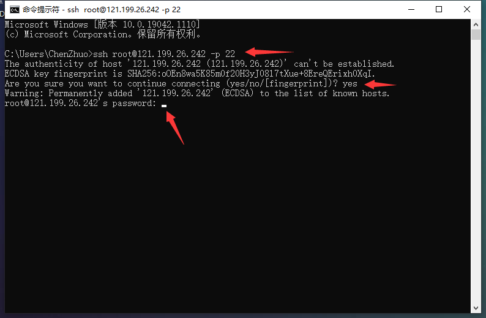
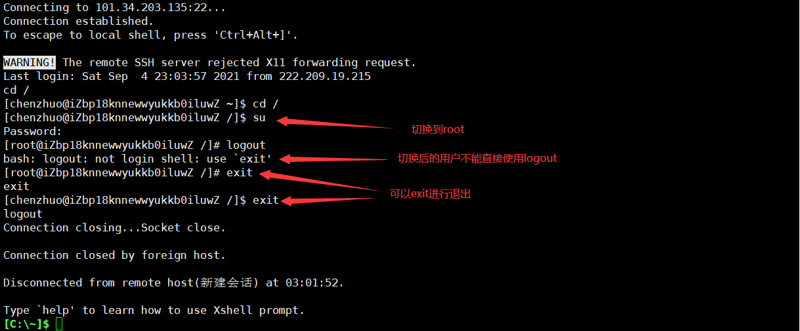

# 系统操作

## 主机名称

在前面我们介绍过Linux系统前面命令行的含义：`[当前用户@主机名称 当前目录]#`

查看主机名 - **hostname**


修改主机名 - **hostname 新名称**


这时可以看到，修改的主机名称并没有马上生效，只需重新连接即可生效：


## 系统资源

### 资源管理

#### 内存占用

查看内存使用情况 - **free 参数**

- **-b** - 以Byte为单位显示内存使用情况。
- **-k** - 以KB为单位显示内存使用情况。
- **-m** - 以MB为单位显示内存使用情况。
- **-h** - 以合适的单位显示内存使用情况，最大为三位数，自动计算对应的单位值。单位有：`B = bytes  K = kilos  M = megas  G = gigas  T = teras`
- **-o** - 不显示缓冲区调节列。
- **-s <间隔秒数>** - 持续观察内存使用状况。
- **-t** - 显示内存总和列。
- **-V** - 显示版本信息。

free指令会显示内存的使用情况，包括实体内存，虚拟的交换文件内存，共享内存区段，以及系统核心使用的缓冲区等。


虚拟内存统计 - **vmstat**


字段含义说明：

| 类别  | 项目                                     |
| ----- | ---------------------------------------- |
| r     | 等待执行的任务数                         |
| b     | 等待IO的进程数量                         |
| swpd  | 正在使用虚拟的内存大小，单位k            |
| free  | 空闲内存大小                             |
| buff  | 已用的buff大小，对块设备的读写进行缓冲   |
| cache | 已用的cache大小，文件系统的cache         |
| si    | 每秒从交换区写入内存的大小（单位：kb/s） |
| so    | 每秒从内存写到交换区的大小               |
| bi    | 每秒读取的块数（读磁盘）                 |
| bo    | 每秒写入的块数（写磁盘）                 |
| in    | 每秒中断数，包括时钟中断                 |
| cs    | 每秒上下文切换数                         |
| us    | 用户进程执行消耗cpu时间(user time)       |
| sy    | 系统进程消耗cpu时间(system time)         |
| id    | 空闲时间(包括IO等待时间)                 |
| wa    | 等待IO时间                               |

#### 实时全局监控

实时监控进程占用资源状况 - **top 参数**

- **-c** - 显示进程的整个路径。
- **-d** - 指定两次刷屏之间的间隔时间（秒为单位，默认为3秒）。
- **-i** - 不显示闲置进程或僵尸进程。
- **-p** - 显示指定进程的信息。

**top命令经常用来监控linux的系统状况，是常用的性能分析工具，能够实时显示系统中各个进程的资源占用情况。默认进入top时，前5行是统计信息，下面各进程是按照CPU的占用量来排序的进程信息。**


第1行是任务队列信息：

| 内容                         | 含义                                                         |
| :--------------------------- | :----------------------------------------------------------- |
| 17:35:29                     | 表示当前时间                                                 |
| up 49 day                    | 系统已经运行49天                                             |
| 1 users                      | 当前登录用户数为1                                            |
| load average: 0.51 0.16 0.09 | 系统负载，三个数值分别为 1分钟、5分钟、15分钟前到现在的平均值。 |

第2为进程的信息：

| 内容        | 含义             |
| :---------- | :--------------- |
| 90 total    | 进程总数         |
| 2 running   | 正在运行的进程数 |
| 88 sleeping | 睡眠的进程数     |
| 0 stopped   | 停止的进程数     |
| 0 zombie    | 僵尸进程数       |

第3行为CPU的信息：

| 内容    | 含义                                          |
| :------ | :-------------------------------------------- |
| 4.1 us  | 用户空间占用CPU百分比                         |
| 1.0 sy  | 内核空间占用CPU百分比                         |
| 0.0 ni  | 用户进程空间内改变过优先级的进程占用CPU百分比 |
| 94.5 id | 空闲CPU百分比                                 |
| 0.0 wa  | 等待输入输出的CPU时间百分比                   |
| 0.0 hi  | 硬中断（Hardware IRQ）占用CPU的百分比         |
| 0.3 si  | 软中断（Software Interrupts）占用CPU的百分比  |
| 0.0 st  |                                               |

第4行为内存信息：

| 内容               | 含义                 |
| ------------------ | -------------------- |
| 1882012 total      | 物理内存总量         |
| 96136 free         | 使用的物理内存总量   |
| 257376 used        | 空闲内存总量         |
| 1528500 buff/cache | 用作内核缓存的内存量 |

第5行为交换区信息：

| 内容              | 含义                                   |
| ----------------- | -------------------------------------- |
| 0 total           | 交换区总量                             |
| 0 used            | 使用的交换区总量                       |
| 0 free            | 空闲交换区总量                         |
| 1427912 avail Mem | 代表可用于进程下一次分配的物理内存数量 |

下面进程信息：

| 列名    | 含义                                                         |
| ------- | ------------------------------------------------------------ |
| PID     | 进程id                                                       |
| USER    | 进程所有者的用户名                                           |
| PR      | 优先级                                                       |
| NI      | nice值。负值表示高优先级，正值表示低优先级                   |
| VIRT    | 进程使用的虚拟内存总量，单位kb。                             |
| RES     | 进程使用的、未被换出的物理内存大小，单位kb。                 |
| SHR     | 共享内存大小，单位kb                                         |
| S       | 进程状态。D=不可中断的睡眠状态 R=运行 S=睡眠 T=跟踪/停止 Z=僵尸进程 |
| %CPU    | 上次更新到现在的CPU时间占用百分比                            |
| %MEM    | 进程使用的物理内存百分比                                     |
| TIME+   | 进程使用的CPU时间总计，单位1/100秒                           |
| COMMAND | 命令名/命令行                                                |

?> top命令是一个非常强大的功能，但是它监控的最小单位是进程，如果想监控更小单位时，就需要用到ps或者netstate命令来满足我们的要求。

### 进程管理

Linux中进程的基本知识点：

1. 在Linux中，每一个程序都有自己的一个进程，且每一个进程都有一个id号和一个父进程。
2. 进程有两种存在方式：前台运行，一般基本的程序；后台运行，启动的基础服务。

#### 查看进程

查看当前系统中各种进程信息 - **ps 参数**

- **-a** 显示当前终端运行的一个进程信息。
- **-u** 显示属于该用户的进程信息。
- **-x** 显示后台运行的进程参数。


进程树命令 - **pstree 参数**

- **-p** 显示父进程id。
- **-u** 显示用户组。

?> 通过进程树我们可以很直观的看到子进程和父进程。



#### 筛选进程

**上面可以看到许多的进程信息，但有很大一部分是我们不需要知道的，我们可以在Linux当中通过管道符 `|` 将进程筛选出来。**例如：

```base
格式：ps -aux|grep 名称
只查看mysql进程：ps -aux|grep mysql
只查看redis进程：ps -aux|grep redis
```

?> 下图中，输出的进程信息是查询的该命令的进程，本机还未安装mysql和redis。


查找与指定条件匹配的进程号 - **pgrep 进程名**


#### 后台进程

查看后台进程 - **jobs**

jobs命令可用于查看系统后台运行程序，文件位于/usr/bin目录下。jobs是bash内建命令，已集成在bash中，无需单独进行安装，就可以进行运行。

#### 结束进程

强制结束进程的命令 - **kill -9 进程id**

结束名称为mysql的进程（包括同名进程） - **killall -9 mysql**

结束进程中含有“字符串”的所有进程 - **kill -9 $(pgrep 字符串)**

结束用户的所有进程（会让用户和服务器断开连接） - **pkill -u 用户名称**

### 磁盘管理

Linux磁盘管理好坏直接关系到整个系统的性能问题。

#### 磁盘使用量

列出文件系统的整体磁盘使用量 - **df 参数 [目录或文件名]**

- **-a** 列出所有的文件系统，包括系统特有的 /proc 等文件系统；
- **-k** 以 KBytes 的容量显示各文件系统；
- **-m** 以 MBytes 的容量显示各文件系统；
- **-h** 以人们较易阅读的 GBytes, MBytes, KBytes 等格式自行显示；
- **-H** 以 M=1000K 取代 M=1024K 的进位方式；
- **-T** 显示文件系统类型, 连同该 partition 的 filesystem 名称 (例如 ext3) 也列出；
- **-i** 不用硬盘容量，而以 inode 的数量来显示

下图df命令展示了磁盘的：文件系统、总体大小、使用大小、可用空间、使用率、挂载目录。


还可以将指定路径底下的可用的磁盘容量以易读的容量格式显示：


文件和目录磁盘使用量 - **du 参数 文件或目录名称**

- **-a** 列出所有的文件与目录容量，因为默认仅统计目录底下的文件量而已。
- **-h** 以人们较易读的容量格式 (G/M) 显示；
- **-s** 列出总量而已，而不列出每个各别的目录占用容量；
- **-S** 不包括子目录下的总计，与 -s 有点差别。
- **-k** 以 KBytes 列出容量显示；
- **-m** 以 MBytes 列出容量显示；



#### 设备挂载卸载

根文件系统之外的其他文件要想能够被访问，都必须通过“关联”至根文件系统上的某个目录来实现，此关联操作即为“挂载”，此目录即为“挂载点”,解除此关联关系的过程称之为“卸载”

外部设备挂载命令 - **mount 参数 装置文件名 挂载点**

- **-t** 文件系统
- **-L** Label名
- **-o** 额外选项

```
# 若插入一个外部U盘，可以将U盘挂载到Linux系统的mnt目录下：
mount /dev/u_disk /mnt/u_disk
```

外部设备卸载命令 - **umount 参数 装置文件名或挂载点**

- **-f** 强制卸除！可用在类似网络文件系统 (NFS) 无法读取到的情况下；
- **-n** 不升级 /etc/mtab 情况下卸除。

```
# 卸载/dev/u_disk
umount /dev/u_disk
```

#### 其他磁盘命令

1. 磁盘分区表操作 - **fdisk**。

2. 磁盘分区工具 - **parted**。

3. 格式化文件系统 - **mkfs**。

   ```
   [root ~]# mkfs -t ext4 -v /dev/sdb
   ```

   - `-t` - 指定文件系统的类型。
   - `-c` - 创建文件系统时检查磁盘损坏情况。
   - `-v` - 显示详细信息。

4. 文件系统检查 - **fsck**。

5. 转换或拷贝文件 - **dd**。

6. 创建/激活/关闭交换分区 - **mkswap** / **swapon** / **swapoff**。

> **说明**：执行上面这些命令会带有一定的风险，如果不清楚这些命令的用法，最好不用随意使用，在使用的过程中，最好对照参考资料进行操作，并在操作前确认是否要这么做。

## 服务配置

我们可以Linux系统下安装和配置各种服务，也就是说我们可以把Linux系统打造成数据库服务器、Web服务器、缓存服务器、文件服务器、消息队列服务器等等。**Linux下的大多数服务都被设置为守护进程（驻留在系统后台运行），所以我们安装的服务通常名字后面都有一个字母 `d`，它是英文单词`daemon`的缩写。**例如：防火墙服务叫 `firewalld`，MySQL服务叫 `mysqld`，Apache服务器叫 `httpd` 等。

### 常用命令

在安装好服务之后，可以使用 `systemctl` 命令或 `service` 命令来完成对服务的启动、停止等操作，这里我们不用深究两个命令之间的区别，只需要记住一个命令及其常用参数即可，具体操作如下所示。

查看所有的服务 - **systemctl**


系统默认启动的服务是非常多的，上图只截取了前面几行。下面是对输出的介绍：

UNIT：项目的名称，包括各个 unit 的类别(看扩展名)。

LOAD：开机时 unit 的配置是否被加载。

ACTIVE：目前的状态，须与后续的 SUB 搭配！就是我们用 systemctl status 观察时，active的内容。

DESCRIPTION：描述信息。

查看系统服务状态 - **systemctl list-unit-files**


结果也非常的多，我们仍然只截取一部分结果。**这里的 STATE 就是我们前面介绍的服务的启动状态，static表示该服务与其他服务相关联,不能单独设置该服务的启动状态，disabled表示禁止开机启动，enabled表示允许开机启动。**

systemctl 提供了一组子命令来管理单个的服务，其命令格式为：**systemctl 选项 服务名称**

```
查看服务状态
systemctl status 服务名称

列出服务配置
systemctl show 服务名称

启动服务
systemctl start 服务名称

终止服务
systemctl stop 服务名称

重启服务
systemctl restart 服务名称

设置下次开机时启动
systemctl enable 服务名称

设置下次开机时不启动
systemctl disable 服务名称

注销服务（注销后就无法再启动该服务了）
systemctl mask 服务名称

取消对服务的注销
systemctl unmask 服务名称
```

### 防火墙服务

1. 启动防火墙服务。

    ```
    [root ~]# systemctl start firewalld
    ```

2. 终止防火墙服务。

    ```
    [root ~]# systemctl stop firewalld
    ```

3. 重启防火墙服务。

    ```
    [root ~]# systemctl restart firewalld
    ```

4. 查看防火墙服务状态。

    ```
    [root ~]# systemctl status firewalld
    ```


输出内容的第一行是对 unit 的基本描述。

第二行中的 Loaded 描述操作系统启动时会不会启动这个服务，enabled 表示开机时启动，disabled 表示开机时不启动。而启动该服务的配置文件路径为：`/lib/systemd/system/firewalld.service`。

第三行 中的 Active 描述服务当前的状态，active (running) 表示服务正在运行中。如果是 inactive (dead) 则表示服务当前没有运行。后面则是服务的启动时间。

第四行的 Docs 提供了在线文档的地址。

第五行的 Main PID 表示进程的 ID，接下来是任务的数量，占用的内存和 CPU 资源。

第六行的 Cgroup 描述的是 cgrpup 相关的信息，笔者会在后续的文章中详细的介绍。

最后是输出的日志信息。

## 计划任务

1. 在指定的时间执行命令。

    - **at** - 将任务排队，在指定的时间执行。
    - **atq** - 查看待执行的任务队列。
    - **atrm** - 从队列中删除待执行的任务。

    指定3天以后下午5点要执行的任务。

    ```
    [root ~]# at 5pm+3daysat> rm -f /root/*.htmlat> <EOT>job 9 at Wed Jun  5 17:00:00 2019
    ```

    查看待执行的任务队列。

    ```
    [root ~]# atq9       Wed Jun  5 17:00:00 2019 a root
    ```

    从队列中删除指定的任务。

    ```
    [root ~]$ atrm 9
    ```

2. 计划任务表 - **crontab**。

    ```
    [root ~]# crontab -e* * * * * echo "hello, world!" >> /root/hello.txt59 23 * * * rm -f /root/*.log
    ```

    > 说明：输入`crontab -e`命令会打开vim来编辑Cron表达式并指定触发的任务，上面我们定制了两个计划任务，一个是每分钟向/root目录下的hello.txt中追加输出`hello, world!`；另一个是每天23时59分执行删除/root目录下以log为后缀名的文件。如果不知道Cron表达式如何书写，可以参照/etc/crontab文件中的提示（下面会讲到）或者用搜索引擎找一下“Cron表达式在线生成器”来生成Cron表达式。

    和crontab相关的文件在`/etc`目录下，通过修改`/etc`目录下的crontab文件也能够定制计划任务。


## 登录退出

### ssh协议

**ssh是一个远程登录协议，默认端口号是22。**按照下面步骤编辑配置启动ssh服务：

```
yum install sshd-service  # 安装sshd服务
vim /etc/ssh/sshd_config  # 配置ssh

编辑内容为：
'''
Port 22              # 端口号22Protocol 
2                    # ssh2类型
PermitRootLogin yes  # 允许任何类型登录
'''
```

PermitRootLogin可以限定root用户通过ssh的登录方式，如禁止登陆、禁止密码登录、仅允许密钥登陆和开放登陆，以下是对可选项的概括：

| 参数类别             | ssh登陆 | 登录方式       | 交互shell          |
| -------------------- | ------- | -------------- | ------------------ |
| yes                  | 允许    | 没有限制       | 没有限制           |
| without-password     | 允许    | 除密码以外     | 没有限制           |
| forced-commands-only | 允许    | 仅允许使用密钥 | 仅允许已授权的命令 |
| no                   | 不允许  | N/A            | N/A                |

ssh服务

```
service sshd status  # 查看sshd服务状态service
sshd start           # 启动sshd服务service
sshd restart         # 重启sshd服务service
sshd stop            # 停止sshd服务
```

### 远程连接

如我们使用的是其他的电脑，从来没有连接过自己的服务器，就可以打开该电脑的终端使用 ssh 命令来进行连接。其实这个在前面《常用软件》中讲过，直接粘贴：

```
ssh root@云服务器公网IP -p 22
```



输入重置后的实例密码（这里输入密码是没有任何显示的，但密码是输入进去的），点击回车，就接连接上了云服务器：


### 密钥登陆

```
密码学的内容，加密-解密，用到一个东西  秘钥
加密-解密秘钥相同-对称加解密
加密-解密秘钥不相同-非对称加解密
一对儿秘钥：公钥和私钥
公钥：给你们，你们拿的都是公钥
私钥：我自己拥有，
公钥加密-私钥解密，私钥加密-公钥解密
实现免密码登录，linux1登录linux2，实现免密码登录
（1）在linux1上，生成公钥和私钥
ssh-keygen   一路敲enter即可
（2）来到生成秘钥的文件中
id_rsa : 私钥
id_rsa.pub : 公钥
（3）复制公钥
（4）来到linux2中
vi ~/.ssh/authorized_keys
将公钥粘贴进来即可
这样在通过linux1登录linux2的时候就实现了免密码登录
```

### 注销登录

注销登录 - **exit** / **logout**

logout只能是从当前登录的用户退出系统登录：


exit即能从当前登录的用户退出系统登录，也能从切换后的用户退出到当前登录的用户：



## 运行级别

运行级别 - **runlevel**

**linux操作系统自从开始启动至启动完毕需要经历几个不同的阶段，这几个阶段就叫做runlevel，同样，当linux操作系统关闭时也要经历另外几个不同的runlevel，进入每个runlevel都需要启动或关闭相应的一系列服务(services)。**在大多数的linux发行版本中，通常有8个runlevel：

```
运行级别0：系统停机状态，系统默认运行级别不能设为0，否则不能正常启动
运行级别1：单用户工作状态，root权限，用于系统维护，禁止远程登陆
运行级别2：多用户状态(没有NFS)
运行级别3：完全的多用户状态(有NFS)，登陆后进入控制台命令行模式
运行级别4：系统未使用，保留
运行级别5：X11控制台，登陆后进入图形GUI模式
运行级别6：系统正常关闭并重启，默认运行级别不能设为6，否则不能正常启动
S s Single user mode
```

**多数的桌面的linux系统缺省的runlevel是5，用户登陆时是图形界面，而多数的服务器版本的linux系统缺省的runlevel是3，用户登陆时是字符界面，runlevel 1和2除了调试之外很少使用，runlevel s和S并不是直接给用户使用，而是用来为Single user mode作准备。**


切换运行级别 - **init**

您可以认为runlevel有点象微软的windows操作系统启动模式中的Normal（正常模式），safemode（安全模式），和command prompt only（命令行模式），比起windows的启动模式的优势在于：你可以在系统空闲时使用init命令切换你现在使用的runlevel，另外，当你关闭或者启动linux系统时你已经不知不觉中切换你的runlevel，系统关机进程需要调用runlevel(0或6)来关闭所有正在运行中的进程。

```
init N：进入其它运行级别
init 0：关机
init 6：重启系统
```

## 关机重启

在linux领域内大多用在服务器上，很少遇到关机的操作。毕竟服务器上跑一个服务是永无止境的，除非特殊情况下，不得已才会关机。**但不管是重启系统还是关闭系统，首先要运行 `sync` 命令，把内存中的数据写到磁盘中。**

重启和关机 - **reboot** / **shutdown**

```
sync # 将数据由内存同步到硬盘中。

shutdown # 关机指令，你可以man shutdown 来看一下帮助文档。例如你可以运行如下命令关机：

shutdown –h 10 # 这个命令告诉大家，计算机将在10分钟后关机

shutdown –h now # 立马关机

shutdown –h 20:25 # 系统会在今天20:25关机

shutdown –h +10 # 十分钟后关机

shutdown –r now # 系统立马重启

shutdown –r +10 # 系统十分钟后重启

reboot # 立即重启，等同于 shutdown –r now

halt # 关闭系统，等同于shutdown –h now 和 poweroff
```

?> 在执行`shutdown`命令时会向登录系统的用户发出警告，可以在命令后面跟上警告消息来替换默认的警告消息，也可以在`-h`参数后通过`now`来表示立刻关机。