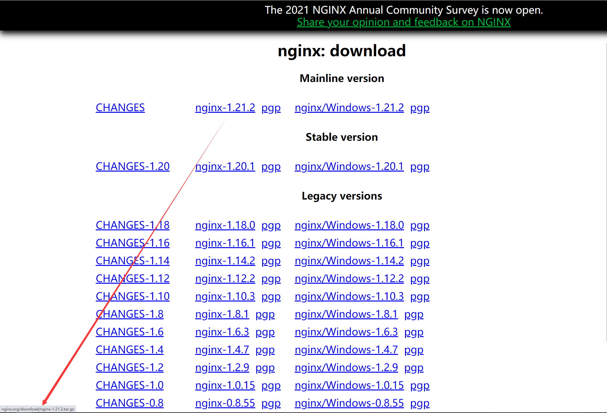
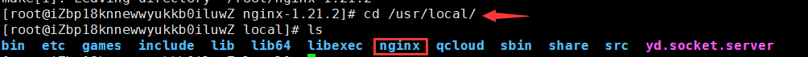
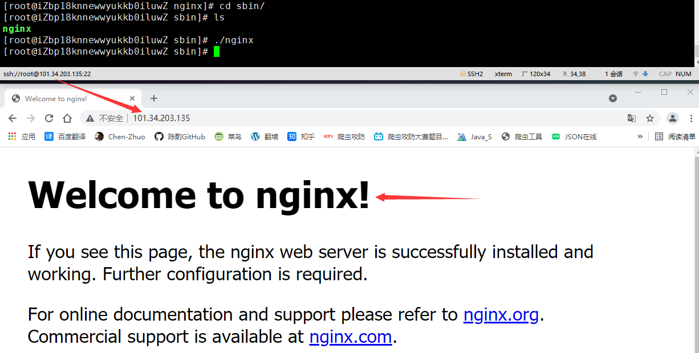
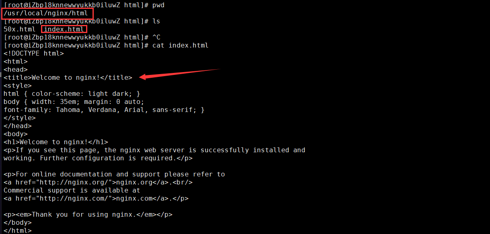
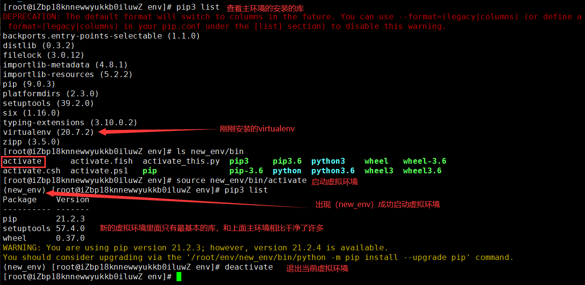
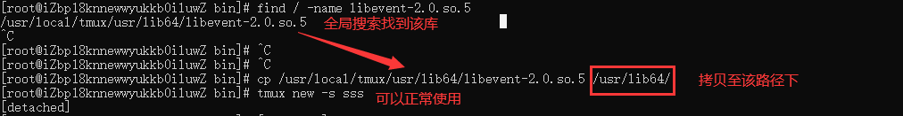
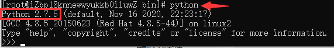
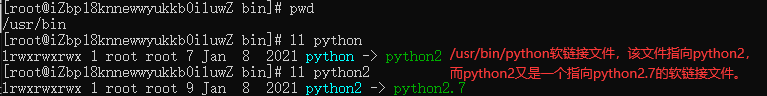

# 软件管理

**下载安装命令在基于Debian平台Ubuntu系统下是dpkg和apt指令，但在这里我们主要学习基于Fedora平台CentOS系统下的rpm和yum指令。**

## Linux软件

### 软件库

现在我们所使用云服务器系统是CentOS，但不是标准的CentOS，这是因为云服务器的提供商会在你购买云服务器后对初始化的Linux系统额外预装一些软件，例如前面编辑文件使用的Vim，而在标准的CentOS是没有Vim的，需要安装才能使用。

**除此之外，标准的CentOS用命令下载安装软件时，是从国外的标准软件库进行下载的，而我们购买的云服务器中CentOS是从自家的镜像软件库进行下载安装的。**例如，阿里云服务器的CentOS安装的软件是从阿里云镜像软件库下载，腾讯云服务器的CentOS安装的软件是从腾讯云镜像软件库下载。

**镜像软件库就是将标准软件库拷贝一份，同时还添加了额外的一些软件的仓库。**例如，在标准软件库里面没有Python3，但在镜像软件库里面有Python3，假如我们使用的是腾讯云或者阿里云的CentOS，就可以直接通过命令进行安装，而标准的CentOS就需要通过包或者源码进行安装。

为了弥补标准软件的软件包缺失，可以安装EPEL，即一组高质量的额外软件包，在这个额外的安装包里面能找到Python3。


### 软件安装包

**在Windows当中下载的安装包无外乎两种格式：`.exe`、`.msi`，而在基于基于Debian平台的安装包都是 `.deb` 格式，基于Fedora平台的安装包都是 `.rpm` 格式。**

此外，Windows当中的压缩包格式基本是：`zip`、`rar`，而在Linux当中压缩包的常见格式为：`.zip`、`.tgz`、`.tbz`。

### 软件安装方式

Linux当中软件安装有三种方式：

1. **直接在线安装**，最常用的安装方式而且会自动安装依赖，常用命令 `apt` 或 `yum`（推荐）
2. **下载离线安装包**，这种安装方式不会自动安装依赖，使用命令 `dpkg` 或 `rpm`；
3. **下载源代码包编译安装**，最为繁琐和复杂的安装方式，需要下载 `.tgz` 源代码文件，进行多个步骤的安装，不建议使用。

### 软件包命令

**不论你用的是yum还是用的rpm安装，其实安装的都是rpm包。**

在Linux里面，安装软件的时候，不仅仅是安装这么一个软件，与之对应的要按照很多的依赖软件 `a ==》b===》c==》d`，如果使用rpm安装，你要知道软件依赖关系才能安装，但是使用yum的话，不用知道依赖关系，yum自动为你解决。

```
# 查看当前Linux系统安装的软件列表
yum list installed

# 在线安装软件，自动解决依赖
yum install 软件名

# 在线安装软件，自动解决依赖，安装过程一路默认yes
yum install 软件名 -y

# 在线安装软件，自动解决依赖，指定安装路径（基本都为/usr/local/软件名称），需要新建软链接和拷贝库
yum -c /etc/yum.conf --installroot=/usr/local/软件名 --releasever=/ install 软件名 -y

# 只下载安装包，不安装
yum install -y --downloadonly --downloaddir=路径 包名 

# 卸载软件，自动解决依赖
yum remove 软件名

# 显示可用更新
yum check-update

# 更新指定的软件
yum update 软件名

# 查看当前Linux系统安装的软件列表
rpm -aq

# 查寻单个安装的软件
rpm -aq | grep 软件名

# 离线安装，软件包一定要在本地存在,不会自动安装依赖，一般会安装失败
rpm -ivh 包名.rpm

# 离线卸载，不会自动删除依赖，一般也不会卸载成功
rpm -e 包名

# 列出包安装路径
rpm -ql 包名

# 列出指定包的详细信息
rpm -qi 包名
```

yum是基于rpm，它的功能更加强大。

| 场景             | rpm                                | yum                                |
| :--------------- | ---------------------------------- | ---------------------------------- |
| 离线的.rpm安装包 | 能够安装，但是不能自动下载安装依赖 | 能够安装，并且能够自动下载安装依赖 |
| 在线安装         | 不支持，只能把安装包下载到本地安装 | 支持在线下载安装                   |

## 安装软件

### 安装tmux

tmux是指通过一个终端登录远程主机并运行后，在其中可以开启多个控制台的终端复用软件。

安装命令：`yum -c /etc/yum.conf --installroot=/usr/local/tmux --releasever=/ install tmux -y`


安装成功后，就会在指定的安装路径下生成文件夹：


通过上面命令安装好了以后，还不能马上使用，**原因会在最下面有讲解**，还需要在/usr/bin下新建一个软链接文件指向tmux的执行文件：

```
ln -s tmux执行文件路径 /usr/bin/tmux
```


### 安装wget

**wget是一款Linux上的下载软件，就类似于Windows上的迅雷。**

使用格式：`wget 参数 下载地址`

- -b 后台下载模式
- -O 下载到指定的目录
- -r 递归下载

下载安装命令：`yum install wget -y`，这里提示我已经安装过了。


### 安装dokcer

Docker 是一个开源的应用容器引擎，让开发者可以打包他们的应用以及依赖包到一个可移植的镜像中，然后发布到任何流行的 Linux或Windows操作系统的机器上。

安装命令：`yum install docker -y`


### 安装nginx

nginx是一款自由的、开源的、高性能的HTTP服务器和反向代理服务器，可以将我们的web应用程序部署到nginx服务器上。

首先下载安装nginx依赖，执行命令：`yum install gcc-c++ pcre-devel zlib zlib-devel openssl openssl-devel`


因为有许多包云服务器已经提前帮你安装好了，所以整体安装起来很快。

虽然我们可以直接使用yum在线安装nginx，但为了熟悉源码安装，我们使用源码文件进行安装。首先进入nginx官网，选择版本获取下载地址：



下载地址：`http://nginx.org/download/nginx-1.21.2.tar.gz`

这里我就不下载到我本机的Windows，因为下载地址的最后几位就可以看出，这是一个在Linux上使用的 `.tar.gz` 压缩文件。

直接在Linux当中使用wget通过下载地址进行下载：`wget http://nginx.org/download/nginx-1.21.2.tar.gz`


下载完成后，我们得到一个nginx的源码压缩包，使用拆包命令进行解压：`tar -zxvf nginx-1.21.2.tar.gz `

!> Linux中解压不等于安装软件。


进入文件夹找到绿色的 `configure` 可执行文件，配置nginx安装目录：`./configure --prefix=/usr/local/nginx`


用root用户身份执行命令进行编译安装：`make && make install`

命令执行完成以后，我们去到上面配置的安装路径下：`cd /usr/local/`



就会有一个nginx目录，进入nginx目录下的sbin目录，会有一个绿色的 `nginx` 可执行文件，启动nginx服务命令：`./nginx`


现在我们去访问我们服务器的地址，就能看到nginx的欢迎界面：



这个页面读取的是 `/usr/local/nginx/html` 下的 `index.html` 文件：



现在我们自己创建一个 `test.html` 静态页面：`vim test.html`，并访问：


?> 如果访问失败，执行命令 `systemctl stop firewalld` 关闭防火墙，再试试访问。

?> 一个服务器通过配置虚拟主机可以放多个网站。

### 安装Python3

方便起见，直接在线下载安装命令：`yum install python3 -y`


查看版本号：`python3 -V`


### 搭建虚拟环境

如果不知道什么是虚拟环境，请先参看：《Python板块》——《后端02-虚拟环境virtualenv》

首先我们新建一个文件夹专门用来存储虚拟环境：`mkdir env`

下面命令安装virtualenv：`pip3 install virtualenv`

检查是否安装成功：`virtualenv --version`


进入新建目录：`cd env`

搭建新的环境：`virtualenv new_env`


当前环境安装的库列表：`pip3 list`

启动虚拟环境：`source new_env/bin/activate`

退出当前虚拟环境：`deactivate`



## 常见问题

### 缺少库

通过指定路径的命令安装好了软件，运行命令后会提示缺少某某库：


其实该库已经存在，是没有被拷贝到/usr/lib64路径下：

```
# 我们通过全局搜索找库文件
find / -name 库文件
# 拷贝至/usr/lib64路径下
cp /库文件路径 /usr/lib64
```



### 默认Python

在Linux当中都为我们默认安装了Python2，在命令行中输入命令 `python` 即可启动Python2的环境：



为什么命令 `python` 启动是Python2的环境，而不是前面我们安装的Python3的环境。**这是因为在Linux当中输入命令 `python` 实际上是读取/usr/bin/python软链接文件，该文件指向python2，而python2又是一个指向python2.7的软链接文件。**



现在我们安装了最常用的Python3，现在希望输入命令 `python` 启动的是Python3的环境，可以如下操作：

```
# 删除软连接文件python
rm -rf /usr/bin/python
# 新建一个软连接文件python指向我们安装的python3
ln -s python3的执行文件路径 /usr/bin/python
```


注意当我们修改了软链接后，在使用yum命令会出现如下错误：


看错误，发现是该文件的语法错误，**首先有一点可以肯定的是，yum命令肯定调用了该文件，打开该文件发现文件内容使用的Python2的语法，看第一行的路径文件就是我们刚刚新建的软链接文件**：


这里我们应该就能明白什么原因导致了问题的出现，归纳一下就是：**因为python命令的软链接文件现在指向的是python3，导致yum命令调用Python2语法文件报错，解决办法也很简单，直接将第一行代码改为指向现有的python2的软链接。**

```
#!/usr/bin/python2
```

同样的 `/usr/libexec/urlgrabber-ext-down` 文件也会报相同的错，解决方式和上面一样。

