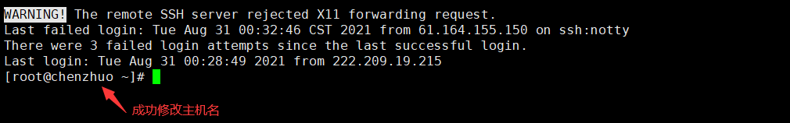
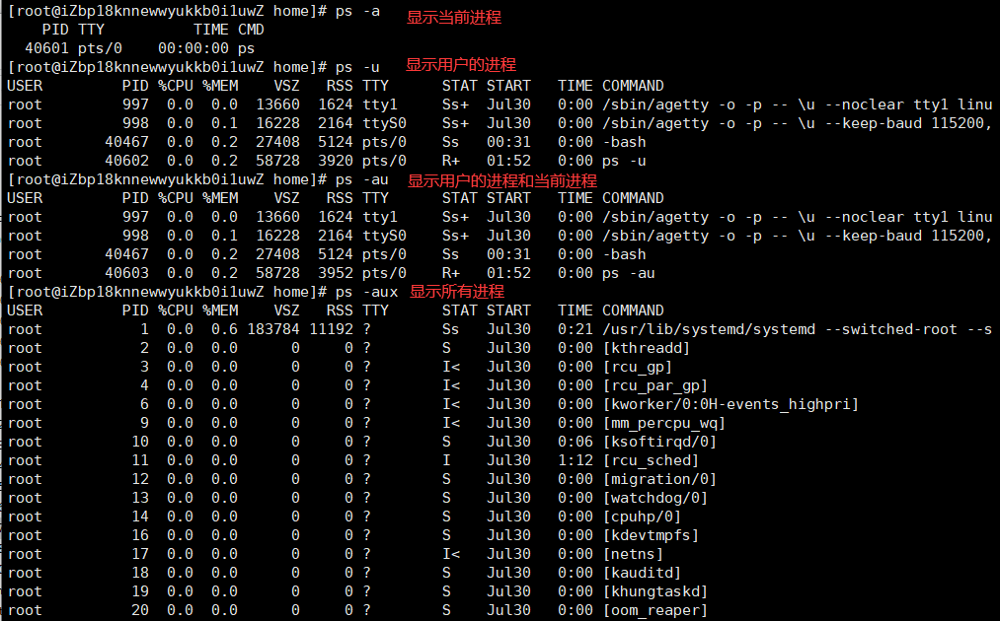
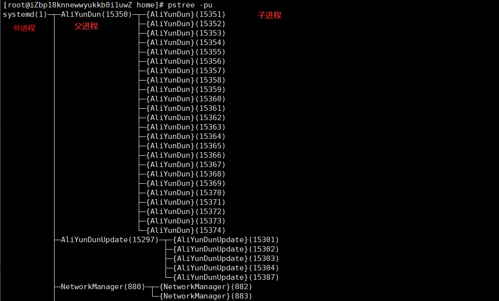
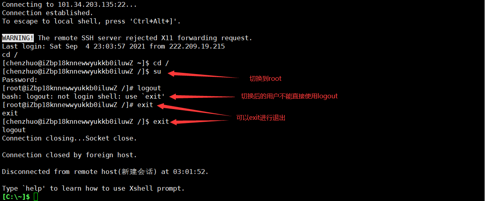

# 基础命令（系统操作）

## 主机名称

在前面我们介绍过Linux系统前面命令行的含义：`[当前用户@主机名称 当前目录]#`

查看主机名 - **hostname**


修改主机名 - **hostname 新名称**


这时可以看到，修改的主机名称并没有马上生效，只需重新连接即可生效：



## 磁盘管理

Linux磁盘管理好坏直接关系到整个系统的性能问题。

### 系统磁盘使用量

列出文件系统的整体磁盘使用量 - **df 参数 [目录或文件名]**

- **-a** 列出所有的文件系统，包括系统特有的 /proc 等文件系统；
- **-k** 以 KBytes 的容量显示各文件系统；
- **-m** 以 MBytes 的容量显示各文件系统；
- **-h** 以人们较易阅读的 GBytes, MBytes, KBytes 等格式自行显示；
- **-H** 以 M=1000K 取代 M=1024K 的进位方式；
- **-T** 显示文件系统类型, 连同该 partition 的 filesystem 名称 (例如 ext3) 也列出；
- **-i** 不用硬盘容量，而以 inode 的数量来显示

下图df命令展示了磁盘的：文件系统、总体大小、使用大小、可用空间、使用率、挂载目录。


还可以将指定路径底下的可用的磁盘容量以易读的容量格式显示：


### 目录磁盘使用量

Linux du命令也是查看使用空间的，但是与df命令不同的是Linux du命令是对文件和目录磁盘使用的空间的查看，还是和df命令有一些区别的，这里介绍Linux du命令。

目录磁盘使用量 - **du 参数 文件或目录名称**

- **-a** 列出所有的文件与目录容量，因为默认仅统计目录底下的文件量而已。
- **-h** 以人们较易读的容量格式 (G/M) 显示；
- **-s** 列出总量而已，而不列出每个各别的目录占用容量；
- **-S** 不包括子目录下的总计，与 -s 有点差别。
- **-k** 以 KBytes 列出容量显示；
- **-m** 以 MBytes 列出容量显示；


### 设备挂载卸载

根文件系统之外的其他文件要想能够被访问，都必须通过“关联”至根文件系统上的某个目录来实现，此关联操作即为“挂载”，此目录即为“挂载点”,解除此关联关系的过程称之为“卸载”

外部设备挂载命令 - **mount 参数 装置文件名 挂载点**

- **-t** 文件系统
- **-L** Label名
- **-o** 额外选项

```
# 若插入一个外部U盘，可以将U盘挂载到Linux系统的mnt目录下：
mount /dev/u_disk /mnt/u_disk
```

外部设备卸载命令 - **umount 参数 装置文件名或挂载点**

- **-f** 强制卸除！可用在类似网络文件系统 (NFS) 无法读取到的情况下；
- **-n** 不升级 /etc/mtab 情况下卸除。

```
# 卸载/dev/u_disk
umount /dev/u_disk
```

### 其他磁盘命令

1. 磁盘分区表操作 - **fdisk**。

2. 磁盘分区工具 - **parted**。

3. 格式化文件系统 - **mkfs**。

    ```
    [root ~]# mkfs -t ext4 -v /dev/sdb
    ```

    - `-t` - 指定文件系统的类型。
    - `-c` - 创建文件系统时检查磁盘损坏情况。
    - `-v` - 显示详细信息。

4. 文件系统检查 - **fsck**。

5. 转换或拷贝文件 - **dd**。

6. 创建/激活/关闭交换分区 - **mkswap** / **swapon** / **swapoff**。

> **说明**：执行上面这些命令会带有一定的风险，如果不清楚这些命令的用法，最好不用随意使用，在使用的过程中，最好对照参考资料进行操作，并在操作前确认是否要这么做。

## 进程管理

Linux中进程的基本知识点：

1. 在Linux中，每一个程序都有自己的一个进程，且每一个进程都有一个id号和一个父进程。
2. 进程有两种存在方式：前台运行，一般基本的程序；后台运行，启动的基础服务。

### 查看进程信息

查看当前系统中各种进程信息 - **ps 参数**

- **-a** 显示当前终端运行的一个进程信息。
- **-u** 显示属于该用户的进程信息。
- **-x** 显示后台运行的进程参数。



### 筛选进程信息

**上面可以看到许多的进程信息，但有很大一部分是我们不需要知道的，我们可以在Linux当中通过管道符 `|` 将进程筛选出来。**例如：

```base
格式：ps -aux|grep 名称
只查看mysql进程：ps -aux|grep mysql
只查看redis进程：ps -aux|grep redis
```


### 进程树

通过进程树我们可以很直观的看到子进程和父进程。

进程树命令 - **pstree 参数**

- **-p** 显示父进程id。
- **-u** 显示用户组。



### 结束进程

强制结束进程的命令 - **kill -9 进程id**

结束名称为mysql的进程（包括同名进程） - **killall -9 mysql**

结束用户的所有进程（会让用户和服务器断开连接） - **pkill -u 用户名称**

## 退出登录

退出登录 - **exit** / **logout**


logout只能作用于登录的用户，不能作用于切换后的用户，但exit可以：



## 关机重启

在linux领域内大多用在服务器上，很少遇到关机的操作。毕竟服务器上跑一个服务是永无止境的，除非特殊情况下，不得已才会关机。**但不管是重启系统还是关闭系统，首先要运行 `sync` 命令，把内存中的数据写到磁盘中。**

重启和关机 - **reboot** / **shutdown**。

```
sync # 将数据由内存同步到硬盘中。

shutdown # 关机指令，你可以man shutdown 来看一下帮助文档。例如你可以运行如下命令关机：

shutdown –h 10 # 这个命令告诉大家，计算机将在10分钟后关机

shutdown –h now # 立马关机

shutdown –h 20:25 # 系统会在今天20:25关机

shutdown –h +10 # 十分钟后关机

shutdown –r now # 系统立马重启

shutdown –r +10 # 系统十分钟后重启

reboot # 立即重启，等同于 shutdown –r now

halt # 关闭系统，等同于shutdown –h now 和 poweroff
```

?> 在执行`shutdown`命令时会向登录系统的用户发出警告，可以在命令后面跟上警告消息来替换默认的警告消息，也可以在`-h`参数后通过`now`来表示立刻关机。
