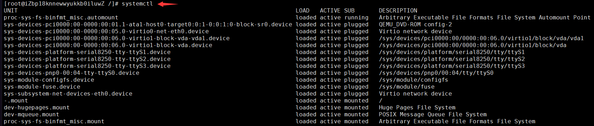
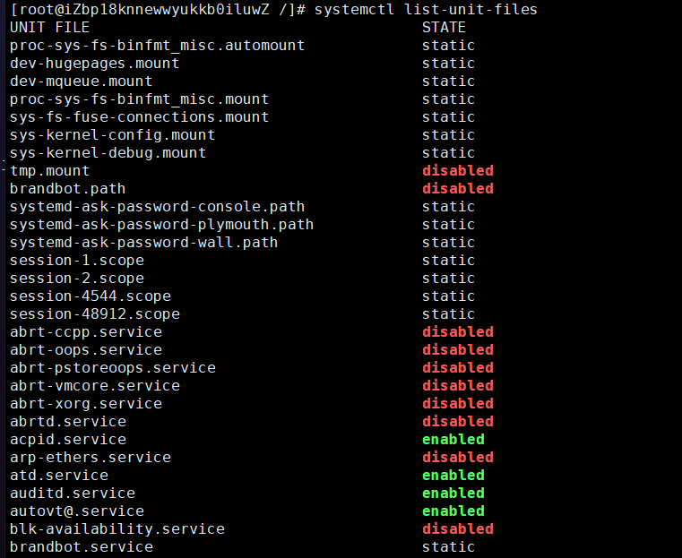
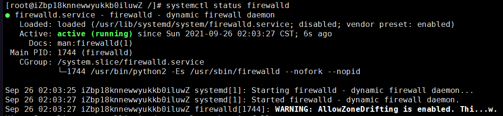

# 基础命令（系统操作）

## 主机名称

在前面我们介绍过Linux系统前面命令行的含义：`[当前用户@主机名称 当前目录]#`

查看主机名 - **hostname**


修改主机名 - **hostname 新名称**


这时可以看到，修改的主机名称并没有马上生效，只需重新连接即可生效：


## 磁盘管理

Linux磁盘管理好坏直接关系到整个系统的性能问题。

### 系统磁盘使用量

列出文件系统的整体磁盘使用量 - **df 参数 [目录或文件名]**

- **-a** 列出所有的文件系统，包括系统特有的 /proc 等文件系统；
- **-k** 以 KBytes 的容量显示各文件系统；
- **-m** 以 MBytes 的容量显示各文件系统；
- **-h** 以人们较易阅读的 GBytes, MBytes, KBytes 等格式自行显示；
- **-H** 以 M=1000K 取代 M=1024K 的进位方式；
- **-T** 显示文件系统类型, 连同该 partition 的 filesystem 名称 (例如 ext3) 也列出；
- **-i** 不用硬盘容量，而以 inode 的数量来显示

下图df命令展示了磁盘的：文件系统、总体大小、使用大小、可用空间、使用率、挂载目录。


还可以将指定路径底下的可用的磁盘容量以易读的容量格式显示：


### 目录磁盘使用量

Linux du命令也是查看使用空间的，但是与df命令不同的是Linux du命令是对文件和目录磁盘使用的空间的查看，还是和df命令有一些区别的，这里介绍Linux du命令。

目录磁盘使用量 - **du 参数 文件或目录名称**

- **-a** 列出所有的文件与目录容量，因为默认仅统计目录底下的文件量而已。
- **-h** 以人们较易读的容量格式 (G/M) 显示；
- **-s** 列出总量而已，而不列出每个各别的目录占用容量；
- **-S** 不包括子目录下的总计，与 -s 有点差别。
- **-k** 以 KBytes 列出容量显示；
- **-m** 以 MBytes 列出容量显示；


### 设备挂载卸载

根文件系统之外的其他文件要想能够被访问，都必须通过“关联”至根文件系统上的某个目录来实现，此关联操作即为“挂载”，此目录即为“挂载点”,解除此关联关系的过程称之为“卸载”

外部设备挂载命令 - **mount 参数 装置文件名 挂载点**

- **-t** 文件系统
- **-L** Label名
- **-o** 额外选项

```
# 若插入一个外部U盘，可以将U盘挂载到Linux系统的mnt目录下：
mount /dev/u_disk /mnt/u_disk
```

外部设备卸载命令 - **umount 参数 装置文件名或挂载点**

- **-f** 强制卸除！可用在类似网络文件系统 (NFS) 无法读取到的情况下；
- **-n** 不升级 /etc/mtab 情况下卸除。

```
# 卸载/dev/u_disk
umount /dev/u_disk
```

### 其他磁盘命令

1. 磁盘分区表操作 - **fdisk**。

2. 磁盘分区工具 - **parted**。

3. 格式化文件系统 - **mkfs**。

    ```
    [root ~]# mkfs -t ext4 -v /dev/sdb
    ```

    - `-t` - 指定文件系统的类型。
    - `-c` - 创建文件系统时检查磁盘损坏情况。
    - `-v` - 显示详细信息。

4. 文件系统检查 - **fsck**。

5. 转换或拷贝文件 - **dd**。

6. 创建/激活/关闭交换分区 - **mkswap** / **swapon** / **swapoff**。

> **说明**：执行上面这些命令会带有一定的风险，如果不清楚这些命令的用法，最好不用随意使用，在使用的过程中，最好对照参考资料进行操作，并在操作前确认是否要这么做。

## 配置服务

我们可以Linux系统下安装和配置各种服务，也就是说我们可以把Linux系统打造成数据库服务器、Web服务器、缓存服务器、文件服务器、消息队列服务器等等。**Linux下的大多数服务都被设置为守护进程（驻留在系统后台运行，但不会因为服务还在运行而导致Linux无法停止运行），所以我们安装的服务通常名字后面都有一个字母`d`，它是英文单词`daemon`的缩写。**例如：防火墙服务叫firewalld，MySQL服务叫mysqld，Apache服务器叫httpd等。

### 常用参数

在安装好服务之后，可以使用 `systemctl` 命令或 `service` 命令来完成对服务的启动、停止等操作，这里我们不用深究两个命令之间的区别，只需要记住一个命令及其常用参数即可，具体操作如下所示。

查看所有的服务 - **systemctl**



系统默认启动的服务是非常多的，上图只截取了前面几行。下面是对输出的介绍：

UNIT：项目的名称，包括各个 unit 的类别(看扩展名)。

LOAD：开机时 unit 的配置是否被加载。

ACTIVE：目前的状态，须与后续的 SUB 搭配！就是我们用 systemctl status 观察时，active的内容。

DESCRIPTION：描述信息。

查看系统服务状态 - **systemctl list-unit-files**



结果也非常的多，我们仍然只截取一部分结果。**这里的 STATE 就是我们前面介绍的服务的启动状态，static表示该服务与其他服务相关联,不能单独设置该服务的启动状态，disabled表示禁止开机启动，enabled表示允许开机启动。**

systemctl 提供了一组子命令来管理单个的服务，其命令格式为：**systemctl 选项 服务名称**

```
查看服务状态
systemctl status 服务名称

列出服务配置
systemctl show 服务名称

启动服务
systemctl start 服务名称

终止服务
systemctl stop 服务名称

重启服务
systemctl restart 服务名称

设置下次开机时启动
systemctl enable 服务名称

设置下次开机时不启动
systemctl disable 服务名称

注销服务（注销后就无法再启动该服务了）
systemctl mask 服务名称

取消对服务的注销
systemctl unmask 服务名称
```

### 防火墙服务

1. 启动防火墙服务。

    ```
    [root ~]# systemctl start firewalld
    ```

2. 终止防火墙服务。

    ```
    [root ~]# systemctl stop firewalld
    ```

3. 重启防火墙服务。

    ```
    [root ~]# systemctl restart firewalld
    ```

4. 查看防火墙服务状态。

    ```
    [root ~]# systemctl status firewalld
    ```




输出内容的第一行是对 unit 的基本描述。

第二行中的 Loaded 描述操作系统启动时会不会启动这个服务，enabled 表示开机时启动，disabled 表示开机时不启动。而启动该服务的配置文件路径为：`/lib/systemd/system/firewalld.service`。

第三行 中的 Active 描述服务当前的状态，active (running) 表示服务正在运行中。如果是 inactive (dead) 则表示服务当前没有运行。后面则是服务的启动时间。

第四行的 Docs 提供了在线文档的地址。

第五行的 Main PID 表示进程的 ID，接下来是任务的数量，占用的内存和 CPU 资源。

第六行的 Cgroup 描述的是 cgrpup 相关的信息，笔者会在后续的文章中详细的介绍。

最后是输出的日志信息。

## 计划任务

1. 在指定的时间执行命令。

    - **at** - 将任务排队，在指定的时间执行。
    - **atq** - 查看待执行的任务队列。
    - **atrm** - 从队列中删除待执行的任务。

    指定3天以后下午5点要执行的任务。

    ```
    [root ~]# at 5pm+3daysat> rm -f /root/*.htmlat> <EOT>job 9 at Wed Jun  5 17:00:00 2019
    ```

    查看待执行的任务队列。

    ```
    [root ~]# atq9       Wed Jun  5 17:00:00 2019 a root
    ```

    从队列中删除指定的任务。

    ```
    [root ~]$ atrm 9
    ```

2. 计划任务表 - **crontab**。

    ```
    [root ~]# crontab -e* * * * * echo "hello, world!" >> /root/hello.txt59 23 * * * rm -f /root/*.log
    ```

    > 说明：输入`crontab -e`命令会打开vim来编辑Cron表达式并指定触发的任务，上面我们定制了两个计划任务，一个是每分钟向/root目录下的hello.txt中追加输出`hello, world!`；另一个是每天23时59分执行删除/root目录下以log为后缀名的文件。如果不知道Cron表达式如何书写，可以参照/etc/crontab文件中的提示（下面会讲到）或者用搜索引擎找一下“Cron表达式在线生成器”来生成Cron表达式。

    和crontab相关的文件在`/etc`目录下，通过修改`/etc`目录下的crontab文件也能够定制计划任务。

    ```
    [root ~]# cd /etc[root etc]# ls -l | grep cron-rw-------.  1 root root      541 Aug  3  2017 anacrontabdrwxr-xr-x.  2 root root     4096 Mar 27 11:56 cron.ddrwxr-xr-x.  2 root root     4096 Mar 27 11:51 cron.daily-rw-------.  1 root root        0 Aug  3  2017 cron.denydrwxr-xr-x.  2 root root     4096 Mar 27 11:50 cron.hourlydrwxr-xr-x.  2 root root     4096 Jun 10  2014 cron.monthly-rw-r--r--   1 root root      493 Jun 23 15:09 crontabdrwxr-xr-x.  2 root root     4096 Jun 10  2014 cron.weekly[root etc]# vim crontab  1 SHELL=/bin/bash  2 PATH=/sbin:/bin:/usr/sbin:/usr/bin  3 MAILTO=root  4  5 # For details see man 4 crontabs  6  7 # Example of job definition:  8 # .---------------- minute (0 - 59)  9 # |  .------------- hour (0 - 23) 10 # |  |  .---------- day of month (1 - 31) 11 # |  |  |  .------- month (1 - 12) OR jan,feb,mar,apr ... 12 # |  |  |  |  .---- day of week (0 - 6) (Sunday=0 or 7) OR sun,mon,tue,wed,thu,fri,sat 13 # |  |  |  |  | 14 # *  *  *  *  * user-name  command to be executed
    ```

## 进程管理

Linux中进程的基本知识点：

1. 在Linux中，每一个程序都有自己的一个进程，且每一个进程都有一个id号和一个父进程。
2. 进程有两种存在方式：前台运行，一般基本的程序；后台运行，启动的基础服务。

### 查看进程信息

查看当前系统中各种进程信息 - **ps 参数**

- **-a** 显示当前终端运行的一个进程信息。
- **-u** 显示属于该用户的进程信息。
- **-x** 显示后台运行的进程参数。


### 筛选进程信息

**上面可以看到许多的进程信息，但有很大一部分是我们不需要知道的，我们可以在Linux当中通过管道符 `|` 将进程筛选出来。**例如：

```base
格式：ps -aux|grep 名称
只查看mysql进程：ps -aux|grep mysql
只查看redis进程：ps -aux|grep redis
```


### 进程树

通过进程树我们可以很直观的看到子进程和父进程。

进程树命令 - **pstree 参数**

- **-p** 显示父进程id。
- **-u** 显示用户组。


### 结束进程

强制结束进程的命令 - **kill -9 进程id**

结束名称为mysql的进程（包括同名进程） - **killall -9 mysql**

结束用户的所有进程（会让用户和服务器断开连接） - **pkill -u 用户名称**

## 退出登录

退出登录 - **exit** / **logout**


logout只能作用于登录的用户，不能作用于切换后的用户，但exit可以：


## 关机重启

在linux领域内大多用在服务器上，很少遇到关机的操作。毕竟服务器上跑一个服务是永无止境的，除非特殊情况下，不得已才会关机。**但不管是重启系统还是关闭系统，首先要运行 `sync` 命令，把内存中的数据写到磁盘中。**

重启和关机 - **reboot** / **shutdown**。

```
sync # 将数据由内存同步到硬盘中。

shutdown # 关机指令，你可以man shutdown 来看一下帮助文档。例如你可以运行如下命令关机：

shutdown –h 10 # 这个命令告诉大家，计算机将在10分钟后关机

shutdown –h now # 立马关机

shutdown –h 20:25 # 系统会在今天20:25关机

shutdown –h +10 # 十分钟后关机

shutdown –r now # 系统立马重启

shutdown –r +10 # 系统十分钟后重启

reboot # 立即重启，等同于 shutdown –r now

halt # 关闭系统，等同于shutdown –h now 和 poweroff
```

?> 在执行`shutdown`命令时会向登录系统的用户发出警告，可以在命令后面跟上警告消息来替换默认的警告消息，也可以在`-h`参数后通过`now`来表示立刻关机。
