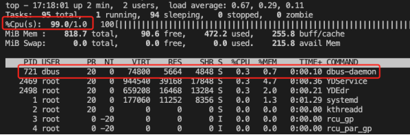

# 网络安全

## 网络流量

### 外网IP地址

查看本机的外网IP地址(windows、Linux通用) - **curl ip.sb**


查看本机的外网IP地址 - **curl ifconfig.me**


### 网络配置

网络配置查看 - **ifconfig**

```
ifconfig：查看和设置网卡信息（eth0第一网卡，eth1第二块网卡，lo回环网卡（虚拟））
ifconfig eth0 IP地址：设置网卡eth0指定的IP地址
```


第一块网卡 `ifcfg-eth0` 配置文件：`vim /etc/sysconfig/network-scripts/ifcfg-eth0 `

```
DEVICE         # 设备名称
BOOTPROTO      # 地址类型静态
HWADDR         # HWaddr的值
TYPE           # 网络类型
UUID           # 唯一标识
ONBOOT         # 是否自动加载
NM_CONTROLLED  # NNetwork Manager托管
IPADDR         # IP地址
NETMASK        # 子网掩码
GATEWAY        # 网关
```

### 服务端口

查看网络服务和端口 - **netstat**

- **-a** (all)显示所有选项，默认不显示LISTEN相关
- **-l** - 仅列出有在 Listen (监听) 的服务状态
- **-r** - 显示路由信息，路由表
- **-n** - 拒绝显示别名，能显示数字的全部转化成数字
- **-p** - 显示建立相关链接的程序名
- **-t** -  (tcp)仅显示tcp相关选项
- **-u** - (udp)仅显示udp相关选项

?> 提示：LISTEN和LISTENING的状态只有用-a或者-l才能看到

```
netstat -a：列出所有端口 
netstat -at：列出所有 tcp 端口 
netstat -au：列出所有 udp 端口 
netstat -an：查看所有网络连接（ESTABL LSHED连接状态，发起端口随机，目标端口固定）
netstat -rn：查看路由表
netstat -lnp：查看网络和端口使用情况
netstat -lnp | grep 80：查看与80相关的端口和服务情况
netstat -nap | grep nginx：查看与名称nginx相关的端口和服务情况
```


### 连通性检查

网络可达性检查 - **ping**

```
ping IP地址：测试与指定IP地址是否网络相通
ping -c 4 IP地址：给指定的IP地址发送4个数据包
```


### 路由表

显示或管理路由表 - **route**

### 网络监听抓包

网络监听抓包 - **tcpdump**

## 安全防护

### 木马植入

前段时间我的云服务器出现了一些问题，**其中一个就是ssh密钥被篡改还用 `chattr` 命令锁定了设置密钥的 `authorized_keys` 文件，还有一个就是服务器运行卡顿，当我重启服务器后就正常了，但慢慢的服务器又回变得卡顿，用 `free -h` 命令一看，原来内存已经满了：**


我想我也没有启动什么程序，怎么内存就被耗光了，于是我想找到是哪一个进程占用了这么多内存，**用 `top` 命令一看，发现 `%CPU(s)` 这行中显示只有 `8.5 id` 值，也就是说CPU的使用率已经达到91.5%，下面关于内存的信息倒是和 `free -h` 命令相差不大，在 `%MEM` 这列显示了当前每个进程占用内存的百分比，在 `%CPU` 这列显示了当前每个进程占用CPU的百分比，但这里奇怪的问题就来了，可以看到 `%MEM` 这列数值百分比之和远达不到系统中被消耗内存的百分比，同样 `%CPU` 这列数值之和也是远达不到系统中被消耗CPU的百分比，这是为什么呢？**于是，我把目光放在了有多个且重名的**bioset进程**上，为什么觉得这个进程可疑呢？**一般来说，除非自己启动了多个同名进程，否则Linux几乎不太可能有多个重名进程，但是该同名的bioset进程却有3个。**


我用 `ps -aux | grep bioset` 命令筛选了该进程，这三个进程占用进程号（PID）分别是23、24、25，**这时奇怪的又来了，我用 `kill -9 PID` 发现居然结束不掉该进程：**


没办法，我百度了一下这个bioset到底是个什么进程？结果得到了如下页面：**原来bioset是一个挖矿脚本，难怪服务器的CPU、内存一直处于高负载状态。**


**最终我选择了备份自己的文件，并通过控制台重装了系统实例，当然这样做也有好处，就是减少了时间花费，彻底清除了其他潜在的木马脚本**：


### 木马清理

重装系统后，我在控制台收到了如下通知：**现在可以判定服务器CPU、内存占用如此之高的罪魁祸首就是这个bioset挖矿木马了，那这个木马是怎么到我的服务器上的呢？看了通知里面提到参考文档[《挖矿木马自助清理手册》](https://s.tencent.com/research/report/168)我找到了答案。**


首先，什么是挖矿木马？**挖矿木马会占用CPU进行超频运算，从而占用主机大量的CPU资源，严重影响服务器上的其他应用的正常运行。黑客为了得到更多的算力资源，一般都会对全网进行无差别扫描，同时利用SSH爆破和漏洞利用等手段攻击主机。部分挖矿木马还具备蠕虫化的特点，在主机被成功入侵之后，挖矿木马还会向内网渗透，并在被入侵的服务器上持久化驻留以获取最大收益。整体攻击流程大致如下图所示：**


现在我明白了木马是怎么到我的服务器上了，**原因就是，服务器的安全没有做到位，导致黑客的入侵，并在我的服务器上放置了挖矿木马。**

在手册当中还提到了，**挖矿木马通常还会在~/.ssh/authoruzed_keys文件中写入黑客的SSH公钥，这样子就算用户将挖矿木马清除得一干二净，黑客还是可以免密登陆该主机，这也是常见的保持服务器控制权的手段。排查~/.ssh/authorized_keys文件，如果发现可疑的SSH公钥，直接删除。**难怪我就说为什么服务器的密钥设置文件被修改了，而且还加了文件锁。

为什么系统CPU占用率接近100%，却看不到是哪个进程导致的？这个同样也在手册中还提到了，**这种情况一般是因为系统命令被木马篡改了，从而隐藏了木马进程的踪迹，让用户无法进行溯源分析。**



命令篡改有多种方式，分别如下：

**（1）top源文件被篡改，恶意进程信息被过滤后返回。通过执行如下命令即可复原：`rm -rf /usr/bin/top && mv /usr/bin/top.original /usr/bin/top`**


**（2）篡改预加载so文件，ls、top、ps等命令已经被木马的动态链接库劫持，无法获得木马进程相关的信息。通过执行如下命令即可复原：`> /etc/ld.so.preload && rm -rf 恶意so文件路径`**


综上，我明白我在服务器上遇到的全部遭遇，想仔细了解的去链接里面看看文档，说不定收获满满。
