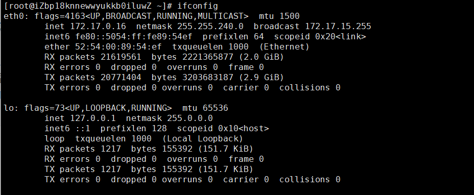

# 网络安全

## 网络流量

### 外网IP地址

查看本机的外网IP地址(windows、Linux通用) - **curl ip.sb**


查看本机的外网IP地址 - **curl ifconfig.me**


### 网络配置

网络配置查看 - **ifconfig**

```
ifconfig：查看和设置网卡信息（eth0第一网卡，eth1第二块网卡，lo回环网卡（虚拟））
ifconfig eth0 IP地址：设置网卡eth0指定的IP地址
```



第一块网卡 `ifcfg-eth0` 配置文件：`vim /etc/sysconfig/network-scripts/ifcfg-eth0 `

```
DEVICE         # 设备名称
BOOTPROTO      # 地址类型静态
HWADDR         # HWaddr的值
TYPE           # 网络类型
UUID           # 唯一标识
ONBOOT         # 是否自动加载
NM_CONTROLLED  # NNetwork Manager托管
IPADDR         # IP地址
NETMASK        # 子网掩码
GATEWAY        # 网关
```

### 服务端口

查看网络服务和端口 - **netstat**

- **-a** (all)显示所有选项，默认不显示LISTEN相关
- **-l** - 仅列出有在 Listen (监听) 的服务状态
- **-r** - 显示路由信息，路由表
- **-n** - 拒绝显示别名，能显示数字的全部转化成数字
- **-p** - 显示建立相关链接的程序名
- **-t** -  (tcp)仅显示tcp相关选项
- **-u** - (udp)仅显示udp相关选项

?> 提示：LISTEN和LISTENING的状态只有用-a或者-l才能看到

```
netstat -a：列出所有端口 
netstat -at：列出所有 tcp 端口 
netstat -au：列出所有 udp 端口 
netstat -an：查看所有网络连接（ESTABL LSHED连接状态，发起端口随机，目标端口固定）
netstat -rn：查看路由表
netstat -lnp：查看网络和端口使用情况
netstat -lnp | grep 80：查看与80相关的端口和服务情况
netstat -nap | grep nginx：查看与名称nginx相关的端口和服务情况
```


### 连通性检查

网络可达性检查 - **ping**

```
ping IP地址：测试与指定IP地址是否网络相通
ping -c 4 IP地址：给指定的IP地址发送4个数据包
```


### 路由表

显示或管理路由表 - **route**

### 网络监听抓包

网络监听抓包 - **tcpdump**

## 安全防护

### 木马植入

最近我的云服务器被植入了挖矿木马，因此我收到了如下通知：


植入木马后，导致我的
