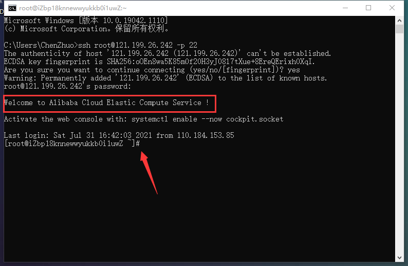

# 基础命令（网络访问）

## 网络配置

网络配置工具（旧） - **ifconfig**。

```

```

网络配置工具（新） - **ip**。

```

```

网络可达性检查 - **ping**。

```

```

## 网络访问和管理

### 安全远程连接

安全远程连接 - **ssh**

如我们使用的是其他的电脑，从来没有连接过自己的服务器，就可以打开该电脑的终端使用 **ssh** 命令来进行连接。其实这个在前面《常用软件》中讲过，直接粘贴：

```
ssh root@云服务器公网IP -p 22
```


输入重置后的实例密码（这里输入密码是没有任何显示的，但密码是输入进去的），点击回车，就接连接上了云服务器：



显示或管理路由表 - **route**。

查看网络服务和端口 - **netstat** / **ss**。

```
[root ~]# netstat -nap | grep nginx
```

网络监听抓包 - **tcpdump**。

安全文件拷贝 - **scp**。

```
[root ~]# scp root@1.2.3.4:/root/guido.jpg hellokitty@4.3.2.1:/home/hellokitty/pic.jpg
```

文件同步工具 - **rsync**。

> 说明：使用`rsync`可以实现文件的自动同步，这个对于文件服务器来说相当重要。关于这个命令的用法，我们在后面讲项目部署的时候为大家详细说明。

安全文件传输 - **sftp**。

```
[root ~]# sftp root@1.2.3.4root@1.2.3.4's password:Connected to 1.2.3.4.sftp>
```

- `help`：显示帮助信息。
- `ls`/`lls`：显示远端/本地目录列表。
- `cd`/`lcd`：切换远端/本地路径。
- `mkdir`/`lmkdir`：创建远端/本地目录。
- `pwd`/`lpwd`：显示远端/本地当前工作目录。
- `get`：下载文件。
- `put`：上传文件。
- `rm`：删除远端文件。
- `bye`/`exit`/`quit`：退出sftp。
