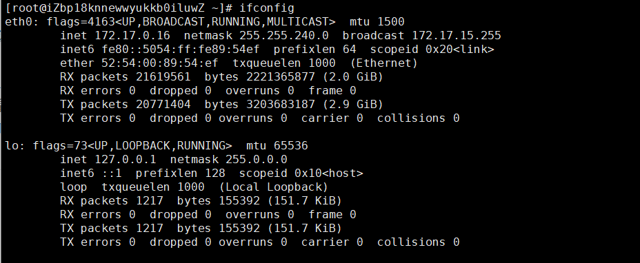

# 网络传输

## 网络配置

### 网络配置工具

网络配置工具 - **ifconfig**

```
ifconfig：查看和设置网卡信息（eth0第一网卡，eth1第二块网卡，lo回环网卡（虚拟））
ifconfig eth0 IP地址：设置网卡eth0指定的IP地址
setup：设置IP地址（DHCP[*]自动配置IP地址，没有DHCP服务就去掉*，重启network服务生效（service network restart），永久生效）
```



### 配置IP

执行`ifconfig`命令，记录eth0中网卡MAC地址，即`HWaddr`的值

编辑ifcfg-eth0配置文件

```
vim /etc/sysconfig/network-scripts/ifcfg-eth0 
```

内容为：

注意：这里设置的IP不能与虚拟网卡VirtualBox、VMnet1、VMnet8中的IP起冲突。

```
DEVICE=eth0                                # 设备名称eth0
BOOTPROTO=static                           # 地址类型静态
HWADDR=00:50:56:2D:C7:70                   # 上面记录的HWaddr的值
TYPE=Ethernet                              # 网络类型
UUID=a003d5b9-f6c3-456c-b475-390bdc93f734  # 唯一标识
ONBOOT=yes                                 # 自动加载
NM_CONTROLLED=yes                          # NNetwork Manager托管
IPADDR=192.168.1.120                       # IP地址
NETMASK=255.255.255.0                      # 子网掩码
GATEWAY=192.168.1.1                        # 网关
```

退出保存后，重启network

```
service network restart
```

## 网络检查

### 端口查看

显示网络相关信息 - **netstat**

- **-l** - 监听
- **-r** - 路由
- **-n** - 显示IP地址和端口号
- **-tuln** - 查看监听端口
- **-an** - 查看所有网络连接（ESTABL LSHED连接状态，发起端口随机，目标端口固定）
- **-rn** - 查看路由表

### 连通性检查

网络可达性检查 - **ping**

```
ping IP地址：测试与指定IP地址是否网络相通
ping -c 4 IP地址：给指定的IP地址发送4个数据包
```

显示或管理路由表 - **route**。

查看网络服务和端口 - **netstat** / **ss**

```
[root ~]# netstat -nap | grep nginx
```

网络监听抓包 - **tcpdump**

### 文件传输

安全文件拷贝 - **scp**

```
scp：基于ssh的cp，cp是实现本机之间来回拷贝，scp在两台linux之间进行拷贝
scp的用法：
    scp 源路径 目标路径
    scp 1.txt root@ip地址:路径
    如果发送文件夹，需要添加 -r 选项
linux和linux之间使用scp进行互发，如果搭建了主机信任，不用输入密码
winscp，实现windows和linux之间使用scp进行互发
    安装，使用即可，左边：windows目录，右边：linux目录，相互拖动即可    
[root ~]# scp root@1.2.3.4:/root/guido.jpg hellokitty@4.3.2.1:/home/hellokitty/pic.jpg
```

文件同步工具 - **rsync**

> 说明：使用`rsync`可以实现文件的自动同步，这个对于文件服务器来说相当重要。关于这个命令的用法，我们在后面讲项目部署的时候为大家详细说明。

安全文件传输 - **sftp**

```
[root ~]# sftp root@1.2.3.4root@1.2.3.4's password:Connected to 1.2.3.4.sftp>
```

- `help`：显示帮助信息。
- `ls`/`lls`：显示远端/本地目录列表。
- `cd`/`lcd`：切换远端/本地路径。
- `mkdir`/`lmkdir`：创建远端/本地目录。
- `pwd`/`lpwd`：显示远端/本地当前工作目录。
- `get`：下载文件。
- `put`：上传文件。
- `rm`：删除远端文件。
- `bye`/`exit`/`quit`：退出sftp。
