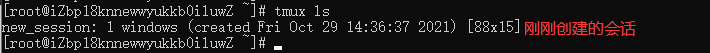
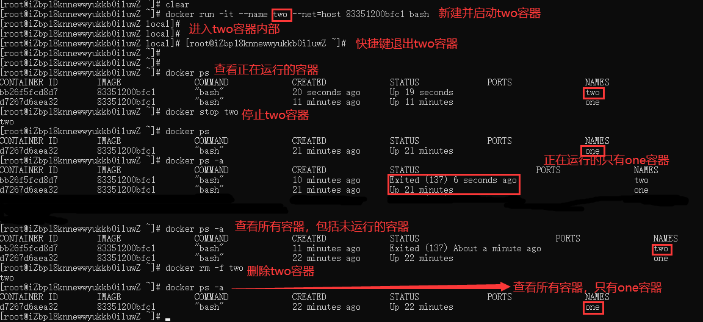

# 软件管理

**下载安装命令在基于Debian平台Ubuntu系统下是dpkg和apt指令，但在这里我们主要学习基于Fedora平台CentOS系统下的rpm和yum指令。**

## Linux软件

### 软件库

现在我们所使用云服务器系统是CentOS，但不是标准的CentOS，这是因为云服务器的提供商会在你购买云服务器后对初始化的Linux系统额外预装一些软件，例如前面编辑文件使用的Vim，而在标准的CentOS是没有Vim的，需要安装才能使用。

**除此之外，标准的CentOS用命令下载安装软件时，是从国外的标准软件库进行下载的，而我们购买的云服务器中CentOS是从自家的镜像软件库进行下载安装的。**例如，阿里云服务器的CentOS安装的软件是从阿里云镜像软件库下载，腾讯云服务器的CentOS安装的软件是从腾讯云镜像软件库下载。

**镜像软件库就是将标准软件库拷贝一份，同时还添加了额外的一些软件的仓库。**例如，在标准软件库里面没有Python3，但在镜像软件库里面有Python3，假如我们使用的是腾讯云或者阿里云的CentOS，就可以直接通过命令进行安装，而标准的CentOS就需要通过包或者源码进行安装。

为了弥补标准软件的软件包缺失，可以安装EPEL，即一组高质量的额外软件包，在这个额外的安装包里面能找到Python3。


### 软件安装包

**在Windows当中下载的安装包无外乎两种格式：`.exe`、`.msi`，而在基于基于Debian平台的安装包都是 `.deb` 格式，基于Fedora平台的安装包都是 `.rpm` 格式。**

此外，Windows当中的压缩包格式基本是：`zip`、`rar`，而在Linux当中压缩包的常见格式为：`.zip`、`.tgz`、`.tbz`。

### 软件安装方式

Linux当中软件安装有三种方式：

1. **直接在线安装**，最常用的安装方式而且会自动安装依赖，常用命令 `apt` 或 `yum`（推荐）
2. **下载离线安装包**，这种安装方式不会自动安装依赖，使用命令 `dpkg` 或 `rpm`；
3. **下载源代码包编译安装**，最为繁琐和复杂的安装方式，需要下载 `.tgz` 源代码文件，进行多个步骤的安装，不建议使用。

### 软件包命令

**不论你用的是yum还是用的rpm安装，其实安装的都是rpm包。**

在Linux里面，安装软件的时候，不仅仅是安装这么一个软件，与之对应的要按照很多的依赖软件 `a ==》b===》c==》d`，如果使用rpm安装，你要知道软件依赖关系才能安装，但是使用yum的话，不用知道依赖关系，yum自动为你解决。

```
# 查看当前Linux系统安装的软件列表
yum list installed

# 在线安装软件，自动解决依赖
yum install 软件名

# 在线安装软件，自动解决依赖，安装过程一路默认yes
yum install 软件名 -y

# 在线安装软件，自动解决依赖，指定安装路径（基本都为/usr/local/软件名称），需要新建软链接和拷贝库
yum -c /etc/yum.conf --installroot=/usr/local/软件名 --releasever=/ install 软件名 -y

# 只下载安装包，不安装
yum install -y --downloadonly --downloaddir=路径 包名 

# 卸载软件，自动解决依赖
yum remove 软件名

# 显示可用更新
yum check-update

# 更新指定的软件
yum update 软件名

# 查看当前Linux系统安装的软件列表
rpm -aq

# 查寻单个软件的安装包
rpm -aq | grep 软件名

# 离线安装，软件包一定要在本地存在,不会自动安装依赖，一般会安装失败
rpm -ivh 包名.rpm

# 离线卸载，不会自动删除依赖，一般也不会卸载成功
rpm -e 包名

# 列出包安装路径
rpm -ql 包名

# 列出指定包的详细信息
rpm -qi 包名
```

yum是基于rpm，它的功能更加强大。

| 场景             | rpm                                | yum                                |
| :--------------- | ---------------------------------- | ---------------------------------- |
| 离线的.rpm安装包 | 能够安装，但是不能自动下载安装依赖 | 能够安装，并且能够自动下载安装依赖 |
| 在线安装         | 不支持，只能把安装包下载到本地安装 | 支持在线下载安装                   |

## 安装软件

### 安装Tmux

Tmux是指通过一个终端登录远程主机并运行后，在其中可以开启多个控制台的终端复用软件。

安装命令：`yum -c /etc/yum.conf --installroot=/usr/local/tmux --releasever=/ install tmux -y`


安装成功后，就会在指定的安装路径下生成文件夹：


通过上面命令安装好了以后，还不能马上使用，**原因会在最下面有讲解**，还需要在/usr/bin下新建一个软链接文件指向Tmux的执行文件：

```
ln -s tmux执行文件路径 /usr/bin/tmux
```


### 安装Wget

**Wget是一款Linux上的下载软件，就类似于Windows上的迅雷。**

使用格式：`wget 参数 下载地址`

- -b 后台下载模式
- -O 下载到指定的目录
- -r 递归下载

下载安装命令：`yum install wget -y`，这里提示我已经安装过了。


### 安装Docker

Docker 是一个开源的应用容器引擎，让开发者可以打包他们的应用以及依赖包到一个可移植的镜像中，然后发布到任何流行的 Linux或Windows操作系统的机器上。

Docker要求CentOS系统的内核版本等于或高于 3.10 ，通过 `uname -r` 命令查看你当前的内核版本是否支持安装。


Docker安装命令：`yum install docker -y`


查看Docker服务状态：`systemctl status docker`


设置Docker服务为开机自启：`systemctl enable docker`


启动Docker服务：`systemctl start docker`


### 安装Redis

Redis是一种基于键值对[丰富的数据结构]、单线程+内存[高性能]、持久化、分布式、开源的非关系型（NoSQL）数据库。

redis安装命令：`yum install redis -y`


查看Reids版本：`redis-server安装路径 --version`


同样设置Redis的服务：

```
# 查看redis服务状态
systemctl status redis

# 设置redis服务开机自启
systemctl enable redis

# 启动redis服务
systemctl start redis
```


?> 关于Redis的启动方式以及密码配置，参看《DataBase》的《[Redis02-启动、连接、配置、关闭](https://chen-zhuo.github.io/DataBase/#/Redis02-启动、连接、配置、关闭)》。

### 安装Nginx

Nginx是一款自由的、开源的、高性能的HTTP服务器和反向代理服务器，可以将我们的web应用程序部署到Nginx服务器上。

首先下载安装Nginx依赖，执行命令：`yum install gcc-c++ pcre-devel zlib zlib-devel openssl openssl-devel`


因为有许多包云服务器已经提前帮你安装好了，所以整体安装起来很快。

虽然我们可以直接使用yum在线安装Nginx，但为了熟悉源码安装，我们使用源码文件进行安装。首先进入Nginx官网，选择版本获取下载地址：


下载地址：`http://nginx.org/download/nginx-1.21.2.tar.gz`

这里我就不下载到我本机的Windows，因为下载地址的最后几位就可以看出，这是一个在Linux上使用的 `.tar.gz` 压缩文件。

直接在Linux当中使用Wget通过下载地址进行下载：`wget http://nginx.org/download/nginx-1.21.2.tar.gz`


下载完成后，我们得到一个Nginx的源码压缩包，使用拆包命令进行解压：`tar -zxvf nginx-1.21.2.tar.gz `

!> Linux中解压不等于安装软件。


进入文件夹找到绿色的 `configure` 可执行文件，配置nginx安装目录：`./configure --prefix=/usr/local/nginx`


用root用户身份执行命令进行编译安装：`make && make install`

命令执行完成以后，我们去到上面配置的安装路径下：`cd /usr/local/`


就会有一个Nginx目录，进入Nginx目录下的sbin目录，会有一个绿色的 `nginx` 可执行文件，启动nginx服务命令：`./nginx`


现在我们去访问我们服务器的地址，就能看到Nginx的欢迎界面：


这个页面读取的是 `/usr/local/nginx/html` 下的 `index.html` 文件：


现在我们自己创建一个 `test.html` 静态页面：`vim test.html`，并访问：


?> 如果访问失败，执行命令 `systemctl stop firewalld` 关闭防火墙，再试试访问。

?> 一个服务器通过配置虚拟主机可以放多个网站。

### 安装Python3

方便起见，直接在线下载安装命令：`yum install python3 -y`


查看版本号：`python3 -V`


### 搭建虚拟环境

如果不知道什么是虚拟环境，请先参看：《Python板块》——《后端02-虚拟环境virtualenv》

首先我们新建一个文件夹专门用来存储虚拟环境：`mkdir env`

下面命令安装virtualenv：`pip3 install virtualenv`

检查是否安装成功：`virtualenv --version`


进入新建目录：`cd env`

搭建新的环境：`virtualenv new_env`


当前环境安装的库列表：`pip3 list`

启动虚拟环境：`source new_env/bin/activate`

退出当前虚拟环境：`deactivate`


## 安装问题

### 缺少库

通过指定路径的命令安装好了软件，运行命令后会提示缺少某某库：


其实该库已经存在，是没有被拷贝到/usr/lib64路径下：

```
# 我们通过全局搜索找库文件
find / -name 库文件

# 拷贝至/usr/lib64路径下
cp /库文件路径 /usr/lib64
```


### 默认Python

在Linux当中都为我们默认安装了Python2，在命令行中输入命令 `python` 即可启动Python2的环境：


为什么命令 `python` 启动是Python2的环境，而不是前面我们安装的Python3的环境。**这是因为在Linux当中输入命令 `python` 实际上是读取/usr/bin/python软链接文件，该文件指向python2，而python2又是一个指向python2.7的软链接文件。**


现在我们安装了最常用的Python3，现在希望输入命令 `python` 启动的是Python3的环境，可以如下操作：

```
# 删除软连接文件python
rm -rf /usr/bin/python
# 新建一个软连接文件python指向我们安装的python3
ln -s python3的执行文件路径 /usr/bin/python
```


注意当我们修改了软链接后，在使用yum命令会出现如下错误：


看错误，发现是该文件的语法错误，**首先有一点可以肯定的是，yum命令肯定调用了该文件，打开该文件发现文件内容使用的Python2的语法，看第一行的路径文件就是我们刚刚新建的软链接文件**：


这里我们应该就能明白什么原因导致了问题的出现，归纳一下就是：**因为python命令的软链接文件现在指向的是python3，导致yum命令调用以前Python2语法文件报错，解决办法也很简单，直接将第一行代码改为指向现有的python2的软链接。**

```
#!/usr/bin/python2
```

同样的 `/usr/libexec/urlgrabber-ext-down` 文件也会报相同的错，解决方式和上面一样。

## 软件使用

### 使用Tmux

前面已经简短的介绍过，Tmux是指通过一个终端登录远程主机并运行后，在其中可以开启多个控制台的终端复用软件。


通常我们在终端中操作一个任务的时候，一旦终端关闭，任务也就结束了，被强制关闭了，在Tmux中使用 session（会话）就可以解决这个问题，我们可以把当前操作的任务隐藏起来，在视觉上让它消失，任务继续执行着，当我们想返回任务做一些操作的时候，它可以很方便的回来，我们通常把上面的操作就做 session 操作，我们可以把 session 给隐藏起来，我们也可以把 session 给真的关掉。

在Tmux中有一个Window（窗口）的概念，我们可以这样要去理解：当前呈现在我们面前的这一个工作区域就是一个窗口（当前的终端界面），窗口可以被不断切割，切割成一个个小块，这一个个小块我们叫做pane（窗格），这就是窗口和窗格的概念，我们把它想象成一块大蛋糕可以切成很多小块蛋糕，窗口可以被分割成很多小的窗格。

**Tmux 的快捷键都必须在会话窗口里面才会生效，且都要通过默认前缀键 `Ctrl+b` 唤起。即先按下`Ctrl+b`，快捷键才会生效。**举例来说，帮助命令的快捷键是`Ctrl+b ?`，先按下`Ctrl+b`，**松开后**，再按下`?`，就会显示帮助信息。然后，按下 ESC 键或`q`键，就可以退出帮助。

**新建一个会话**：`tmux new -s 会话名称`

?> 会话名称不能和现有会话名称冲突，执行命令后，直接进入新建的会话里面。


进入会话后，底部会有绿色横条显示当前会话的一些信息。


**退出当前会话**：`tmux detach`，快捷键`Ctrl+b d`


退出会话后，之前创建的会话还存在只是回到之前的界面窗口：


**查看会话列表**：`tmux ls`，在会话里面的快捷键`ctrl+b s`

下图可以看到刚刚创建的会话名称，会话创建时间以及会话窗口的大小：



关闭所有会话或没有会话就会提示连接服务失败：


**进入现有会话**：`tmux a -t 现有会话名称` 或 `tmux attach -t 现有会话名称`


成功进入会话new_session：


**关闭所有会话**：`tmux kill-server`

**关闭指定会话**：`tmux kill-session -t 现有会话名称`

**关闭除指定会话外的所有会话**：`tmux kill-session -a -t 现有会话名称`


**切换会话**：`tmux switch -t 现有其他会话名称 `，快捷键`Ctrl+b s`

?> 切换会话的前提是，当前位置在会话当中。

**重命名会话**：`tmux rename-session -t 旧名称 新名称`，在会话里面的快捷键 `Ctrl+b $`

**每个会话都拥有一个窗口，每个窗口可以被拆分为多个窗格，每个窗格都可以进行不同的操作**：

```
划分上下两个窗格：tmux split-window，快捷键：Ctrl+b "

划分左右两个窗格：tmux split-window -h，快捷键：Ctrl+b %

光标切换到上方窗格：tmux select-pane -U，快捷键：Ctrl+b ↑

光标切换到下方窗格：tmux select-pane -D，快捷键：Ctrl+b ↓

光标切换到左边窗格：tmux select-pane -L，快捷键：Ctrl+b ←

光标切换到右边窗格：tmux select-pane -R，快捷键：Ctrl+b →

关闭当前窗格快捷键：Ctrl+b x

查看窗格编号：Ctrl+b q
```


### 使用Docker

Docker 是一个用go语言开发的开源的应用容器引擎，让开发者可以打包他们的应用以及依赖包到一个可移植的镜像中，然后发布到任何流行的 Linux或Windows操作系统的机器上。


软件开发最大的麻烦事之一，就是环境配置。用户计算机的环境都不相同，你怎么知道自家的软件，能在那些机器跑起来？因此用户必须保证两件事：操作系统的设置，各种库和组件的安装。只有它们都正确，软件才能运行。举例来说，安装一个 Python 应用，计算机必须有 Python 引擎，还必须有各种依赖，可能还要配置环境变量。

如果某些老旧的模块与当前环境不兼容，那就麻烦了。环境配置如此麻烦，换一台机器，就要重来一次，旷日费时。很多人想到，能不能从根本上解决问题，让软件可以带环境安装，也就是说，安装的时候，把原始环境一模一样地复制过来。

#### Dockerfile文件

首先，在安装有Docker服务器中的项目根目录下新建一个 `Dockerfile` 文件，这是Docker的核心文件，常用的字段如下：

```bash
FROM <image>:<tag> # 表示用哪个基础镜像去构建新的镜像，并且必须是第一条指令。

MAINTAINER <name> # 指定作者

RUN <command> # 后边直接跟shell命令，在linux上 /bin/sh -c，在windows上cmd /S /C
RUN ["executable", "param1", "param2"] # 类似函数调用，executable可执行文件，后面就是两个参数
# 注意：多行命令不要写多个RUN，原因是Dockerfile中每一个指令都会建立一层，多少个RUN就构建了多少层镜像，会造成镜像的臃肿、多层，不仅仅增加了构件部署的时间，还容易出错。RUN书写时的换行符是\

ENV <key> <value> ... # 设置环境变量，一次只能设置一个
ENV <key>=<value> ... # 设置环境变量，可以一次设置多个

ADD ["<src>",... "<dest>"]# 一个复制命令，把文件复制到景象中。<dest>路径的填写可以是容器内的绝对路径，也可以是相对于工作目录的相对路径。<src>可以是一个本地文件或者是一个本地压缩文件，还可以是一个url，如果把<src>写成一个url，那么ADD就类似于wget命令

VOLUME /dir # 可实现挂载功能，可以将内地文件夹或者其他容器中得文件夹挂载到这个容器中

EXPOSE 端口号 # 暴漏容器运行时的监听端口给外部，但是并不会使容器访问主机的端口，如果想使得容器与主机的端口有映射关系，必须在容器启动的时候加上-P参数

WORKDIR /path/to/workdir # 设置工作目录，如果不存在则会创建，也可以设置多次。
WORKDIR /a
WORKDIR b
WORKDIR c
RUN pwd # pwd执行的结果是/a/b/c

ENTRYPOINT command param1 param2 # 表示容器启动后默认执行的命令，shell形式
ENTRYPOINT ["executable", "param1", "param2"] # 表示容器启动后默认执行的命令，可执行文件加参数形式
```

基于Centos构建Python3运行环境内容如下，可根据自身需求增减：

```bash
##############################################
# 基于centos构建python3运行环境
# 构建命令: 在Dockerfile文件目录下执行 docker build -t data_server .
# 容器启动命令: docker run -it --net=host images_id
# 进入容器：docker exec -it py_admin /bin/bash
# docker update -m 8000M --memory-swap 8000M  897a6a09807a
##############################################
FROM centos:7.6.1810 # 基础环境
MAINTAINER ZhangSan # 指定作者信息

RUN set -ex \
    # 预安装所需组件
    && yum install -y wget tar libffi-devel zlib-devel bzip2-devel openssl-devel ncurses-devel sqlite-devel readline-devel tk-devel gcc make initscripts \
    && wget https://www.python.org/ftp/python/3.7.0/Python-3.7.0.tgz \
    && tar -zxvf Python-3.7.0.tgz \
    && cd Python-3.7.0 \
    && ./configure prefix=/usr/local/python3 \
    && make \
    && make install \
    && make clean \
    && rm -rf /Python-3.7.0* \
    && yum install -y epel-release \
    && yum install -y python-pip

# 设置默认为python3
RUN set -ex \
    # 备份旧版本python
    && mv /usr/bin/python /usr/bin/python27 \
    && mv /usr/bin/pip /usr/bin/pip-python27 \
    # 配置默认为python3
    && ln -s /usr/local/python3/bin/python3.7 /usr/bin/python \
    && ln -s /usr/local/python3/bin/pip3 /usr/bin/pip

# 修复因修改python版本导致yum失效问题
RUN set -ex \
    && sed -i "s#/usr/bin/python#/usr/bin/python27#" /usr/bin/yum \
    && sed -i "s#/usr/bin/python#/usr/bin/python27#" /usr/libexec/urlgrabber-ext-down \
    && yum install -y deltarpm

# 基础环境配置
RUN set -ex \
    # 修改系统时区为东八区
    && rm -rf /etc/localtime \
    && ln -s /usr/share/zoneinfo/Asia/Shanghai /etc/localtime \
    && yum install -y vim \
    # 安装定时任务组件
    && yum -y install cronie

# 支持中文
RUN yum install kde-l10n-Chinese -y
RUN localedef -c -f UTF-8 -i zh_CN zh_CN.utf8
ENV LC_ALL zh_CN.UTF-8

# 常用工具
RUN yum install -y git \
    && yum install -y nodejs
    
# 克隆项目拉取分支
RUN git clone git地址
RUN cd /项目路径 \
    && git fetch -f origin 线上分支名称:本地分支名称 \
    && git checkout 本地分支

# 通过文件中的列表安装所需的包
RUN pip install -i "https://pypi.tuna.tsinghua.edu.cn/simple" -r /项目路径/requirements.txt --timeout=60

# 启动虚拟环境，并进行映射
RUN source /虚拟环境/bin/activate \
    && export PYTHONPATH=$(pwd)

# 设置代码文件夹工作目录
WORKDIR /项目路径
```

!> 新建的 `Dockerfile` 文件不要带有 `.txt` 等后缀名，可能会引起错误。

#### 生成镜像

上面Dockerfile说得很清楚，我们的程序需要一个基础镜像centos:7.6.1810，就需要执行下面命令：

```
# 下载基础镜像
docker pull 基础镜像名称
docker pull centos:7.6.1810
```


这时我们使用 `docker images` 命令查看镜像，就会看到在我们本地多了一个基础镜像：


| 字段       | 描述                                                         |
| ---------- | ------------------------------------------------------------ |
| REPOSITORY | 来自于哪个仓库                                               |
| TAG        | 镜像的标签信息，比如7.6.1810表示版本信息                     |
| IMAGE ID   | 镜像的ID（唯一标识镜像），如果两个镜像的ID相同，说明它们实际上指向了同一个镜像 |
| CREATED    | 创建时间，说明镜像最后的更新时间                             |
| SIZE       | 镜像大小，优秀的镜像往往体积都较小                           |

现在 centos:7.6.1810 的基础镜像有了，就可以使用 `docker build` 命令构建我们的程序镜像了，就是执行刚刚那个Dockerfile文件：

```
docker build -t 镜像名字 .
```

?> 镜像名字，随便取，别忘了命令最后有个点。

该命令会去查找当前路径下的 `Dockerfile` 文件，如果没有就会报错：


 `Dockerfile` 文件存在执行命令后，就会成功创建新的程序镜像：


再次使用 `docker images` 命令查看镜像，就会看到在我们本地多了一个 `data_server` 程序镜像：


删除镜像的命令：

```
# 删除指定镜像
docker rmi 镜像id号
docker rmi 镜像名称

# 所有的镜像id
docker images -q

# 删除所有镜像
docker rmi $(docker images -q)
```

这里有一点要注意的是：删除镜像的时候要保证，使用该镜像生成的容器已经停止，否则会报错。


#### 操作容器

镜像我们已经有了，但最后能让项目运行起来的是容器。**镜像可以理解为一个Java类，而容器可以理解为Java类的实例，一个类可以new出千千万万个实例对象。所以，镜像只是一个可以生成容器的东西，而容器才能让程序运行起来。**

**创建并启动**容器命令：`docker run 参数`

```
# 启动镜像，创建容器
docker run -p 端口:端口 -it --name 容器名称 --net=host 镜像id号 /bin/bash

# 后台运行并打印容器iD, 将容器的8080端口映射到主机的8081,将当前的host文件挂载到容器的/etc/hosts,已只读的方式挂载. 结束自动删除容器
docker run -d -p 8081:8080 -v ./hosts:/etc/hosts:ro --rm playgateway 

# 容器挂掉时总是重启, 容器名为platformui , 使用网络my_net, 没有会创建
docker run --restart=always --network=my_net --name platformui  platformpcweb 

# 已交互的形式 进入centos 容器,退出后,删除容器
docker run -it --rm centos bash
```


退出容器快捷键：`Ctrl+P+Q`


现在我们退出了容器，但容器仍然在运行，通过 `docker ps` 命令查看正在运行的容器：

```
# 查看正在运行的容器
docker ps

# 显示所有的容器，包括未运行的
docker ps -a
```


我们再增加一个容器，继续熟练下面的命令：

```
# 启动容器
docker start 容器名称

# 停止容器
docker stop 容器名称
# 所有的容器id
docker ps -a -q
# 停止所有容器
docker stop $(docker ps -a -q)

# 删除指定容器，删除前要先停止容器
docker rm -f 容器名称
# 删除所有的容器，删除前要先停止所有容器
docker rm $(docker ps -a -q)
```



#### 打包传输

现在我们容器已经成功运行起来了，那如何将本机的容器拷贝到另一台机器并启动？可以按照下面步骤：

使用 `docker ps` 查看自己容器的id


**执行命令 `docker export 容器id > 打包文件名称.tar` 将容器打包成镜像文件：**


执行命令 `scp /传输文件路径/文件名称 用户@目标机ip:/路径/传输后的文件名称` 传输打包文件：


进入目标机的路径下，就可以看到成功传输的文件了：


接下来就是导入镜像文件（前提是本机也已经安装了Docker，并启动了Docker服务）：

```
docker import new_server.tar 镜像名称:镜像标签
```

然后通过查看镜像的命令获取镜像id号：

```
docker images
```

最后一步就是创建容器了：

```
# 启动镜像，创建容器
docker run -p 端口:端口 -it --name 容器名称 --net=host 镜像id号 /bin/bash
```

