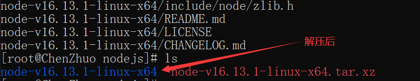

# 代码部署

使用云服务器的最终目的都是服务于我们，最常用的方式就是跑我们的代码或者部署我们自己的网站。恰好在这之前的《Document》我们学习了Docsify文档生成工具，并在GithubPage上成功的部署了我们的文档网站，但毕竟Github的服务器是在国外，访问速度或多或少都会受到到点影响，如果将我们的网站部署在国内自己的云服务器上，肯定会对我们的网站访问速度有一个提高。

## 环境搭建

在《Document》当中已经讲过，运行Docsify需要Nodejs环境和安装Docsify工具。

### 安装Nodejs

选择Nodejs安装路径：


下载Nodejs压缩文件：`https://nodejs.org/dist/v16.13.1/node-v16.13.1-linux-x64.tar.xz`


解压Nodejs压缩文件：`tar -xvf node-v16.13.1-linux-x64.tar.xz`



创建软链接，以后可以在任意目录下直接使用node和npm命令：

```
ln -s /安装的绝对路径/node /usr/bin/node
ln -s /安装的绝对路径/npm /usr/bin/npm
```


### 安装Docsify

`docsify-cli` 工具可以**方便创建及本地预览文档网站**。

```
npm i docsify-cli -g
```


