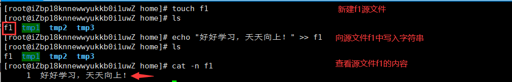
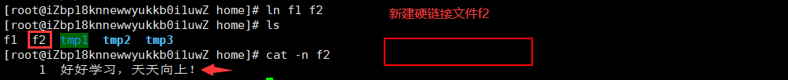
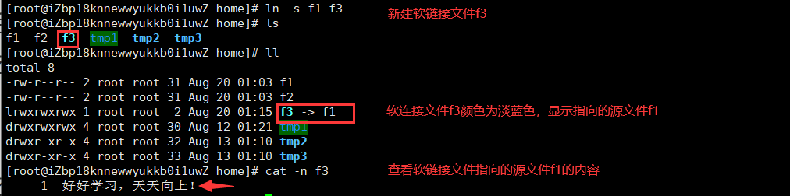
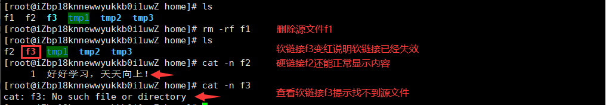
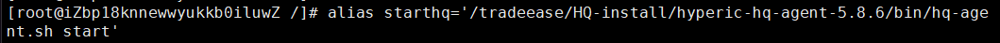
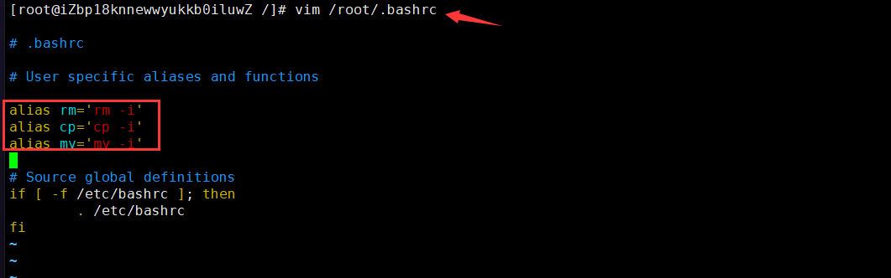
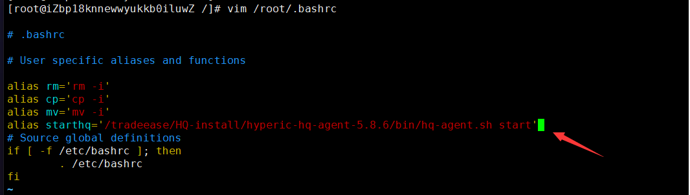
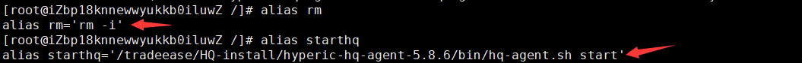
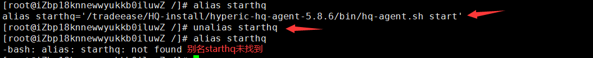

# 拓展认识

## 硬链接和软链接

**Linux 链接分两种，一种被称为硬链接（Hard Link），另一种被称为符号链接（Symbolic Link）。**

为了更好的解释两种链接的区别，我们新建一个源文件f1：



### 硬链接

#### 硬链接含义

**硬连接指通过索引节点来进行连接。**在 Linux 的文件系统中，保存在磁盘分区中的文件不管是什么类型都给它分配一个编号，称为索引节点号(Inode Index)。在 Linux 中，多个文件名指向同一索引节点是存在的。比如：**A 是 B 的硬链接（A 和 B 都是文件名），则 A 的目录项中的 inode 节点号与 B 的目录项中的 inode 节点号相同，即一个 inode 节点对应两个不同的文件名，且A 和 B 对文件系统来说是完全平等的。删除其中任何一个都不会影响另外一个的访问。**

**硬连接的作用是允许一个文件拥有多个有效路径名，这样用户就可以建立硬连接到重要文件，以防止“误删”的功能。**其原因如上所述，因为对应该目录的索引节点有一个以上的连接。只删除一个连接并不影响索引节点本身和其它的连接，只有当最后一个连接被删除后，文件的数据块及目录的连接才会被释放。也就是说，文件真正删除的条件是与之相关的所有硬连接文件均被删除。

#### 新建硬链接

新建硬链接 - **ln 源文件 新建硬链接文件**

这里我们新建一个硬链接文件f2指向源文件f1：



### 软链接

#### 软链接含义

软链接文件有类似于 Windows 的快捷方式。它实际上是一个特殊的文件。在符号连接中，文件实际上是一个文本文件，其中包含的有另一文件的位置信息。比如：A 是 B 的软链接（A 和 B 都是文件名），A 的目录项中的 inode 节点号与 B 的目录项中的 inode 节点号不相同，A 和 B 指向的是两个不同的 inode，继而指向两块不同的数据块。但是 A 的数据块中存放的只是 B 的路径名（可以根据这个找到 B 的目录项）。A 和 B 之间是“主从”关系，如果 B 被删除了，A 仍然存在（因为两个是不同的文件），但指向的是一个无效的链接。

#### 新建软链接

新建硬链接 - **ln -s 源文件 新建软链接文件**

这里我们新建一个软链接文件f3指向源文件f1：



### 硬链接和软链接区别

硬链接和软链接区别在于：**硬链接能独立于源文件显示内容，软链接必须依附源文件显示内容。**

现在我们删除源文件f1，再去查看硬链接f2和软链接f3：



## 别名

### 起别名

起别名格式 - **alias 别名='原命令'**

在Linux当中我们可以通过起别名的方式来自定义命令。例如，我经常通过下面命令来启动服务：

```
/tradeease/HQ-install/hyperic-hq-agent-5.8.6/bin/hq-agent.sh start
```

可以看到这样的命令不仅很长，还很容易输入错误，我们就可以自定义一个简短的命令 `starthq` 来达到和上面的命令同样的效果。

方法一：可以直接执行下面的命令起别名，但这这种方法只能适用于本次登录有效。

```
alias starthq='/tradeease/HQ-install/hyperic-hq-agent-5.8.6/bin/hq-agent.sh start'
```



方法二：修改文件起别名，此设置永久有效。

首先，我们需要修改root文件夹下面的 `.bashrc` 文件：

```
vim /root/.bashrc
```



看到里面其实已经有其他的自定义的命令，我们就可以依葫芦画瓢，在下面定义我们的命令：

```
alias starthq='/tradeease/HQ-install/hyperic-hq-agent-5.8.6/bin/hq-agent.sh start'
```



修改后保存退出，再执行 `starthq` 命令就能达到和之前长命令同样的效果了。

### 显示别名

显示别名的内容 - **alias 别名**

可以看到，不论是 `/root/.bashrc` 文件中定义的别名，还是通过 `alias` 定义的别名都能显示其内容：



### 删除别名

删除别名 - **unalias 别名**

删除全部别名 - **unalias -a**

删除别名后，再次使用该别名，就会提示”找不到该别名“：


