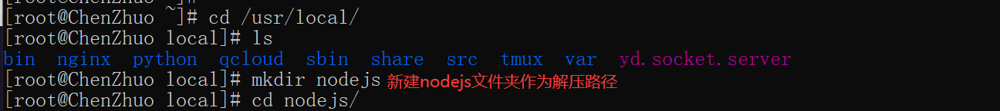
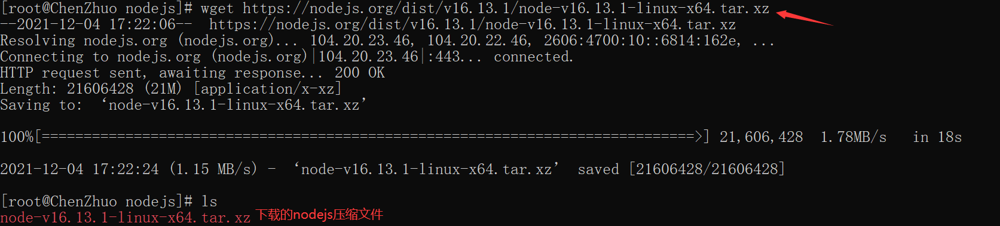
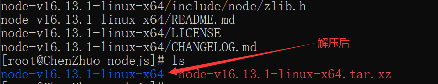
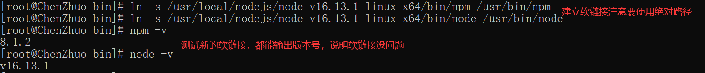
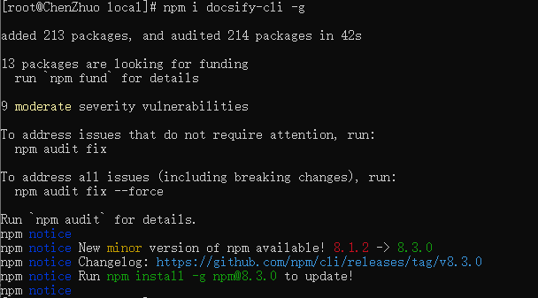
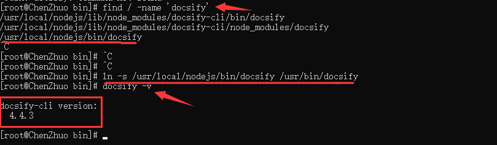
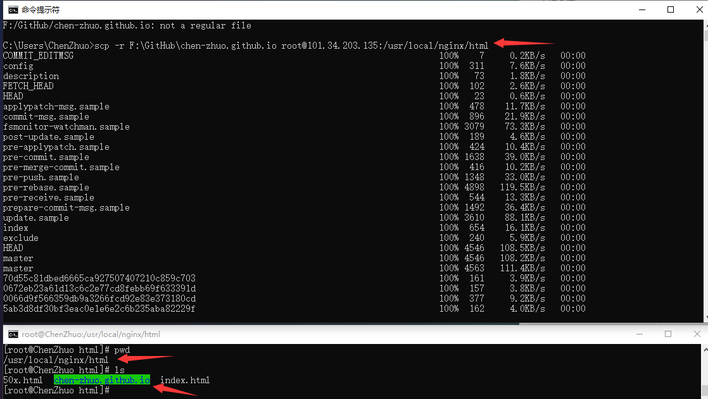
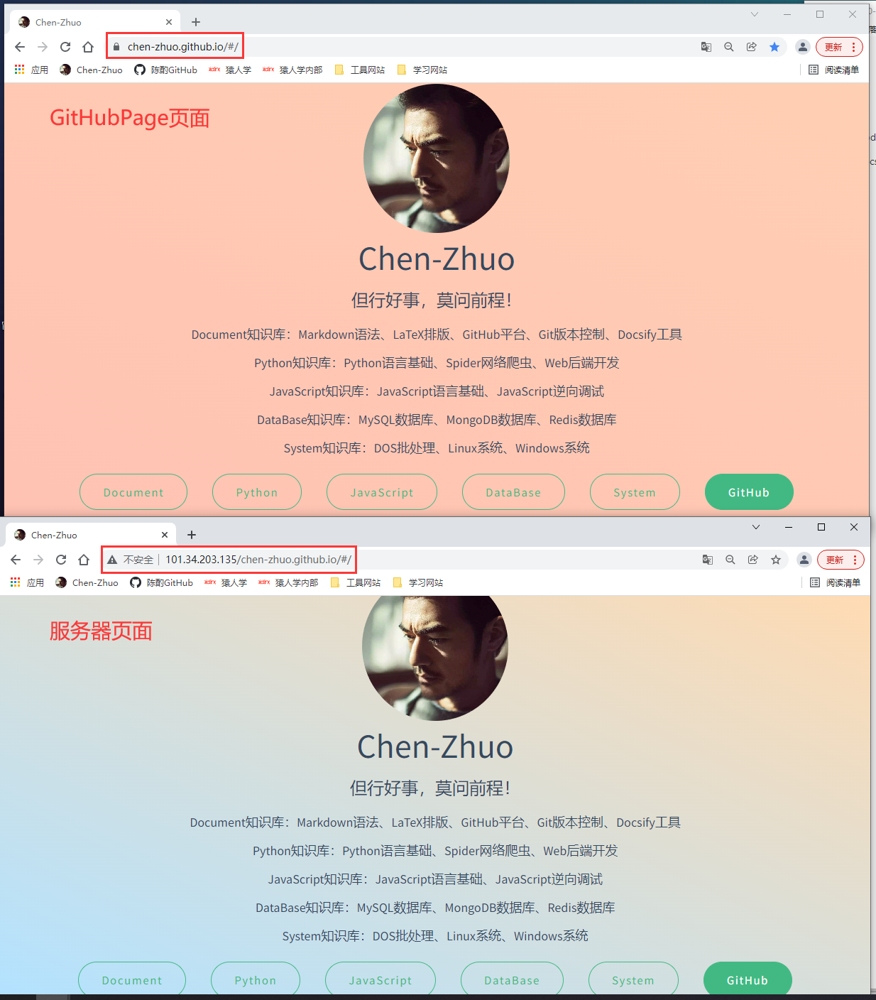

# 部署网站

使用云服务器的最终目的都是服务于我们，最常用的方式就是跑我们的代码或者部署我们自己的网站。恰好在这之前的《Document》我们学习了Docsify文档生成工具，并在GithubPage上成功的部署了我们的文档网站，但毕竟Github的服务器是在国外，访问速度或多或少都会受到到点影响，如果将我们的网站部署在国内自己的云服务器上，肯定会对我们的网站访问速度有一个提高。

## 环境搭建

在《Document》当中已经讲过，运行Docsify需要Nodejs环境和安装Docsify工具。

### 安装Nodejs

选择Nodejs安装路径：



下载Nodejs压缩文件：`https://nodejs.org/dist/v16.13.1/node-v16.13.1-linux-x64.tar.xz`



解压Nodejs压缩文件：`tar -xvf node-v16.13.1-linux-x64.tar.xz`



创建软链接，以后可以在任意目录下直接使用node和npm命令：

```
ln -s /安装的绝对路径/node /usr/bin/node
ln -s /安装的绝对路径/npm /usr/bin/npm
```



### 安装Docsify

`docsify-cli` 工具可以**方便创建及本地预览文档网站**。

```
npm i docsify-cli -g
```



查找 `docsify` 并创建软连接到 `/usr/bin` 下，最后验证一下版本是否安装成功：

``` 
# 查找
find / -name 'docsify'
# 创建软链接
ln -s /usr/local/nodejs/bin/docsify /usr/bin/docsify
# 查看版本
docsify -v
```



## 上传文件

我们以前通过Git上传文件到GitHub上，现在我们通过 `scp` 命令上传到自己的服务器中的nginx路径下：

```
# 从本地上传文件到服务器上
scp -r 本地文件夹路径 root@自己服务器:nginx路径
```



## 访问网站

现在我们的服务器后面加上文件夹的地址看看，网站成功部署。



