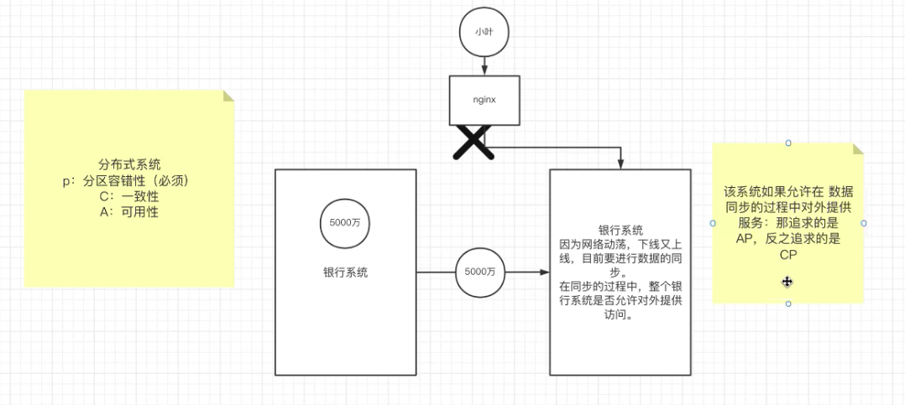

# 分布式系统

**分布式系统（distributed system）是建立在网络之上的软件系统。**正是因为软件的特性，所以分布式系统具有高度的内聚性和透明性。因此，网络和分布式系统之间的区别更多的在于高层软件（特别是操作系统），而不是硬件。

简单的来说，**分布式系统是通过软件来连接的一组计算机系统一起工作，在终端用户看来，就像一台计算机在工作一样**。这组一起工作的计算机，拥有**共享的状态**，他们同时运行，独立机器的故障不会影响整个系统的正常运行。

## 系统扩展

提到分布式系统，我们首先需要明白两个概念：横向扩展、纵向扩展

横向扩展：**指通过增加更多的机器来提升整个系统的性能。**

纵向扩展：**指通过靠升级单台计算机的硬件来提升整个系统的性能。**

优劣比较：

1. **纵向扩展有很强的局限性，即使达到最新硬件的能力以后，还是无法满足中等或者大型工作负载的技术要求。**
2. **横向扩展则没有这个限制，它没有上限，每当性能下降的时候，你就需要增加一台机器，这样理论上讲可以达到无限大的工作负载支持。**
3. **横向扩展的容错性更强**，某个节点出现错误以后，并不会导致整个系统的瘫痪，而单机系统出错后，可能会导致整个系统的崩溃。
4. **横向扩展的延迟性低**，在不同的物理位置部署不同的机器，通过就近获取的原则降低访问的延迟时间。
5. 从价格上来说，横向扩展相比纵向扩展更容易控制。

## 举例应用

举个例子，传统的数据库是存储在一台机器的文件系统上的。每当我们取出或者插入信息的时候，我们直接和那台机器进行交互。那么现在我们把这个传统的数据库设计成**分布式数据库**。假设我们使用了**三台机器来构建这台分布式数据库，我们追求的结果是，在机器1上插入一条记录，需要在机器1、2、3上都可以返回那条记录。**

**因此使用分布式系统最大的好处就是能够让你横向的扩展系统。**

以上面提到的单一数据库为例，处理更多流量的唯一方式就是**升级数据库运行的硬件，这就是纵向扩展**。然而**纵向扩展的是有局限性的**，当到了一定程度以后，即使最好的硬件，也不能够满足当前流量的需求。**如果使用分布式来横向扩展系统，可以让整个系统的容错性更强，且延迟更低。**

## 设计推演

假设一个场景，有一个网络应用变得越来越流行，服务的人数也越来越多，应用程序每秒收到的请求远远超过能够正常处理的数量，导致应用程序性能下降明显。那我们下面就来扩展一下应用程序来满足更高的要求：

一般来说，**读取信息的频率要远远超过插入或修改信息的频率。**

**主从复制策略来实现扩展系统**：我们可以创建两个新的数据库服务器，他们与主服务器同步。用户业务对这两个新的数据库只能读取。每次当向主数据库插入和修改信息时，都**会异步的通知副本数据库进行更新变化**。这让我们有了**三倍于原来系统读取数据的性能支持**，但是这里有一个问题，在数据库事务的设计当中遵循ACID原则，在主数据库对其他两个数据库进行数据更新的时候，我们**有一个时间窗口失去了一致性原则**。如果在这个时间窗口内对两个新的数据库进行查询，可能查不到数据。且在这个时候**由于同步这三个数据库的数据，会影响到写操作的性能**，这是我们**在设计分布式系统的时候，不得不承受的一些代价**。

上面的主从复制策略解决了用户读取性能方面的需求，但是当数据量达到一定程度，一台机子上无法存放的时候，我们可以**使用分区技术扩展写操作性能。分区技术是指根据特定的算法，比如用户名a到z作为不同的分区，分别指向不同的数据库写入，每个写入数据库会有若干读取的从数据库进行同步提升读取性能。**当然，这样使得整套系统变得更加复杂，最重要的难点是分区算法。试想一下，如果c开头的用户名比其他开头的用户名要多很多，这会导致c区的数据量非常庞大，相应地，对于c区的请求也会远远大于其他区。此时c区成为热点。**要避免热点，需要对c区进行拆分。此时要进行共享数据就会变得非常昂贵，甚至可能导致停机**。

如果一切都很理想，那我们就**拥有了n倍的写入流量，n是分区的数目**。当然这里也存在一个陷阱，我们**进行数据分区以后，导致除了分区键以外的查询都变得非常低效**，尤其是对于sql语句如join查询就变得非常之糟糕，导致一些复杂的查询根本无法使用。

## CAP定理

CAP定理是指**一个分布式系统不能同时具有一致性，可用性和分区容忍性**。

- 一致性（Consistency）：即更新操作成功并返回客户端完成后，所有节点在同一时间的数据完全一致。

- 可用性（Availability）：服务一直可用，而且是正常响应时间。

- 分区容忍（Partition tolerant）：即当某个节点或网络分区故障时，仍然能够对外提供满足一致性或可用性的服务。简单说，就是避免单点故障，就要进行冗余部署，冗余部署相当于是服务的分区，这样的分区就具备了容错性。

对于任何分布式系统来说，**分区容忍是一个必要条件**，如果没有这一点，就不可能做到一致性和可用性。试想如果两个节点链接断掉了，他们如何能够做到既可用又一致？最后你只能选择在网络分区情况下，你的系统**要么强一致，要么高可用**。

## BASE理论

BASE理论是对CAP理论的延伸，核心思想就是即使无法做到强一致性（CAP的一致性就是强一致性），但应用可以采用合适的方式达到最终一致性。

- 基本可用：指分布式系统在出现故障的时候，允许损失部分可用性，只保证核心可用。例如，电商大促时，为了应对访问量激增，部分用户可能被引导到降级页面，服务层也可能只提供降级服务。这就是损失部分可用性的体现。
- 软状态：指允许系统存在中间状态，而中间状态不会影响系统整体可用性。
- 最终一致性：指系统中所有数据副本经过一定时间后，最终能够达到一致的状态。

这些系统提供了BASE属性，这是相对于传统数据库的ACID来讲的。 也就是(Basically available)基本上是可用的，系统总会返回一个响应。(Soft state)软状态, 系统可以随着时间的推移而变化，甚至在没有输入的情况下也可以变化, 如保持最终的一致性的同步。(Eventual consistency)最终的一致性, 在没有输入的情况下，数据迟早会传播到每一个节点上，从而变得一致。

**追求高可用的分布式数据库例子有Cassandra；看重强一致性的数据库有HBase，Redis；而zookeeper在数据同步时，最求的并不是强一致性，而是顺序一致性（事务id的单调递增）。**

## 常用架构类型

**客户端服务器**：在这个类型中，**分布式系统架构有一个服务器作为共享资源**。比如打印机或者网络服务器，它有多个客户机，这些客户机决定何时使用共享资源，如何使用和显示改变数据，并将其送回服务器，像git这样的代码仓，这是一个很好的例子。

**三层架构**：这种架构把系统分为**表现层，逻辑层和数据层**，这简化了应用程序的部署，**大部分早期的网络应用都是三层的**。

**多层架构**：上面的**三层架构是多层架构的一种特殊形式**。一般**会把上面的三层进行更详细的划分，比如说以业务的形式进行分层**。

**点对点架构**：在这种架构中，没有专门的机器提供服务或管理网络资源。而是**将责任统一分配给所有的机器，成为对等机，对等机既可以作为客户机，也可以作为服务器。**这种架构的例子，包括bittorrent和区块链。

**以数据库为中心**：这种架构是指**用一个共享的数据库**，使分布式的各个节点在不需要任何形式直接通信的情况下，进行协同工作的架构。

## 分布式优缺点

分布式系统优点如下：

1. **分布式系统中的所有节点都是相互连接的，所以节点之间可以很容易地共享数据。**

2. **更多的节点可以很容易地添加到分布式系统中，即可以根据需要进行扩展。**

3. **一个节点的故障不会导致整个分布式系统的失败**，其他节点仍然可以相互通信。

4. **硬件资源可以与多个节点共享，而不是只限于一个节点。**

分布式系统缺点如下：

1. 在分布式系统中**很难提供足够的安全**，因为节点以及连接都需要安全。

2. **一些消息和数据在从一个节点转移到另一个节点时，可能会在网络中丢失**。

3. 与单用户系统相比，**连接到分布式系统的数据库是相当复杂和难以处理的**。

4. 如果**分布式系统的所有节点都试图同时发送数据，网络中可能会出现过载现象**。

## 小结

最后谈一下**分布式系统与集群**的关联，因为**分布式系统是通过多个节点的集群来完成一个任务**，让外界看起来是跟一套系统作为一个整体打交道。

**一套分布式系统可以有多个集群**，这些集群可以业务进行划分，也可以物理区域进行划分。每一个集群可以作为这个分布式系统的一个节点。**这些集群节点组成的分布式系统，又可以作为单个的节点与其他的节点组成一个集群。**

