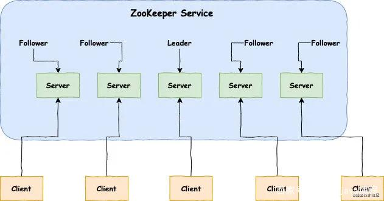
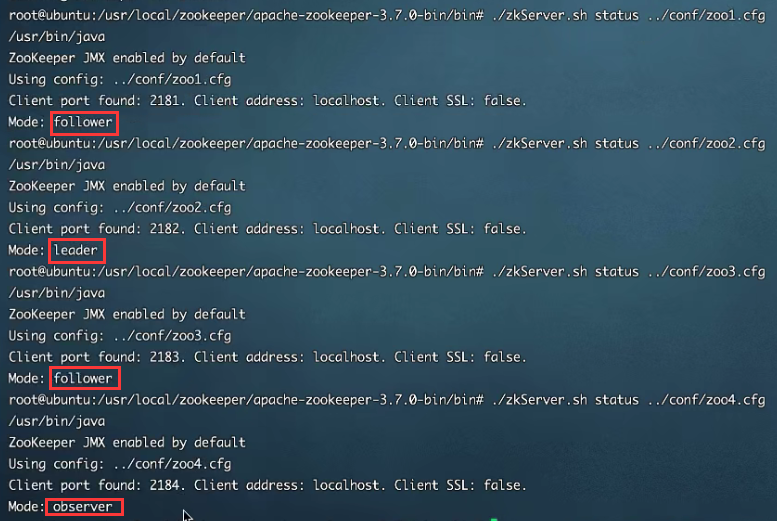

# Zookeeper

## Zookeeper简介

ZooKeeper 是 Apache 的一个顶级项目，为分布式应用提供高效、高可用的分布式协调服务，提供了诸如数据发布/订阅、负载均衡、命名服务、分布式协调/通知和分布式锁等分布式基础服务。**ZooKeeper的优点就是封装好复杂易出错的关键服务，将简单易用的接口和性能高效、功能稳定的系统提供给用户，由于其便捷的使用方式、卓越的性能和良好的稳定性，被广泛地应用于诸如 Hadoop、HBase、Kafka 和 Dubbo 等大型分布式系统中。**

?> 为了简化表达，后期常用ZK代表zookeeper。

### 运行模式

Zookeeper 有三种运行模式：单机模式、伪集群模式和集群模式。

**单机模式：**这种模式一般适用于开发测试环境，一方面我们没有那么多机器资源，另外就是平时的开发调试并不需要极好的稳定性。

**集群模式：**一个 ZooKeeper 集群通常由一组机器组成，一般 3 台以上就可以组成一个可用的 ZooKeeper 集群了。组成 ZooKeeper 集群的每台机器都会在内存中维护当前的服务器状态，并且每台机器之间都会互相保持通信。

**伪集群模式：**这是一种特殊的集群模式，即集群的所有服务器都部署在一台机器上。当你手头上有一台比较好的机器，如果作为单机模式进行部署，就会浪费资源，这种情况下，ZooKeeper 允许你在一台机器上通过启动不同的端口来启动多个 ZooKeeper 服务实例，以此来以集群的特性来对外服务。

### 不同角色

在Zookeeper集群当中，不同的机器都有属于自己的角色。主要分为以下三种：

**领导者（leader）：**负责进行投票的发起和决议，更新系统状态。

**跟随者（follower）：**用于接收客户端请求并给客户端返回结果，在选主过程中进行投票。

**观察者（observer）：**可以接受客户端连接，将写请求转发给 leader，但是observer不参加投票的过程，只是为了扩展系统，提高读取的速度。

**选举机制**：当领导者（leader）挂掉以后，跟随者（follower）会进行投票，从中所有的跟随者（follower）当中选择一位当领导者（leader），也就是每位跟随者（follower）都有可能成为领导者（leader），而观察者（observer）永远不可能成为领导者（leader）。

!> 注意：领导者（leader）有且只能有一位，且必须有；跟随者（follower）、观察者（observer）可以有多位。

!> 领导者（leader）服务器既可以读也可以写，而跟随者（follower）、观察者（observer）只能读。





### 数据持久化

zookeeper的数据是运行在内存当中的，zk提供了两种持久化机制：

- 数据快照：**zk会在一定时间间隔内做一次内存数据的快照，把该时刻的内存数据保存在快照文件中。**

- 事务日志：**zk把执行的命令以日志的形式保存在dataLogDir指定的路径文件中（没有指定dataLogDir，就按dataDir指定路径）。**

如果zookeeper发生错误，将快照文件中的数据恢复到内存中，再用日志文件数据做增量恢复，这样速度最快。

## 集群搭建

这里讲解如何搭建Zookeeper集群，为了方便演示，这里选择搭建伪集群模式，另外的模式搭建都大同小异。

### 下载安装包

先准备安装包，这里我推荐在Apache官网下载（地址：https://zookeeper.apache.org/releases.html）。选择要安装的zookeeper版本：


点击进行下载：


### 配置文件内容

讲安装包解压到自己指定的目录，进入zookeeper的conf目录：


打开 `zoo_sample.cfg` 文件（模板配置文件），里面的配置内容有许多是 `#` 开头注释的省略不看，最终只有下面5行配置生效，其作用如下：

```
# 2000毫秒，这个时间是作为Zookeeper服务器之间或客户端与服务器之间维持心跳的时间间隔，也就是每个时间间隔就会发送一个心跳。
tickTime=2000
# 集群中的follower服务器(F)与leader服务器(L)之间初始连接时能容忍的最多心跳数（tickTime的数量）。
initLimit=10
# 集群中的follower服务器(F)与leader服务器(L)之间 请求和应答 之间能容忍的最多心跳数（tickTime的数量）。
syncLimit=5
# Zookeeper保存数据的默认目录，包括日志文件默认也保存在这个目录里。
dataDir=/tmp/zookeeper
# 连接Zookeeper服务器的端口，Zookeeper会监听这个端口接受客户端的访问请求。
clientPort=2181
```

将 `zoo_sample.cfg` 文件，复制三份，重命名为 `zoo_1.cfg`、`zoo_2.cfg`、`zoo_3.cfg` 文件：


将 `zoo_1.cfg` 文件内容添加修改如下：

```
tickTime=2000
initLimit=10
syncLimit=5
# 1号服务存放数据路径
dataDir=D:/chenzhuo/apache-zookeeper-3.7.0-bin/data/1
# 1号服务通信连接端口
clientPort=2181
# 服务器列表
server.1=127.0.0.1:2888:3888
server.2=127.0.0.1:2889:3889
server.3=127.0.0.1:2890:3890
```

将 `zoo_2.cfg` 文件内容添加修改如下：

```
tickTime=2000
initLimit=10
syncLimit=5
# 2号服务存放数据路径
dataDir=D:/chenzhuo/apache-zookeeper-3.7.0-bin/data/2
# 2号服务通信连接端口
clientPort=2182
# 服务器列表
server.1=127.0.0.1:2888:3888
server.2=127.0.0.1:2889:3889
server.3=127.0.0.1:2890:3890
```

将 `zoo_3.cfg` 文件内容添加修改如下：

```
tickTime=2000
initLimit=10
syncLimit=5
# 3号服务存放数据路径
dataDir=D:/chenzhuo/apache-zookeeper-3.7.0-bin/data/3
# 3号服务通信连接端口
clientPort=2183
# 服务器列表
server.1=127.0.0.1:2888:3888
server.2=127.0.0.1:2889:3889
server.3=127.0.0.1:2890:3890
```

这里说明一下服务列表配置，**共有3个server说明共有3个服务器，分别是server.1、server.2、server.3，每个服务器都有可能是领导者或跟随者。每个服务器开启两个端口，第一列端口2888、2889、2890是集群之间通信用和数据同步用的，第二列端口3888、3889、3890是用来进行选举投票用的。**

?> 如果再增加一台服务器指定为观察者（observer），服务器列表就添加一行 `server.4=127.0.0.1:2891:3891:observer`。

?> 因为搭建是伪集群模式，即一台机器开多个服务来模拟集群，因此每个服务的配置文件的数据存放路径和所占通信端口都不一样。如果是多台机器，则 `zoo.cfg` 配置文件内容是一样的。

### 建立存放目录

根据存放数据的路径，新建data文件夹，在data里面新建名称为 `1` 、`2`、`3` 的文件夹：


分别在 `1` 、`2`、`3` 文件夹里面新建一个名称为 `myid` 文件（标识文件），其内容分别为 `1` 、`2`、`3` ：


?> myid的号码必须一一对应配置内容中的“服务列表”，一个myid号码对应一个服务server后的编号。

!> 不管有多少机器或多少服务，每个服务的myid都是不一样的，一样的myid在集群内会产生冲突。

### 启动集群

进入bin目录，用编辑文件打开 `zkEnv.cmd` 文件，当中有一行内容如下，这个就是读取服务配置文件的内容：

```
set ZOOCFG=%ZOOCFGDIR%\zoo.cfg
```


我们将 `zkEnv.cmd` 文件内容修改如下并保存，点击运行 `zkServer.cmd` 文件，启动第一个服务：

```
set ZOOCFG=%ZOOCFGDIR%\zoo_1.cfg
```


**需要注意的是，在上面的配置文件里面说明了共有3个服务，当启动第一个服务时会一直报错，因为运行服务不到整个服务数量的一半，当启动第二个服务后，第一个服务才不会报错。以此类推，如果共有9个服务，那么需要启动5个服务才不会报错。**

接下来，继续修改 `zkEnv.cmd` 文件内容修改如下并保存，点击运行 `zkServer.cmd` 文件，启动第二个服务：

```
set ZOOCFG=%ZOOCFGDIR%\zoo_2.cfg
```

接下来，继续修改 `zkEnv.cmd` 文件内容修改如下并保存，点击运行 `zkServer.cmd` 文件，启动第三个服务：

```
set ZOOCFG=%ZOOCFGDIR%\zoo_3.cfg
```

到此，一个zookeeper伪集群模式就搭建起来了，根据 `myid` 来从上到下分别是第一个、第二个、第三个服务：


在Linux系统中常用的集群命令如下：

```
首先还是要将con中的zoo_sample.cfg重命名为zoo.cfg
启动zk服务器：./bin/zkServer.sh start ../conf/zoo.cfg
查看zk服务器：./bin/zkServer.sh status ../conf/zoo.cfg
停止zk服务器：./bin/zkServer.sh stop ../conf/zoo.cfg
```

### 测试连接

双击运行 `zkCli.cmd` 测试与集群的连接，出现如图欢迎字样则连接成功！


在Linux系统中连接集群命令如下：

```
连接到zk服务器：./bin/zkCli.sh -server server1的IP:server1通信端口,server2的IP:server2通信端口,server3的IP:server3通信端口
```

## Zookeeper应用

ZooKeeper 是一个高可用的分布式数据管理与系统协调框架。基于对 Paxos 算法的实现，使该框架保证了分布式环境中数据的强一致性，也正是基于这样的特性，使得 ZooKeeper 解决很多分布式问题。

值得注意的是，ZooKeeper 并非天生就是为这些应用场景设计的，都是后来众多开发者根据其框架的特性，利用其提供的一系列 API 接口（或者称为原语集），摸索出来的典型使用方法。

### 分布式协调组件

**有A、B两台服务器里面的 `flag` 属性都为 `True`，用户进入到A服务器修改 `flag` 属性为 `Flase`，这个时候zookeeper分布式协调组件就会监听到A服务器属性发生了变化，就发送消息给B服务器要求改变其 `flag` 属性为 `Flase`，这样就保证了数据的强一致性。**

### 分布式锁

分布式锁主要得益于 ZooKeeper 为我们保证了数据的强一致性。锁服务可以分为两类：一类是保持独占，另一类是控制时序。

所谓保持独占，就是所有试图来获取这个锁的客户端，最终只有一个可以成功获得这把锁。通常的做法是把 ZooKeeper 上的一个 Znode 看作是一把锁，通过 create znode的方式来实现。所有客户端都去创建 /distribute_lock 节点，最终成功创建的那个客户端也即拥有了这把锁。

控制时序，就是所有视图来获取这个锁的客户端，最终都是会被安排执行，只是有个全局时序了。做法和上面基本类似，只是这里 /distribute_lock 已经预先存在，客户端在它下面创建临时有序节点（这个可以通过节点的属性控制：CreateMode.EPHEMERAL_SEQUENTIAL 来指定）。ZooKeeper 的父节点（/distribute_lock）维持一份 sequence，保证子节点创建的时序性，从而也形成了每个客户端的全局时序。

1.由于同一节点下子节点名称不能相同，所以只要在某个节点下创建 Znode，创建成功即表明加锁成功。注册监听器监听此 Znode，只要删除此 Znode 就通知其他客户端来加锁。

2.创建临时顺序节点：在某个节点下创建节点，来一个请求则创建一个节点，由于是顺序的，所以序号最小的获得锁，当释放锁时，通知下一序号获得锁。

### 分布式队列

队列方面，简单来说有两种：一种是常规的先进先出队列，另一种是等队列的队员聚齐以后才按照顺序执行。对于第一种的队列和上面讲的分布式锁服务中控制时序的场景基本原理一致，这里就不赘述了。

第二种队列其实是在 FIFO 队列的基础上作了一个增强。通常可以在 /queue 这个 Znode 下预先建立一个 /queue/num 节点，并且赋值为 n（或者直接给 /queue 赋值 n）表示队列大小。之后每次有队列成员加入后，就判断下是否已经到达队列大小，决定是否可以开始执行了。

这种用法的典型场景是：分布式环境中，一个大任务 Task A，需要在很多子任务完成（或条件就绪）情况下才能进行。这个时候，凡是其中一个子任务完成（就绪），那么就去 /taskList 下建立自己的临时时序节点（CreateMode.EPHEMERAL_SEQUENTIAL）。当 /taskList 发现自己下面的子节点满足指定个数，就可以进行下一步按序进行处理了。

### 负载均衡

这里说的负载均衡是指软负载均衡。在分布式环境中，为了保证高可用性，通常同一个应用或同一个服务的提供方都会部署多份，达到对等服务。而消费者就须要在这些对等的服务器中选择一个来执行相关的业务逻辑，其中比较典型的是消息中间件中的生产者，消费者负载均衡。
