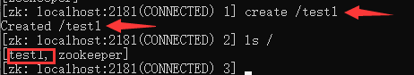

# 节点znode

## 模型

### 无状态化模型

首先讲解一个模型，叫无状态化实现：


**这个模型当中，把数据放在任何一个系统都是不可靠的，因为数据存储系统和客户的登录系统不一定是同一个系统，因此所有系统的数据都需要统一的保存在zookeeper内部，这样就能实现无状态化，这也就表明了zookeeper是可以用来存数据的。**

### 节点模型

**Zookeeper下面被划分为一个个节点，即层次化的目录结构，命名符合常规文件系统规范，类似于 Linux。**特点如下：

1. **所有节点的根路径都是 `/` 开始。**
2. **每个节点在 Zookeeper 中叫做 Znode，并且其有一个唯一的路径标识。**
3. **节点 Znode 根据持续时间可以分为持久节点（PERSISTENT）、临时节点（EPHEMERAL）。**
4. **持久节点一旦被创建，除非主动移除，不然一直会保存在 Zookeeper 中（不会因为创建该节点的客户端的会话失效而消失）。**
5. **节点 Znode 可以包含数据和子节点，但临时节点（EPHEMERAL）不能有子节点。**
6. **节点 Znode 中的数据可以有多个版本，比如某一个路径下存有多个数据版本，那么查询这个路径下的数据就需要带上版本。**
7. 客户端应用可以在节点上设置监视器。
8. **节点不支持部分读写，而是一次性完整读写。**


## 节点类型

### 查看节点

在前面，我们已经通过运行 `zkCli.sh` 文件连接上了ZK服务器，输入下面命令查看节点，可以看到zk给我们初始化创建了一个名称为 `zookeeper` 的节点。

```
查看根路径下的子节点：ls /
递归查看根路径下的子节点：ls -R /
```


### 持久节点

我们通过如下命令来创建一个test1持久节点：

```
create /test1
```



创建节点后，会提示该节点已经创建，通过命令查看节点，就会发现多了一个test1持久节点。接下来，我们通过下面命令来创建test1的持久子节点：

```
create /test1/sub1
```


### 数据节点

 以上创建的节点都是没有数据的空节点，现在我们新建一个test2持久节点，并设置数据abc：

  ```
create /test2 abc
  ```

 

通过下面命令，来获取test2持久节点上的数据：

  ```
get /test2
  ```

  

!> 注意：zookeeper的节点路径都必须从根路径开始，一层一层往下写。

### 持久序号节点

上面，我们已经创建了test2持久节点，如果继续创建，就会提示节点已经存在：


当如果使用下面的命令就可以继续创建test2持久节点：

```
create -s /test2
```


**可以看到后续生成的test2持久节点后面都带有一个事务ID的序列号，这个序列号每多生成一个就加一，这些节点就叫做持久序号节点。**

?> 持久序号节点适用于分布式锁的应用场景。

### 临时节点

**临时节点：会话结束后，自动被删除的节点。**

我们通过下面命令创建一个临时节点test3：

```
create -e /test3
```


现在我们通过 `zkCli.cmd` 再打开一个新的会话：


现在关闭旧会话，在新会话中查看节点变化状态：**经过十几秒以后，旧会话生成的test3临时节点，就自动被删除了。**


?> 利用临时节点的特性，zk可以实现服务注册与发现的效果。

### 临时序号节点

创建临时序号节点就很简单了，就是加上临时节点参数、序号节点参数来创建即可：

```
create -e -s temp_znode
```

### 容器节点

在zookeeper3.5.3版本中新增了容器节点。容器节点特性：**当容器节点中没有任何子节点时，该容器节点会被zk定期删除，时间为60s。**

!> 注意：容器节点必须先有子节点，被删除后，没有子节点才会被加上一个60s删除的周期。

通过下面的命令创建一个名称为mycontainer容器节点，先创建子节点，然后删除，观察60s后，就该容器节点由于没有子节点被自动删除。

```
create -c mycontainer
```


### 节点差异

**首先zk客户端向zk服务器发送连接请求，zk服务器接受到了连接请求后会向zk客户端返回一个当前会话的 `session id`。如果有多个zk客户端连接zk服务器，那么它们各自都会有且仅有一个唯一的 `session id`。**

**如果会话创建的是持久节点，即使会话结束后，节点也不会消失，依然保留在zk服务器上；如果会话创建的是临时节点，zk服务器就会要求创建该节点的zk客户端持续会话，以续约该会话创建的临时节点的存活时间，若会话断开，zk服务器一段时间检测到后，就会删除该会话创建的临时节点。**


## 节点操作

前面讲过，zk中的节点称为znode，它里面包含了四部分：

- data：上面讲的保存数据的部分

- acl权限：定义了什么样的用户能够操作这个节点，且能够进行怎样的操作。

  - c：create，创建权限，允许在该节点下创建子节点。
  - w：write，更新权限，允许更新该节点的数据。
  - r：read，读取权限，允许读取该节点以及子节点的列表信息。
  - d：delete，删除权限，允许删除该节点的子节点。
  - a：admin，管理权限，允许对该节点进行acl权限设置。

- stat：描述当前znode的元数据。

- child：当前节点的子节点。


### 查看节点信息

我们上面创建了两个持久节点test1、test2，使用如下命令来查看节点的详细信息：

```
# 查看test1节点详细信息
get -s /test1

# 查看test2节点详细信息
get -s /test2
```

返回的节点信息如下：

```
cZxid：创建节点的事务ID
mZxid：修改节点的事务ID
pZxid：添加或删除子节点的事务ID
ctime：节点创建时间
mtime：节点最近修改的时间
dataVersion：节点内数据的版本，每更新一次数据，版本会加1
aclVersion：此节点的权限版本
ephemeralOwner：若该节点是临时节点，值为节点所有者的sessionid；若不是临时节点，该值为零
dataLength：节点内数据的长度
numChildren：该节点的子节点个数
```


### 删除节点

删除节点命令如下：

```
# 删除节点（该节点下必须是空节点，下面没有子节点）
delete 节点路径
# 删除节点
deleteall 节点路径
```

我们先来用 `delete` 删除节点test1，提示该节点不为空，用 `deleteall` 成功删除节点test1：


