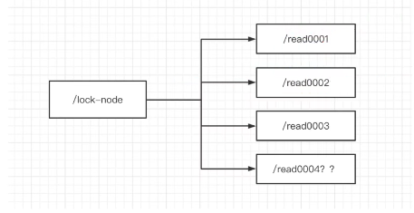
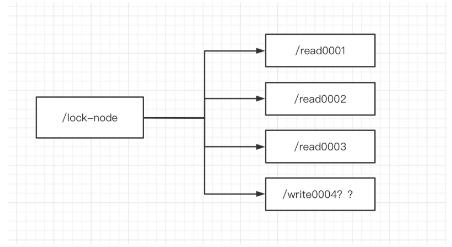
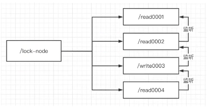
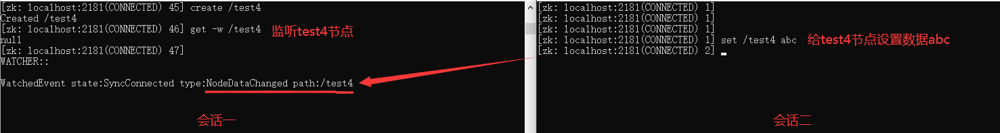
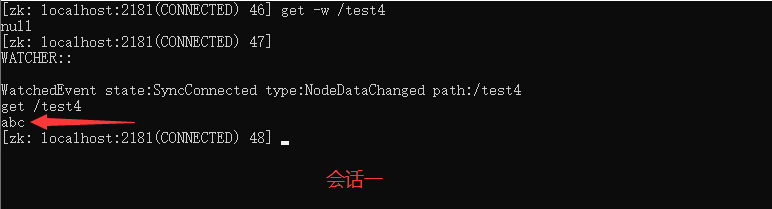
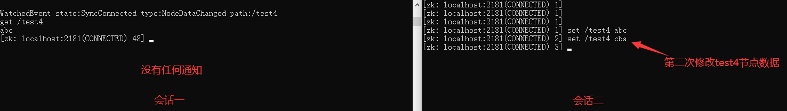
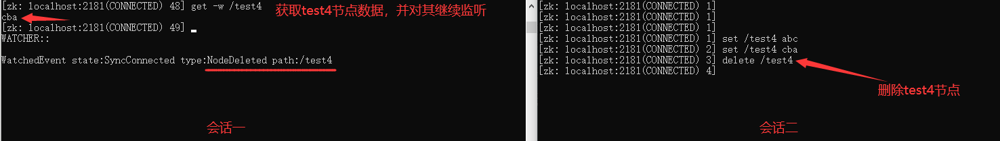

# 锁和watch

## 分布式锁机制

### 锁的种类

zk中锁分为两类：读锁、写锁

- **读锁：读取数据的锁，要想上读锁的前提是，之前的锁没有写锁。**
- **写锁：修改数据的锁，要想上读锁的前提是，之前没有任何锁。**

打个比方，读锁就像是暧昧，写锁就像是结婚，女一在没有结婚之前可以和男一、男二、男三进行暧昧，假如女一想和男一要结婚，有一个前提条件就是女一必须断绝和男二、男三的暧昧关系，且只要男一存在，那么女一今后就不能和男二、男三进行暧昧了。

### 上读锁

- 创建一个临时序号节点，节点的数据是read，表示是读锁；

- 获取当前zk中序号比自己小的所有节点；

- 判断最小节点是否是读锁：

  - 如果是读锁的话，则上锁成功；

  - 如果不是读锁，则上锁失败，为最小节点设置监听，并阻塞等待，zk的watch机制会在最小节点发生变化时通知当前节点，于是在执行第二步的流程。




解释： **当/read0001为读锁时，后面的节点都能上读锁；当/read0001为写锁时，后面的节点都不能上锁，只能阻塞等待/read0001的写锁释放再执行后面操作。**

### 上写锁

- 创建一个临时序号节点，节点的数据是write，表示是写锁；

- 获取当前zk中所有子节点；

- 判断自己是否是最小节点：

  - 如果是，则上锁成功；
  - 如果不是，说明前面还有锁，则上锁失败，监听最小的节点，如果最小节点有变化，则回到第二步。



### 链式监听

使用上述的上锁方式，只要节点发生变化，就会触发其他节点的监听事件，这样的话对zk的压力非常大。——羊群效应

**使用链式监听就可以解决问题，即每个节点只监听前一个节点，前一个节点状态发生变化就触发监听事件。**



## watch

**我们可以把watch理解成是注册在特定znode上的触发器，当znode发生了 `create（创建）`、`set（设置数据）`、`delete（删除）` 变化时，将会触发znode上注册的对应事件，请求watch的客户端会接受到异步通知。**

### 监听命令

我们现在使用zkCli客户端，是有监听功能的。客户端监听命令如下：

```
get -w /test：一次性监听节点test变化，但不能监听到节点test中子节点的变化
ls -w /test：监听test目录，创建和删除子节点会受到通知，子节点中新增子节点不会收到通知
ls -R -w /test：监听子节点中的所有子节点变化，但数据的变化不会收到通知
```

### 节点监听

我们打开两个会话，其中一个会话执行如下命令：

```
# 创建test4节点
create /test4

# 获取test4节点数据，并对其进行监听
get -w /test4
```

第二个会话，执行如下命令：

```
# 给test4节点设置数据
set /test4 abc
```

可以看到，第二个会话为test4节点设置数据后，第一个会话马上就接受到了 `NodeDataChanged` test4节点数据变化的通知：



收到通知后，我们在会话一中可以获取到test4节点数据：



然而，监听方式只触发了一次，当我们第二次修改test4节点数据时，会话一就没有收到通知了：



**其原因就是，上面会话一在获取到test4节点数据后，没有继续对test4节点进行监听。**如果要继续监听就必须加上 `-w` 参数：

```
# 获取test4节点数据，并继续对其进行监听
get -w /test4
```

现在我们在会话一中又对test4节点进行了监听，在会话二中当我们删除test4节点，马上会话一又接受到了 `NodeDeleted` test4节点被删除的通知：


