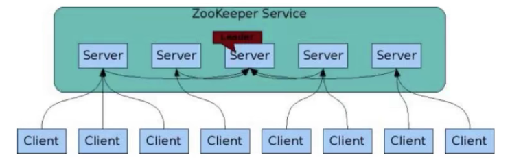
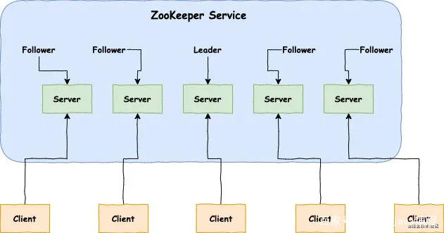
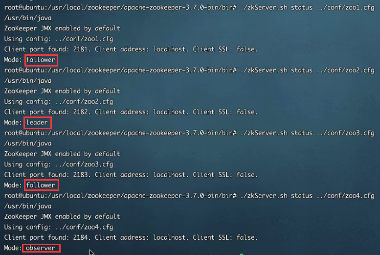
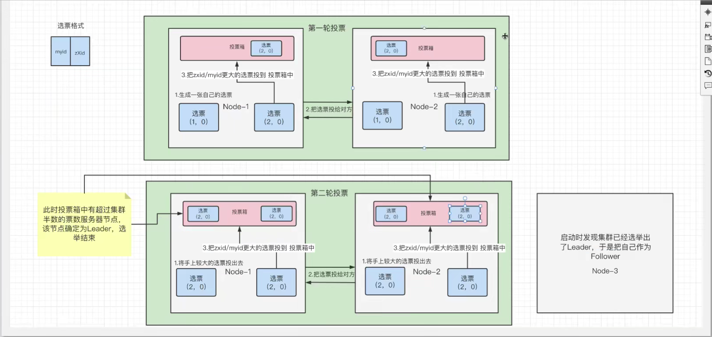
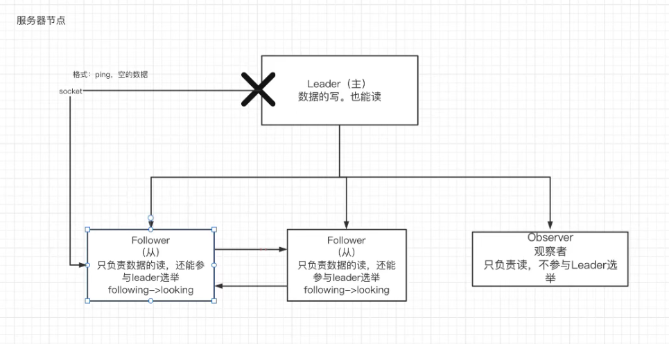
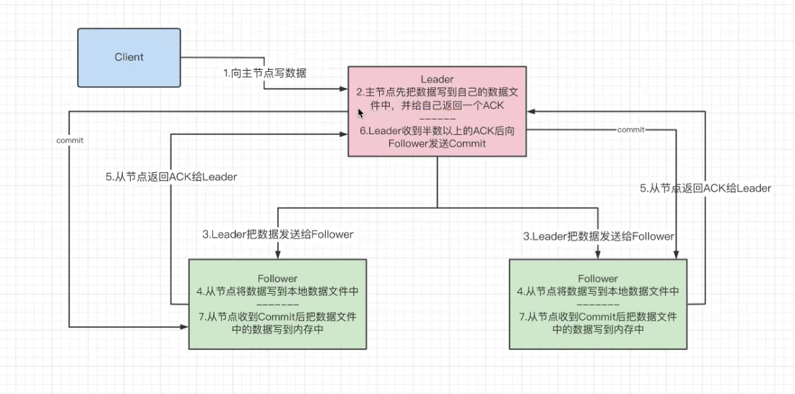

# ZAB协议

zookeeper协议作为非常重要的分布式协调组件，需要进行集群部署，集群中会以一主多从的形式进行部署。zookeeper为了保证数据的一致性，使用了ZAB协议，该协议解决了zookeeper的崩溃恢复和主从数据同步的问题。

## 不同角色

在Zookeeper集群当中，不同的机器都有属于自己的角色。主要分为以下三种：

**领导者（leader）：**负责进行投票的发起和决议，更新系统状态。

**跟随者（follower）：**用于接收客户端请求并给客户端返回结果，在选主过程中进行投票。

**观察者（observer）：**可以接受客户端连接，将写请求转发给 leader，但是observer不参加投票的过程，只是为了扩展系统，提高读取的速度。

**角色差异**：当领导者（leader）挂掉以后，跟随者（follower）会进行投票，从所有的跟随者（follower）当中选择一位当领导者（leader），也就是每位跟随者（follower）都有可能成为领导者（leader），而观察者（observer）永远不可能成为领导者（leader）。

!> 注意：领导者（leader）有且只能有一位，且必须有；跟随者（follower）、观察者（observer）可以有多位。

!> 注意：领导者（leader）服务器既可以读也可以写，而跟随者（follower）、观察者（observer）只能读。

## 四种状态

ZAB协议给zk服务器定义了四种状态：

- Looking：选举状态；
- Following：Follower节点（从节点）所处状态；
- Leading：Leader节点（主节点）所处状态；
- Observing：观察者节点所处状态；

**当zk服务器刚上线后，他是处于Looking状态；经过选举以后，处于Following、Leading、Observing状态中的一种。**

## 选举机制

选票格式：（myid，zXid）

myid：zk服务器的在zookeeper集群中的id号。

zXid：zk服务器的事务id号，每进行一次create、set、delete等事务，号数都会加一。（事务号越大，说明当前zk服务器上的数据越新）

**首先要知道一点，每个节点服务器都有自己的投票箱，每个节点的投票箱最终的结果都是一样的。**

### 普通选举

启动zk服务器的整个的选举流程如下：

1. 第一台zk服务器上线，有选票为（1，0），此时处于Looking状态；
2. 第二台zk服务器上线，有选票为（2，0），开始与第一台zk服务器进行选举；
3. 首先两方复制自己的选票并交换，第一台zk服务器有选票（（1，0），（2，0）），第二台zk服务器有选票（（1，0），（2，0））；
4. 比较zXid（事务id号）大小，投票大的，若一样，比较myid（服务器id号），投票大的，两边比较相同，都给自己的投票箱投了（2，0）；
5. 此时，每个投票箱都有一张选票（2，0），但通过配置zk集群知道有三台zk服务器，票数还未过半（达到两票），于是进行第二轮投票；
6. **这时第一台zk服务器和第二台zk服务器都会把自己上一轮选举认为较大的选票投给对方；**
7. 此时，第一台zk服务器有选票（（2，0），（2，0）），第二台zk服务器有选票（（2，0），（2，0））；
8. 最终投票都是（2，0），投票后，票数过半，因此选举出来的leader服务器就是myid为2的服务器。
9. 最后第三台zk服务进来，发现leader服务器已经选举好了，就自己定为Follower服务器。

这里可以得出一个规则就是：**选举时，最好是奇数个节点服务器，因为投票后需要判断票数是否过半，而偶数就不太好判断了。**

### 崩溃选举

Leader崩溃后的整个的选举流程如下：

1. 当整个zk集群搭建好以后，会选举产生leader服务器；
2. leader服务器会周期性的向follower服务器发送心跳（ping命令，没有内容的socket），告诉他们''我还在"。
3. 当leader服务器崩溃后，follower服务器发现socket通道已关闭，于是follower服务器进入Looking状态；
4. 重新回到上面的普通选举当中。

Server数目一般为奇数（3、5、7）如果有3个Server，则最多允许1个Server挂掉；如果有4个Server，则同样最多允许1个Server挂掉由此，**我们看出3台服务器和4台服务器的的容灾能力是一样的，所以为了节省服务器资源，一般我们采用奇数个数，作为服务器部署个数。**

!> 在leader服务器未选举出来时，zookeeper集群是不能对外提供服务的。

## 数据同步

 zookeeper同步数据的过程如下：

1. 客户端写数据，如果连接的是从节点，从节点会把数据转发给主节点；如果连接的是主节点进行下面的步骤；
2. 主节点先把数据写到自己的数据文件当中，并给自己返回一个ACK；
3. 主节点把数据广播给每一个从节点；
4. 从节点将数据写到本地数据文中；
5. 从节点返回一个ACK给主节点，表明自己已将数据写到本地数据文中；
6. 当主节点收到半数以上（包括自己在内）ACK后，主节点将数据写入内存；
7. 主节点广播给之前返回ACK从节点一个commit，让他们把数据写入到内存当中；

**当多数Server写成功，则任务数据写成功如果有3个Server，则两个写成功即可；如果有4或5个Server，则三个写成功即可。**

