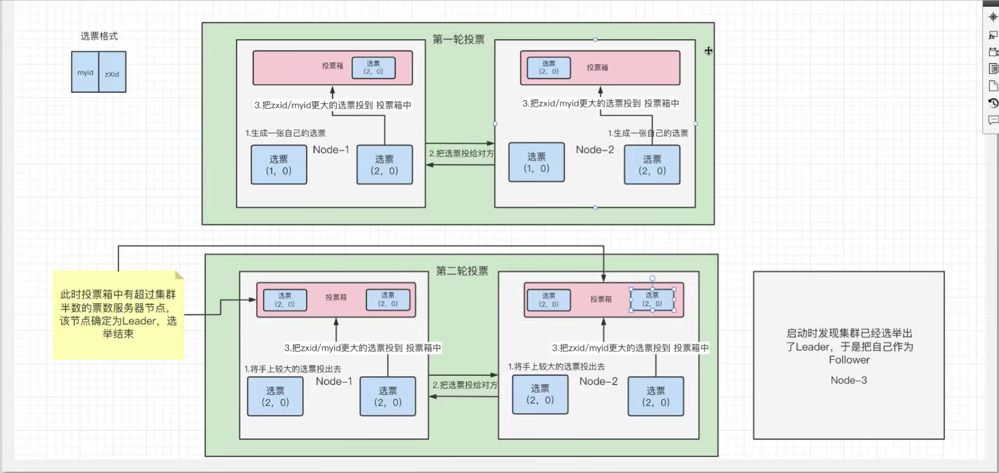

# 集群实战

## ZAB协议

zookeeper协议作为非常重要的分布式协调组件，需要进行集群部署，集群中会以一主多从的形式进行部署。zookeeper为了保证数据的一致性，使用了ZAB协议，该协议解决了zookeeper的崩溃恢复和主从数据同步的问题。

### 四种状态

ZAB协议给zk服务器定义了四种状态：

- Looking：选举状态；
- Following：Follower节点（从节点）所处状态；
- Leading：Leader节点（主节点）所处状态；
- Observing：观察者节点所处状态；

当zk服务器刚上线后，他是处于Looking状态；经过选举以后，处于Following、Leading、Observing状态中的一种

### 选举机制

选票格式：（myid，zXid）

myid：zk服务器的在zookeeper集群中的id号。

zXid：zk服务器的事务id号，每进行一次create、set、delete等事务，号数都会加一。（事务号越大，说明当前zk服务器上的数据越新）

**首先要知道一点，每个节点服务器都有自己的投票箱，每个节点的投票箱最终的结果都是一样的。**

整个的选举流程如下：

1. 第一台zk服务器上线，有选票为（1，0），此时处于Looking状态；
2. 第二台zk服务器上线，有选票为（2，0），开始与第一台zk服务器进行选举；
3. 首先两方复制自己的选票并交换，第一台zk服务器有选票（（1，0），（2，0）），第二台zk服务器有选票（（1，0），（2，0））；
4. 比较zXid（事务id号）大小，投票大的，若一样，比较myid（服务器id号），投票大的，两边比较相同，都给自己的投票箱投了（2，0）；
5. 此时，每个投票箱都有一张选票（2，0），但通过配置zk集群知道有三台zk服务器，票数还未过半（达到两票），于是进行第二轮投票；
6. **这时第一台zk服务器和第二台zk服务器都会把自己上一轮选举认为较大的选票投给对方；**
7. 此时，第一台zk服务器有选票（（2，0），（2，0）），第二台zk服务器有选票（（2，0），（2，0））；
8. 最终投票都是（2，0），投票后，票数过半，因此选举出来的leader服务器就是myid为2的服务器。

这里可以得出一个规则就是：**选举时，最好是奇数个节点服务器，因为投票后需要判断票数是否过半，而偶数就不太好判断了。**

