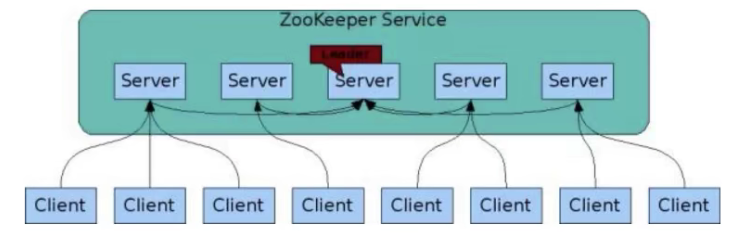

# 集群实战

## ZAB协议

zookeeper协议作为非常重要的分布式协调组件，需要进行集群部署，集群中会以一主多从的形式进行部署。zookeeper为了保证数据的一致性，使用了ZAB协议，该协议解决了zookeeper的崩溃恢复和主从数据同步的问题。

### 四种状态

ZAB协议给zk服务器定义了四种状态：

- Looking：选举状态；
- Following：Follower节点（从节点）所处状态；
- Leading：Leader节点（主节点）所处状态；
- Observing：观察者节点所处状态；

当zk服务器刚上线后，他是处于Looking状态；经过选举以后，处于Following、Leading、Observing状态中的一种

